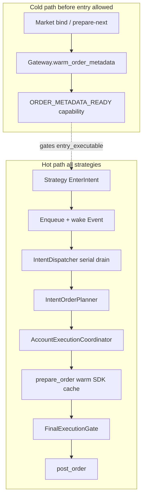

# Fast shared order-prep path (warm + wake)

## Analysis review (verdict)

Your write-up is **correct on the kill mechanism and on where wall time goes**. Locked corrections / additions:

| Claim | Verdict |
|-------|---------|
| Coordinator is safety cashier, not pricing brain | Correct |
| `request_to_prepared_ms` dominated by cold SDK metadata HTTP, not EIP-712 | Correct (`create_market_order` → `prepare_market_order_draft` → `resolve_market`) |
| ~1 Hz `sleep(1.0)` can burn ~1s before consume | Correct ([`market_data_runtime.py`](src/tyrex_pm/runtime/market_data_runtime.py) L695) |
| Final gate + 5s candidate TTL working as designed | Correct — do **not** “fix” by raising TTL |
| Account prewarm exists; SDK order-metadata warm does not | Correct; already intended in [`Docs/implementation/runtim_enhancement/runtime_impl_plan.md`](Docs/implementation/runtim_enhancement/runtime_impl_plan.md) §3.2 but never wired into unified runtime |
| Custom Tyrex metadata cache | **Forbidden** until official SDK cache proven inadequate (same prior decision) |
| Latest run (`…190403Z`) | Same spine; gate fail was **capability race during 13s prepare**, not only stale-candidate — same root cause (slow prepare) |

Honest ms target after this plan: **internal** `candidate → post_started` should drop from multi-seconds to **tens–low hundreds of ms** on a warm cache (queue≈0 + prepare≈sign/math). Venue `post_order` RTT still depends on network/geo; that is a later deploy concern, not this code slice.

## Architecture (keep, do not bypass)

Invariants unchanged:

- Strategies only emit intents.
- Planner sizes; gateway adapts tick + signs; coordinator journals + serializes mutations.
- Final gate still refuses stale / moved / capability-blocked candidates.
- `create_market_order` + `post_order` only (never `place_market_order`).

## Locked design decisions

1. **Warm via official SDK cache** — discarded `create_market_order` (sign only, never POST) for each active/prepared token. Same facility the hot path uses.
2. **Warm is a first-class readiness input** — new capability `order_metadata_ready`; missing warm blocks `entry_executable` (same pattern as account reads).
3. **Intent wake without destroying the 1 Hz loop** — keep discovery/recon on 1s tick; add a **serialized intent dispatcher** woken by `asyncio.Event` on enqueue.
4. **Do not raise `maximum_candidate_age_ms`** as the fix.
5. **Do not add a parallel custom tick/neg_risk cache** in this slice; BookView tick adapt stays as today.
6. **Scope of first ship:** warm + wake + capability + tests + docs/metrics. Thin “pass neg_risk into signer” and geo/Rust are later only if warm P95 still fails SLO.

## Implementation

### P0 — Gateway: reusable warm API

In [`src/tyrex_pm/execution/polymarket/gateway.py`](src/tyrex_pm/execution/polymarket/gateway.py):

- Add `async def warm_order_metadata(self, token_ids: Sequence[str], *, max_price: Decimal, max_spend: Decimal) -> WarmResult`.
- For each token: tiny discarded BUY `create_market_order` (minimal amount, with `max_spend`/`max_price` so the **protected** fee+metadata path populates `AsyncOrderMetadataCache`), then discard (no `post_order`, clear any `_prepared_specs` entry if created).
- Record per-token elapsed_ms; surface `ORDER_METADATA_WARM_*` via run recorder from runtime.
- Failures: mark token unwarmed; runtime keeps `order_metadata_ready=False` (no silent “ready”).

This stays venue-adapter owned so all strategies inherit it.

### P0 — Runtime: warm on bind (mirror account prewarm)

In [`src/tyrex_pm/runtime/trading_runtime.py`](src/tyrex_pm/runtime/trading_runtime.py):

- On `on_market_activated` / `on_prepared_market` (same places as `_prepare_account_state`), schedule/await `gateway.warm_order_metadata` for that market’s YES/NO tokens.
- Re-warm on window promotion (prepared → active) if tokens changed or last warm older than a soft threshold (e.g. 8 min &lt; SDK 10 min TTL).
- Wire capability in [`src/tyrex_pm/runtime/capabilities.py`](src/tyrex_pm/runtime/capabilities.py): `order_metadata_ready` → contributes to `execution_infrastructure_ready` / `entry_executable` with blocker `ORDER_METADATA_NOT_READY`.

Entry evaluation must not fire until warm succeeds (prevents another cold first-hit).

### P0 — Intent dispatcher (kill the 1s dequeue)

In [`trading_runtime.py`](src/tyrex_pm/runtime/trading_runtime.py):

- Keep `intent_queue` + `candidate_monotonic_ns` stamp in `_enqueue_intent`.
- Add `intent_wake: asyncio.Event` set on enqueue.
- Start one long-lived task `intent_dispatcher_loop`: wait Event → clear → drain queue **one intent at a time** via existing `_consume_intent` (preserve serial account/lifecycle semantics).
- Remove reliance on `on_async_tick` for entry/exit intent drain (tick may still call consume as a safety net, or stop duplicating — prefer **single owner = dispatcher** to avoid double-consume races).
- Exits/protection/flatten use the same wake path (shared spine).

Do **not** call coordinator from the strategy thread/callback directly; always queue → dispatcher → lifecycle → coordinator.

### P0 — Observability / acceptance

Extend run summary timeline (already has `candidate_to_request_ms`, `request_to_prepared_ms`):

- Add warm events + `order_metadata_warm_ms` per token.
- Acceptance for ask70 tiny-live (same config, $5):
  - `candidate_to_request_ms` P95 **&lt; 50 ms** (wake path)
  - `request_to_prepared_ms` P95 **&lt; 200 ms** after warm (home path; document if geo worse)
  - Gate reject reason must not be `candidate_stale_after_signing` on warm path
  - Goal of validation run: reach POST (`mutation_attempts &gt; 0`), then fill → `PROTECTION_*` arm

Do **not** change `maximum_candidate_age_ms: 5000` in YAML for this.

### P1 — Hardening (same PR series if small, else immediate follow-up)

- During `coordinator.submit`, avoid overlapping **active-market** account refresh that flips `entry_executable` false mid-prepare (serialize or “hold last READY” for the submit critical section). This addresses the `…190403Z` capability race properly once prepare is fast.
- Unit tests: warm idempotency; capability blocks entry until warm; enqueue wakes dispatcher without waiting for 1s tick; final gate still rejects when age forced over budget.
- Docs: update [`Docs/latest/execution_lifecycle.md`](Docs/latest/execution_lifecycle.md) prep step to include metadata warm + intent wake.

### Explicitly out of scope (this plan)

- Raising candidate TTL to hide latency
- Custom Tyrex order-metadata cache parallel to SDK
- Rust signer / rewrite
- Geo relocation to IAD
- Changing strategy logic (ask70 / z_gap)
- Resting GTC / OCO (protection P4)

## Why this is reusable / not a patch

| Concern | Owner | Reused by |
|---------|-------|-----------|
| Metadata warm | `PolymarketAsyncGateway` | All live strategies via coordinator gateway |
| Readiness gate | `CapabilityController` | Same entry gate z_gap + ask70 |
| Fast dequeue | TradingRuntime intent dispatcher | All intent kinds |
| Safety serialize + journal + final gate | Coordinator (unchanged contract) | All strategies |

## Suggested build order

1. Gateway `warm_order_metadata` + unit test (fake client records calls, no POST)
2. Capability + bind-time warm wiring
3. Intent Event + dispatcher; stop tick-owned consume
4. Tests for wake latency / no double consume
5. Docs + ask70 live re-run to validate POST → fill → protection arm
