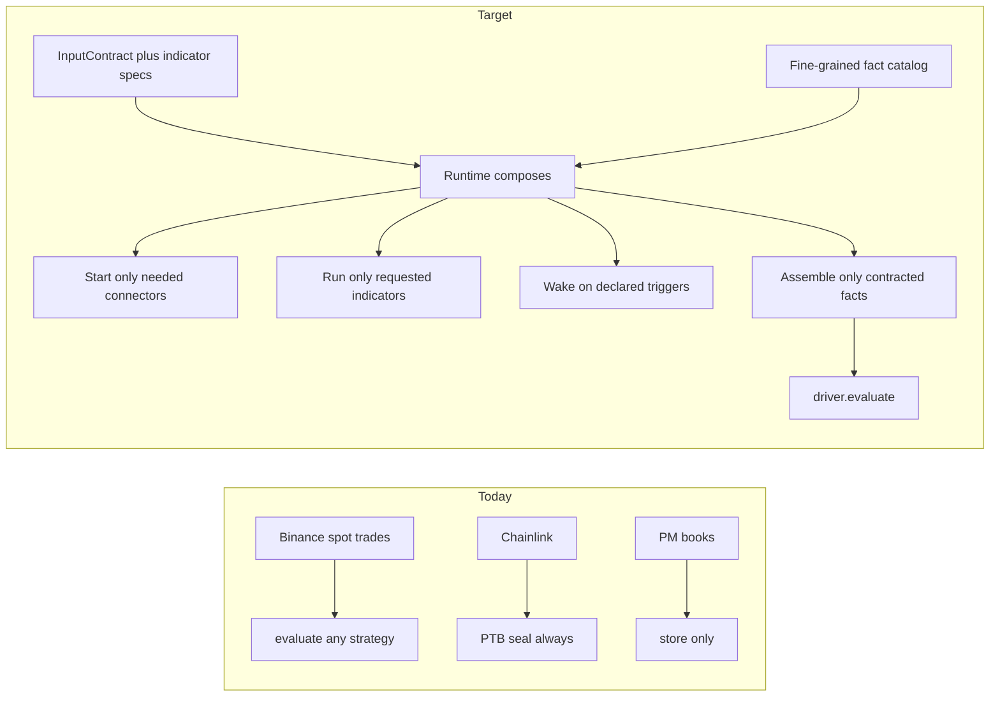
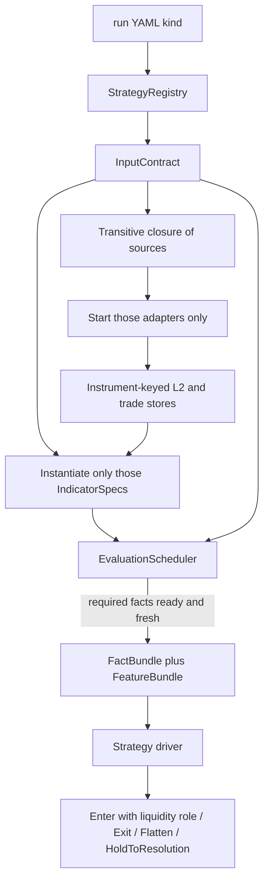

# Strategy Input Contracts — Scaled Against a Real Third Strategy

## Verdict

The execution spine is already strategy-agnostic. The **data plane is not**. Adding a third strategy today means more `if strategy_kind == ...` branches in the host.

This revision uses a **guide strategy** (q-edge: fair-value `q_t` + maker/taker/no-trade) as the scalability test. We will **not** build that strategy. We will shape the framework so adding it later is a new package + registry entry + any *new* connectors/indicators it needs — not a rewrite of [`market_data_runtime.py`](src/tyrex_pm/runtime/market_data_runtime.py).

The original smoking gun remains:

- ask70 decides from Polymarket books.
- Evaluation is scheduled only from Binance `ReferencePriceUpdated` in [`src/tyrex_pm/runtime/market_data_runtime.py`](src/tyrex_pm/runtime/market_data_runtime.py) (`on_bn`, ~549–603).
- Binance, Chainlink, and books are **always started** (~648–652).
- ask70 therefore has a hard liveness dependency on a connector it does not use.

The guide strategy shows that “declare `binance: true`” is still too coarse. Today’s Binance adapter is **spot `@trade` only** ([`BinanceTradeWsAdapter`](src/tyrex_pm/adapters/binance/ws_adapter.py)). q-edge needs spot L2, perp L2, perp trades, funding, multi-horizon OFI, and maker vs taker. Those must be **composable facts**, not a bigger z_gap bundle.

Do **not** fix this with boolean flags (`requires_binance: bool`). The reusable pattern is a **fine-grained fact catalog + parameterized indicator graph + strategy contract + scheduler**.

---

## Guide strategy (not built) — what it forces

Pipeline the framework must be able to compose, not own:

```text
Chainlink TWAP ── distance to K, tau
Binance spot  ───┐
Binance L2    ───┼── momentum, OFI, microprice, imbalance, RV
Binance perp  ───┘── aggressive flow, basis
                     ▼
              FAIR VALUE q = P(UP|F_t)     ← strategy-owned
                     ▼
         Polymarket UP/DOWN books → net edge
                     ▼
              MAKER | TAKER | NO TRADE     ← intent liquidity role
                     ▼
         HOLD | EXIT | RESOLUTION          ← position manager
```

Resolver verification (`Ŷ = 1[C_T ≥ K]` vs official Y on 100–500 markets) is **offline research** over the same fact schemas. It is not a runtime connector. Fact types must be replayable; do not put fitting or resolver audits in the live host.

---

## Gap matrix: three strategies vs today’s host

What each strategy actually needs, and whether the host can supply it without a fork.

**ask70 (exists)**
- Sources: `polymarket.books`, `clock.sync?`, `account.snapshot`
- Indicators: none
- Wake: book updates (coalesced) and/or timer — **not** Binance
- Intents: Enter (taker) + protection overlay
- Today: eval clock is still Binance; Chainlink still started

**z_gap (exists)**
- Sources: `polymarket.books`, `binance.spot.trades`, `chainlink.twap`, `clock.sync`, `account.snapshot`
- Derived: `ptb.sealed`, `reference.aligned`, `vol.ewma` (one horizon, stuffed into the driver via `ingest_volatility`)
- Wake: Binance trades after PTB sealed (~1 Hz) — this cadence is correct **for z_gap**, but hardcoded in `on_bn`
- Intents: Enter/Exit/Flatten + `HoldToResolutionIntent` (emitted, **not consumed**)
- Today: works because the host *is* z_gap

**q-edge (guide)**
- Sources: all of z_gap’s, **plus** `binance.spot.l2`, `binance.perp.trades`, `binance.perp.l2`, `binance.perp.funding`, `polymarket.market_meta` (taker delay, fee, tick, min size, rule version, T0/T/K)
- Indicators: reusable, parameterized — `d_t`, `tau`, `G_t`, L1/L3/L5/L10 imbalance, microprice gap, OFI at 250ms/1s/3s/5s/15s, trade imbalance, momentum R_h, RV_h, perp basis / perp OFI / perp TI. Same OFI producer on spot **and** perp.
- Wake: union of Chainlink TWAP, Binance L2/trades, Polymarket books — coalesced (not every L2 delta)
- Intents: **MAKER** (resting GTC) vs **TAKER** (FAK) vs no-trade; then HOLD / EXIT / RESOLUTION
- Today: cannot be added. No L2/perp adapters, no indicator graph, `EnterIntent` has no liquidity role, planner/gateway default to FAK, `BinaryMarket` has no taker-delay/rule-version, `MarketStateStore` is Polymarket yes/no shaped

The plan is ready for q-edge when that last row is a **plugin + new catalog entries**, not edits to `on_bn` / `prepare_aligned_eval` / `run_config.py`.

---

## Current vs target



---

## Proposed pattern

Four layers. Strategy names **what it thinks in**. Runtime resolves **how to produce it**. Connectors and indicators stay reusable.

### 1. Fine-grained source catalog (framework-owned, open)

Do **not** register `binance` as one fact. Register streams:

- `clock.sync`
- `account.snapshot`
- `polymarket.books` — UP/DOWN CLOB (exists)
- `polymarket.market_meta` — T0, T, K/PTB identity, tick, min size, fee curve, **taker delay**, rule version (partially on [`BinaryMarket`](src/tyrex_pm/domain/polymarket/market.py); taker delay / rule version missing)
- `chainlink.twap` — 30s BTC/USD TWAP + freshness (today’s RTDS adapter)
- `binance.spot.trades` — trades + aggressor + exchange/receive ts (**exists**, [`@trade` WS](src/tyrex_pm/adapters/binance/ws_adapter.py))
- `binance.spot.l2` — bid/ask/size/depth (**does not exist**)
- `binance.perp.trades` / `binance.perp.l2` / `binance.perp.funding` (**do not exist**)

A new venue feed is a new source fact + adapter implementing [`MarketDataAdapter`](src/tyrex_pm/adapters/protocols.py). z_gap keeps starting only `binance.spot.trades`. q-edge starts the extra Binance facts. ask70 starts none of them.

**Generic instrument-keyed L2/trade store.** Today [`MarketStateStore`](src/tyrex_pm/market_data/book_store.py) is a Polymarket yes/no pair. Imbalance, microprice, and OFI must run on **any** L2 instrument (PM UP, PM DOWN, Binance spot, Binance perp). Polymarket books become two instruments in that store; do not write a second ad-hoc Binance book.

**Hard rule:** a fact not in the contract cannot appear in skip reasons, cannot set capabilities, and cannot be a liveness dependency. Binance L2 down must not block ask70. Binance perp down must not block z_gap. Spot-trade down must not block ask70.

### 2. Parameterized indicator graph (reusable producers)

[`src/tyrex_pm/indicators/`](src/tyrex_pm/indicators/) is an empty package plus a few z_gap-local modules. q-edge’s feature vector is ~15 variables, many with **horizons**. That is a graph, not 15 methods on the driver.

Producers are pure/stateful libraries. A strategy **subscribes** with parameters; the runtime runs only those instances.

```text
IndicatorSpec(name="ofi",            source="binance.spot.l2",      horizons_ms=(250, 1000, 3000, 5000, 15000))
IndicatorSpec(name="ofi",            source="binance.perp.l2",      horizons_ms=(1000, 5000))
IndicatorSpec(name="imbalance",      source="binance.spot.l2",      levels=(1, 3, 5, 10))
IndicatorSpec(name="microprice_gap", source="binance.spot.l2")
IndicatorSpec(name="trade_imbalance",source="binance.spot.trades",  horizons_ms=(1000, 5000, 15000))
IndicatorSpec(name="momentum",       source="binance.spot.mid",     horizons_ms=(1000, 5000, 15000, 30000, 60000))
IndicatorSpec(name="realized_vol",   source="binance.spot.trades",  horizons_ms=(10000, 30000, 60000, 300000))
IndicatorSpec(name="basis",          sources=("binance.spot.mid", "binance.perp.mid"))
IndicatorSpec(name="distance_to_k",  sources=("chainlink.twap", "ptb.sealed"))
IndicatorSpec(name="spot_cl_gap",    sources=("binance.spot.mid", "chainlink.twap"))
```

Same `ofi` producer, two sources. z_gap’s EWMA vol becomes `IndicatorSpec(name="ewma_vol", source="binance.spot.trades", ...)` — **not** `binding.ingest_volatility` on every driver ([`market_runtime.py`](src/tyrex_pm/runtime/market_runtime.py) ~318–325).

Market-structure derived facts stay separate from indicators:

- `ptb.sealed` — needs chainlink + window + clock (and today’s Binance/SSR path as configured)
- `reference.aligned` — z_gap’s C_hat / basis EWMA
- `tau` — from `polymarket.market_meta` + clock

Strategy-owned: `q_t = P(Y=1 | F_t)` and the net-edge maker/taker policy. Framework never learns `q`.

Offline research uses the same producer functions over recorded facts (replay adapters). Live runtime is the same graph with live adapters.

### 3. InputContract (strategy-owned)

Each plugin exposes one frozen contract. Sketch:

```python
InputContract(
  required=("polymarket.books", "clock.sync", "account.snapshot"),
  optional=(),
  indicators=(),
  evaluate_on=(OnFact("polymarket.books", coalesce="1s"), OnTimer("1s")),
)
```

Reference mappings:

- **ask70** → sources `{books, clock?, account}`; indicators `()`; wake on books/timer. Closure does **not** start Binance or Chainlink.
- **z_gap** → sources `{books, binance.spot.trades, chainlink.twap, clock, account}` + derived `{ptb.sealed, reference.aligned}` + indicator `{ewma_vol}`; wake on `binance.spot.trades` after PTB sealed (today’s cadence, **declared**).
- **q-edge (guide)** → z_gap sources **plus** `{binance.spot.l2, binance.perp.trades, binance.perp.l2, binance.perp.funding, polymarket.market_meta}` + the indicator specs above; wake on the **union** of chainlink / spot L2 or trades / PM books, coalesced (e.g. 50–200 ms), not every depth update.

`evaluate_on` is independent of “which facts I read”. A strategy must not wake on a fact it did not contract.

Replace unused `on_signal` in [`strategies/protocol.py`](src/tyrex_pm/strategies/protocol.py) with `driver.evaluate(fact_bundle, DecisionContext) -> StrategyEvaluation`. Move `StrategyEvaluation` out of [`z_gap/driver.py`](src/tyrex_pm/strategies/z_gap/driver.py). Drop no-op `configure_ptb` / `ingest_volatility`.

### 4. Runtime composition (host-owned)



Host changes:

- [`run_market_data_runtime`](src/tyrex_pm/runtime/market_data_runtime.py) starts the closure, not a fixed Binance+Chainlink+books triple.
- `on_bn` stops being the global eval clock. Ingest updates stores; the **scheduler** decides.
- [`prepare_aligned_eval`](src/tyrex_pm/runtime/market_runtime.py) is not “z_gap path + ask70 fork”. Assembly is contracted facts + features → strategy assembler.
- [`CapabilityController`](src/tyrex_pm/runtime/capabilities.py): `model_ready` from neutral `EligibilityFacts`. `public_feeds_ready` means **contracted** public facts. Today it is book-feed ready duplicated onto `books_ready` (~458–470).
- Keep **one strategy per run**. Contracts are union-ready for a later multi-strategy host.

Three clocks stay independent:

1. **Strategy evaluation** — `InputContract.evaluate_on`
2. **Protection overlay** — `ProtectionSpec` (typically PM best bid). Today 1 Hz `on_async_tick`; later a books subscriber
3. **Execution / account / reconcile** — always on for live

---

## Execution / intent seams the guide strategy also forces

Data-plane contracts are not enough. q-edge’s policy is MAKER / TAKER / NO TRADE then HOLD / EXIT / RESOLUTION.

- [`EnterIntent`](src/tyrex_pm/core/intents.py) is BUY + notional + `max_price`. No liquidity role. Planner/gateway default **FAK** ([`gateway.py`](src/tyrex_pm/execution/polymarket/gateway.py) ~245). [`OrderSpec`](src/tyrex_pm/execution/orders.py) already has GTC limits — the missing port is intent → planner (`LiquidityRole.TAKER` → FAK, `LiquidityRole.MAKER` → GTC + cancel/replace). NO TRADE is existing WAIT.
- `HoldToResolutionIntent` is emitted by z_gap and **not consumed** in `TradingRuntime._consume_intent`. q-edge’s RESOLUTION path needs that routing. Do it once, for all strategies.
- `polymarket.market_meta` must include **taker delay** (some Up/Down markets: 250 ms). Do not assume zero. Fee, tick, min size already exist on books/discovery; surface them as one fact rather than z_gap config.
- Maker path shares cancel/replace with the protection plan’s resting GTC TP. One cancel consumer, two clients (strategy maker quotes + protection TP).

Do not implement q-edge maker quoting now. Freeze the **intent port** so the data plane is not ready while execution still only speaks FAK.

---

## What not to do

- More `if strategy_kind == "ask70"` (or `"q_edge"`) in market_data / market_runtime.
- Closed flags (`requires_binance`, `requires_perp`). q-edge would still edit the host for L2 vs trades vs funding.
- Start all connectors and ignore unused ones. Unused sockets fail, cost, and leak into gates (PTB seal already reads `runtime.zgap.config.ptb_time_quality` on the ask70 path).
- Evaluate on every Binance L2 delta with no coalesce.
- Kitchen-sink `DecisionSnapshot` with more optional `None`s. Absent facts are absent.
- Put `q_t`, OFI math, or resolver fitting in the runtime. Strategy owns `q`; indicators are libraries; resolver audit is offline.
- One `ingest_*` method per feature on the driver (the z_gap volatility pattern scaled to 15 features).
- A Binance-specific book store that cannot run the same OFI code as Polymarket or perp.

---

## Other generalization blockers (still true)

**P0 — adding a strategy still requires host edits**

- Closed registry: [`run_config.py`](src/tyrex_pm/runtime/run_config.py) ~149–162; [`market_runtime.py`](src/tyrex_pm/runtime/market_runtime.py) `StrategyDriver = ZGapDriver | Ask70Driver`. [`strategies/__init__.py`](src/tyrex_pm/strategies/__init__.py) is empty.
- Host named as z_gap: `ZGapMarketRuntime`, field `runtime.zgap`.
- Config helpers are kind switches: `entry_tau_bounds`, `max_clock_uncertainty_ms`, ask70-only protection required.
- Protocol drift: `on_signal` unused.

**P1 — market and derived-input machinery is a z_gap bundle**

- Family locked to `btc_updown_5m`. Discovery is `resolve_btc_5m_window` / 300s epoch. q-edge still targets that family; a later non-5m market needs `MarketFamilyRegistry`.
- PTB / basis / vol ingestion live in `ZGapMarketRuntime`, not optional producers.
- Adapters constructed concretely; `MarketDataAdapter` unused as a port.

**P2 — generic layers still leak z_gap**

- Reporting blocker frozenset is z_gap reasons ([`run_report.py`](src/tyrex_pm/reporting/run_report.py) ~15–26).
- Protection mark = best bid, 1 Hz tick.
- CLI defaults to z_gap.

**Already reusable — do not copy**

Intent types (extend, don’t fork), `DecisionContext`, execution planner/lifecycle/coordinator/reducer/gateway, account authority, protection `ProtectionSpec`, SQLite journals, PM `BookView`. [`extending.md`](Docs/latest/extending.md) still holds: do not clone `TradingRuntime`.

---

## Suggested freeze order (when you choose to implement)

Design sequence, not a build in this chat:

1. Freeze `FactId` catalog (fine-grained sources above) + `InputContract` + `IndicatorSpec` + `EvalTrigger` + `EligibilityFacts`. Write the three reference mappings: ask70, z_gap, q-edge (guide).
2. `StrategyPlugin` registry. Delete kind switches. Formalize `driver.evaluate`.
3. Generic instrument-keyed L2/trade store + indicator graph. Re-home z_gap EWMA vol as one spec. New adapters (`binance.spot.l2`, perp, funding) are catalog entries added when q-edge is actually built — the **port** exists first.
4. `EvaluationScheduler` + compose from closure. Move eval out of `on_bn`. Rename `ZGapMarketRuntime`. Extract PTB/alignment as derived producers.
5. Intent port: `LiquidityRole` on enter; consume `HoldToResolutionIntent`; `polymarket.market_meta` including taker delay. Neutral eligibility/reporting. Protection as a books subscriber.
6. Later: `MarketFamilyRegistry` (non-`btc_updown_5m`).

**Success test (without building q-edge):** a hypothetical plugin whose contract is the q-edge mapping would (a) start spot L2 + perp only because they are in the closure, (b) not require a `strategy_kind` branch in [`market_data_runtime.py`](src/tyrex_pm/runtime/market_data_runtime.py), (c) leave ask70 runnable with Binance down, (d) express TAKER vs MAKER vs HOLD_TO_RESOLUTION on the existing intent spine. Concrete proof on the way: ask70 evaluates from books with Binance and Chainlink **not started**.
