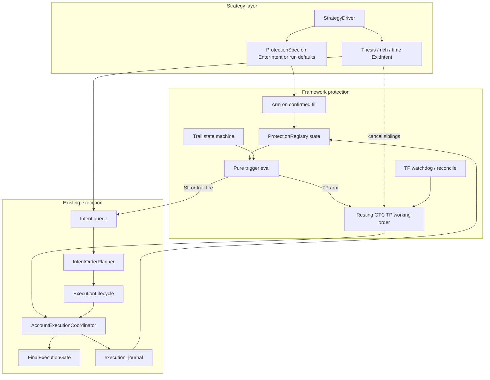

# SL / TP / Trailing on Polymarket — Research & Architecture Map

## Verdict

Polymarket has **no native** stop-loss, take-profit, trailing, OCO, or reduce-only. Every exit is **software automation** over ordinary CLOB orders (`GTC` / `GTD` / `FAK` / `FOK`). Tyrex already has the right spine (`EnterIntent` → fill → `ExitIntent`/`FlattenIntent` → FAK sell lifecycle); what is missing is a **framework-owned protection engine** that arms brackets after confirmed exposure and emits the same exit intents any strategy would.

**Recommended ownership (hybrid):** strategies declare a `ProtectionSpec` on entry (or via run config defaults); the framework owns arming, mark evaluation, resting TP, reactive SL/trail, OCO cancel, watchdog, and recovery. Strategy thesis exits remain first-class and **cancel** brackets before competing.

---

## 1. Concepts adapted to Polymarket

| Concept | Classic meaning | Polymarket reality |
|--------|-----------------|-------------------|
| **Stop loss** | Triggered sell to cap loss | Client watches mark; on breach submits **marketable FAK/FOK sell**. A below-market GTC sell is *not* a stop — it fills immediately. |
| **Take profit** | Lock gains at target | Prefer **resting GTC SELL** above market (maker, often fee-free). Cap near **0.99**. Needs ≥ **~5 shares** or GTC is rejected. |
| **Trailing stop** | Exit after pullback from peak | Track peak mark; fire reactive sell when bid retraces by **% of peak** or **absolute $ delta**. Absolute cents often fit binary books better than %. |
| **Stop market vs stop limit** | Fill certainty vs price certainty | After trigger: FAK/FOK (get out) vs resting limit (price control, gap risk). |
| **OCO / reduce-only** | Venue primitives | **Software only**: cancel resting TP before reactive sell; size ≤ confirmed inventory; never “close” by buying the opposite token. |
| **Trigger mark** | Usually last/mid | For sells, prefer **best bid** (achievable). Mid (common in OSS) can fire when you cannot sell at mid. |

**Price vs PnL%:** OSS bots mostly use `% from entry`. On binaries this is dollar-asymmetric (entry 0.80 −25% → 0.60; entry 0.20 −25% → 0.15). Tyrex should support **absolute price**, **% of entry**, and **absolute $ trail delta**, with explicit mark choice.

**Relation to what z_gap already does:** thesis `p_stop`, `MARKET_RICH_EXIT`, time/resolution preference, and runtime `MANDATORY_FLATTEN` are **economic/time exit policies**, not classic price brackets. SL/TP/trail are a **orthogonal protection overlay** that can run alongside them.

---

## 2. What other projects do

```text
Pattern A (Polybot — best OSS reference)
  BUY fill → GTC SELL@TP → watchdog keeps TP alive
           → poll/WS mark → SL or trail → CANCEL TP → FAK SELL

Pattern B (dexoryn copy-bot)
  Arm after profit ≥ X → chase GTC near market → trail from peak → emergency sell

Pattern C (Adeshh / thryec)
  Poll positions + mark → threshold → marketable sell (no resting TP; death = naked)
```

| Project | SL | TP | Trailing | Lessons for Tyrex |
|---------|----|----|----------|-------------------|
| [Adialia1/Polybot](https://github.com/Adialia1/Polybot) | Mid PnL%, poll, FAK | Resting GTC + retry | WS + REST peak % | **Cancel-before-sell**, TP watchdog, persist order IDs |
| [dexorynlabs/polymarket-trading-bot-ts](https://github.com/dexorynlabs/polymarket-trading-bot-ts) | Trail-as-SL | Armed chase GTC | Peak % + sports widen | Cancel/replace chase; avoid “won’t sell at a loss” |
| Adeshh SL bot / thryec | Entry % poll | Fixed +50% style | — | Minimal; not framework-grade |
| Hey-Traders (product) | Stop market/limit taxonomy | Resting TP | Activation + $ delta | Good **language**; same client-side mechanics |
| [polymarket-execution](https://pypi.org/project/polymarket-execution/) (PyPI) | Trigger monitors | Trigger monitors | — | Separate recovery for masked fills |

**Venue failure modes to design for (not edge cases):** gap-through between ticks; thin book / mid vs bid mismatch; resolution race to $0/$1; opposite-token “hedge close”; GTC min-5 → silent unprotected dust; sports auto-cancel resting TP; TP fill racing SL; process crash without persisted peaks/order IDs.

---

## 3. Where Tyrex stands today

**Already strong:**

- Intent contracts in [`src/tyrex_pm/core/intents.py`](src/tyrex_pm/core/intents.py): `EnterIntent`, `ExitIntent` (`min_price`), `FlattenIntent`, `CancelIntent` (exists but underused for resting children).
- Exit path: planner sell from **confirmed shares** → lifecycle FAK retries → reconcile → `COMPLETED_FLAT` / `MANUAL_INTERVENTION` ([`Docs/latest/execution_lifecycle.md`](Docs/latest/execution_lifecycle.md)).
- Framework safety exits: crash-recovery flatten, `mandatory_exit_before_end_s`.
- Strategy boundary: strategies emit intents only; no SDK ([`Docs/latest/extending.md`](Docs/latest/extending.md)).

**Gaps for classic protection:**

- No live `protection/` package; only legacy [`old/src/tyrex_pm/protection/`](old/src/tyrex_pm/protection/) (reactive TP/SL via mid/last-style mark → `ExitIntent`; **no resting GTC TP, no trailing, no OCO cancel**).
- No resting child-order management for GTC take-profit (execution today is entry FAK + exit FAK).
- `HoldToResolutionIntent` is emitted by z_gap but not fully consumed by the live intent path.
- “Protection price” in gateway/coordinator means **tick-adapted limit floor/ceiling**, not SL/TP.

---

## 4. Target architecture (strategy-agnostic)



### Ownership split

| Concern | Owner | Why |
|---------|--------|-----|
| Whether to use SL/TP/trail; thresholds; mark preference | Strategy config / `ProtectionSpec` on entry | Strategy-specific economics |
| Thesis / model / rich / hold-to-resolution exits | Strategy policy (as today) | Domain logic |
| Arm after **confirmed** fill; peak tracking; trigger eval | Framework `protection/` | Reusable, testable, crash-recoverable |
| Resting GTC TP place/cancel/replace; soft reduce-only | Execution lifecycle + coordinator | Only submission authority |
| Soft OCO: cancel TP before reactive exit | Protection + lifecycle | Prevent double-sell |
| Mandatory flatten / kill / crash flatten | Runtime (already) | Safety outranks brackets |
| Inventory truth / sellable shares | Account state + reducer | Never trust strategy sizing |

### How any strategy uses it

1. Strategy (or run YAML defaults) attaches `ProtectionSpec` when emitting `EnterIntent` (or registers after fill via config keyed by `strategy_id`).
2. On durable confirmed exposure, framework **arms** protection (entry VWAP / confirmed qty from journal, not strategy guess).
3. Strategy continues to emit thesis exits; protection continues to evaluate marks on book updates (event-driven off existing market-data views — not a 30–60s Telegram poll as sole path).
4. First terminal exit path wins: cancel siblings → one flatten/exit submission path → reconcile.
5. New strategies get brackets **without reimplementing monitors**; they only declare specs and keep their own entry/exit policy.

### Suggested `ProtectionSpec` shape (conceptual)

- `take_profit`: absolute price and/or `%` / `$` from entry; `style=resting_gtc|reactive_fak`
- `stop_loss`: absolute / `%`; `style=stop_market_fak|stop_limit`; optional confirm ticks / min bid depth
- `trailing`: `activation` (immediate | after profit | after price); `trail_pct` or `trail_abs`; mark=`bid|mid`
- `size_mode`: full | percent | fixed (legacy old protection already had this)
- `oco_group`: default one bracket per position
- Dust policy: skip resting if &lt; min shares → reactive-only or ride-to-resolve

### State machine (trailing + bracket)

```text
IDLE → ARMED → (optional) TRAILING → TRIGGERED → CANCEL_SIBLINGS → WORKING_EXIT → DONE
                 ↘ TP_RESTING (GTC live) ↗
```

Persist: entry mark, thresholds, peak, resting order IDs, reason codes — in execution journal / run evidence so crash recovery re-arms or flattens like today’s exposed-session path.

### Precedence with z_gap / runtime

Proposed order (high → low):

1. Kill / unknown inventory / emergency flatten  
2. Runtime mandatory flatten / manual deadline  
3. Hard SL fire (protective)  
4. Strategy thesis / rich / time exits (cancel brackets first)  
5. Trailing fire  
6. Resting TP fill (passive)  
7. Hold-to-resolution preference  

---

## 5. Mapping onto existing modules

| New / extended piece | Fits beside | Notes |
|----------------------|-------------|-------|
| `protection/spec.py`, `trigger_eval.py` (pure) | Revive ideas from [`old/.../protection/`](old/src/tyrex_pm/protection/) | Keep pure eval unit-testable |
| `protection/monitor.py` or runtime tick on book events | [`trading_runtime.py`](src/tyrex_pm/runtime/trading_runtime.py) | Emit `ExitIntent`/`FlattenIntent`/`CancelIntent` only — no POST |
| Resting TP path | [`lifecycle.py`](src/tyrex_pm/execution/lifecycle.py) + gateway | New **working-order** role distinct from FAK exit retries |
| Soft OCO cancel | Use existing `CancelIntent` + coordinator | Before SL/trail/strategy exit |
| Watchdog | Reconciliation loop | Missing TP → re-place or escalate; unexpected sell → incident |
| Config | `config/runs/*.yaml` + strategy schema | Defaults per run; strategy may override on intent |
| Reporting | `run_events` / run report | Trigger mark, gap-through, slip, dust-unprotected flags |

**Do not put** SL/TP evaluation inside strategy tick as the only path if the goal is “usable by any strategy” — that forces every strategy to reimplement Polybot. Strategy may *also* implement model exits; protection is the shared overlay.

---

## 6. Phased research roadmap (when you later implement)

1. **Reactive brackets only** — arm SL + reactive TP on bid; reuse FAK exit lifecycle; no resting orders (closest to old protection + Polybot SL half).
2. **Resting GTC TP + cancel-before-sell + watchdog** — Polybot Pattern A; requires working-order tracking.
3. **Trailing state machine** — peak from book WS; absolute delta default for short BTC windows.
4. **Partial exits / scale-out** — needs `ExitIntent` beyond `target_flat=True` only (current contract forbids partials).
5. **Sports/delay market policies** — wider trail, expect TP auto-cancel.

---

## 7. Design principles to keep

- Trigger ≠ fill; report slip and gap-through explicitly.
- Bid mark for reactive sells; never pretend mid is executable.
- Soft reduce-only and OCO are mandatory software invariants.
- Protection must not starve exits when entry/model readiness is false (same rule as today’s exit path).
- Framework safety flatten always outranks resting TP.
- Prefer event-driven book marks over sole polling; polling only as watchdog/fallback.

---

## Out of scope for this brainstorm

No code changes, no YAML changes, no new package creation until you explicitly ask to implement. Legacy `old/protection` is a conceptual reference only — do not resurrect it verbatim (it lacks resting TP, trailing, and unified-runtime wiring).
