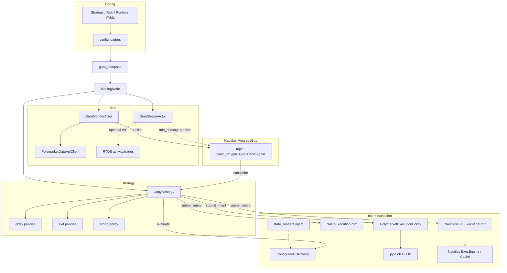

# Tyrex_PM — architecture overview

Grounded in the current codebase (`src/tyrex_pm/`). **Documentation hub:** [README.md](README.md). For operators: [OPERATIONS.md](OPERATIONS.md). For YAML: [CONFIG_MODEL.md](CONFIG_MODEL.md). For contributors: [developer_guide.md](developer_guide.md).

**Per-module detail:** [modules/README.md](modules/README.md).

---

## A. Project purpose

**What Tyrex_PM is:** a Python package for **Polymarket** automation, organized around **NautilusTrader** patterns (actors, strategies, message bus) while keeping **venue I/O** and **risk** in explicit layers.

**Current v1 scope:** a **guru-follow copy** path — ingest a wallet’s trades from **Polymarket RTDS** (recommended: **`guru_ingest_mode: rtds_primary`**) and/or incremental **Data API** polling as shadow, validation, or fallback, turn them into internal signals, size them, run **fail-closed risk**, and either **log-only shadow** or **live** execution (legacy py-clob and/or **Nautilus framework submit**).

**Implemented now:**

- **C1 guru ingestion:** **`GuruStreamActor`** — RTDS WebSocket (`activity` / `trades`), `proxyWallet` filter, shared dedup/watermark with poll, reconnect + liveness + optional REST **gap-fill** (`data/guru_stream_actor.py`, `guru_rtds_ws.py`, `guru_rtds_parse.py`, `guru_gap_fill.py`). **`GuruIngestRuntimeState`** selects publish path: `poll_only` | `rtds_shadow` | `rtds_primary` (`data/guru_ingest_state.py`).
- Incremental **Data API** polling (`GET /activity`, `type=TRADE`) + watermark + optional dedup + `GuruTradeSignal` publication (**`GuruMonitorActor`**, `data/guru_monitor.py`, `data/guru_watermark.py`).
- Shared **`GuruSignalPipeline`** for dedup + bus publish + structured **`guru_signal_emitted`** logging (`data/guru_ingest_pipeline.py`).
- Entry / exit / sizing / **C2** worthiness (`signal/` — conviction sizing + `min_follow_notional_usd` gate; feature-flagged, default off).
- **`CopyStrategy`** (`strategy/copy_strategy.py`) — thin orchestration; **no** direct `Cache` / `Portfolio` / order-book use; forwards **`on_order_event`** to the execution port only for **C3** timer cleanup.
- Typed YAML: strategy / risk / runtime (`config/loaders.py`).
- **`ConfiguredRiskPolicy`** — static limits + optional **framework-backed** pending (open orders, **leaves qty**), **filled** exposure (`Portfolio.net_exposure`), optional **capital gate** (account + py-clob allowance snapshots).
- **`execution/`** — `NoOpExecutionPort`, **`PolymarketExecutionPolicy`** (py-clob), **`NautilusGuruExecutionPort`** (framework `submit_order`). **C3** (normalize, entry guard vs book, depth clip, optional limit timeout) is implemented **only** on **`NautilusGuruExecutionPort`**; legacy py-clob path unchanged — see **`Implementation/plan_C3_Execution-Quality.md`**.
- **`runtime/state_readers.py`** — canonical read boundary; injected into risk from `guru_compose`.
- **Dynamic instruments / zero-bootstrap** — `guru_instrument_dynamic.py`, optional `guru_cache_warmup.py` (see `Implementation/step_5_runtime_integration.md`).
- **`scripts/run_guru.py` + `guru_compose.py`** — `TradingNode` with **empty** or **Polymarket live** clients per runtime flags.

**Intentionally deferred / out of scope:**

- Guru **discovery / ranking / analytics** (separate product surface).
- Rich **reporting** / **indicators** (stubs only).
- Additional **Phase C** ideas beyond shipped MVP (cooldowns, per-cycle caps, **C3 on legacy submit**, TWAP/SOR, etc.) — see **`road_map.md`** / **`Phase_B_planing.md`** §13 vs **`plan_C3_Execution-Quality.md`** (what shipped).

**Maintainer hub:** [`Implementation/current_state.md`](Implementation/current_state.md) · **Phase A:** [`Implementation/phase_a_closure.md`](Implementation/phase_a_closure.md).

---

## B. Architectural principles

| Principle | What it means here |
|-----------|-------------------|
| **Modularity** | Packages under `src/tyrex_pm/*` with small public surfaces (`__init__.py` exports where useful). |
| **Separation of concerns** | Strategy orchestrates; `signal/` is pure policy; `data/` owns external read I/O; `risk/` and `execution/` own gates and venue translation. |
| **Shadow → live continuity** | Same `CopyStrategy`, same `OrderIntent`, same composition; only **`execution_mode`** and the **`ExecutionPort`** implementation change. |
| **Strategy / risk / execution** | Strategy calls `RiskPolicy.evaluate` then `ExecutionPort.submit_intent` — it does **not** embed limit formulas, kill-switch rules, or `py-clob` calls. |
| **Secrets vs config** | `.env` (or env vars) for keys; YAML for non-secrets — see [CONFIG_MODEL.md](CONFIG_MODEL.md). |
| **Data / strategy / runtime split** | **Data** publishes facts; **strategy** decides; **runtime** wires Nautilus + policies + config loaders. |
| **Fail-closed risk** | Missing price, over limit, or kill switch → reject with stable `ReasonCode` strings (`core/reason_codes.py`). |

---

## C. High-level module map

| Module path | Role |
|-------------|------|
| **core** | Shared types (`GuruTradeSignal`, `OrderIntent`), `ReasonCode`, legacy app YAML helpers, logging bits. |
| **config** | Typed settings dataclasses + YAML loaders for **strategy / risk / runtime** (no secrets). |
| **data** | Market helpers (allowlist, resolution, book check), Data API HTTP client, guru parse/dedup, **`GuruMonitorActor`**, **`GuruStreamActor`** (RTDS), gap-fill, ingest pipeline. |
| **signal** | Reusable decision + sizing logic **without** Nautilus or HTTP. |
| **risk** | `RiskPolicy`, `ConfiguredRiskPolicy` (readers injected from runtime). |
| **execution** | `ExecutionPort`, `NoOpExecutionPort`, `PolymarketExecutionPolicy`, **`NautilusGuruExecutionPort`**. |
| **strategy** | `BaseComposableStrategy`, **`CopyStrategy`**. |
| **runtime** | `guru_compose`, **`state_readers`**, **`guru_instrument_dynamic`**, `polymarket_nautilus_env`, `clob_factory`, `live_stub`. |
| **reporting** | Placeholder for future run reports. |

`indicator/` exists as a stub; see [modules/indicator/README.md](modules/indicator/README.md).

---

## D. Module interaction diagram



**Live:** Shadow uses `NoOpExecutionPort`. **Legacy live** uses `PolymarketExecutionPolicy` → py-clob; **`note_fill_assumption`** updates `_token_open` for the token cap. **Framework live** (`polymarket_framework_submit`) uses `NautilusGuruExecutionPort` → `submit_order`; pending cap uses **`Cache` open orders** (leaves qty); token cap adds **filled** exposure from `Portfolio.net_exposure` when the position reader is wired (`note_fill_assumption` is a no-op for pending).

**ASCII (same idea):**

```
  [YAML] -> loaders -> guru_compose -> TradingNode (+ optional/state readers -> risk)
                              |-> GuruMonitorActor --(bus)--> CopyStrategy
                              |-> GuruStreamActor (RTDS; rtds_primary publish / rtds_shadow compare)
                              |                               |-> RiskPolicy
                              |                               |-> ExecutionPort (NoOp / py-clob / Nautilus)
                              +-> Path A: Polymarket DATA+EXEC clients on node
```

---

## E. Runtime flow (`scripts/run_guru.py`)

1. **CLI** parses `--strategy-conf`, `--risk-conf`, `--live-conf`.
2. **Env:** `python-dotenv` loads repo `.env` or `TYREX_PM_DOTENV` (does not replace shell overrides).
3. **Config:** `load_strategy_settings`, `load_risk_settings`, `load_runtime_settings` validate and return dataclasses.
4. **Composition:** `build_guru_trading_node(strategy, risk, runtime)`:
   - Builds `TradingNodeConfig` (`trader_id`, `LoggingConfig`, **`load_state=False`, `save_state=False`**; data/exec clients **empty** or **Polymarket live** when `polymarket_nautilus_live` + `execution_mode: live`).
   - Instantiates `GuruMonitorActor` (wallet, poll interval, dedup path, Data API URL) — always registered; poll **publishes** when `guru_ingest_mode` is `poll_only` or `rtds_shadow`, and in `rtds_primary` **only during fallback** when configured.
   - If `guru_ingest_mode` is `rtds_shadow` or `rtds_primary`, registers **`GuruStreamActor`** (RTDS URL, shared dedup/watermark, ingest state). **Primary:** stream publishes when not in fallback; **shadow:** stream logs `guru_stream_would_emit` only.
   - Instantiates `CopyStrategy` with strategy YAML (`token_filter`, `copy_scale`, optional **C2** conviction + min-follow fields) and **`execution_mode`** from runtime YAML.
   - Builds **state readers** (`NautilusExecutionStateReader`, `NautilusAccountSnapshotProvider`, optional `ClobAllowanceStateProvider`, optional `NautilusPositionStateReader`) and injects them into **`ConfiguredRiskPolicy`**.
   - Injects execution port: **`NoOpExecutionPort`** (shadow), **`NautilusGuruExecutionPort`** (live + framework submit), or **`PolymarketExecutionPolicy`** (live legacy, with `on_submit_ok=note_fill_assumption`).
   - Registers **actor** and **strategy** on the trader **before** `build()`.
5. **Phase A line:** For live framework mode, `run_guru.py` may print a short **phase_a** reminder; see `phase_a_closure.md`.
6. **Lifecycle:** `node.build()` then `node.run()` — Nautilus starts clocks; actor `on_start` runs first poll + timer; strategy subscribes to guru topic.
7. **Signal flow:** **RTDS path** (when enabled): stream parses trade payloads, matches `proxyWallet`, emits **`guru_signal_emitted`** with `source=rtds` on publish. **Poll path:** fetches **`GET /activity`** `TRADE` rows after watermark; emits with `source=poll`. **Gap-fill** may emit with `source=gap_fill`. Shared dedup prevents duplicate `correlation_id` / `source_trade_id`. Bus → **`CopyStrategy._on_guru_trade`** → entry/exit → sizing (optional **C2**) → worthiness gate (optional **C2**) → **`OrderIntent`** → **`risk.evaluate`** → **`ExecutionPort.submit_intent`** (optional **C3** on **`NautilusGuruExecutionPort`**).
8. **Logs:** structured `event=` lines (`guru_signal_emitted` with `source=`, `guru_stream_would_emit` in shadow, RTDS/fallback/gap-fill events, `guru_poll_error`, `copy_skip`, `shadow_order_intent` / `live_order_intent`, framework `LIVE_ORDER_SUBMIT` / guru `ReasonCode` from `nautilus_guru_exec`). Operators: [OPERATIONS.md](OPERATIONS.md) · validation: [Implementation/c1_shadow_run_guide.md](Implementation/c1_shadow_run_guide.md).

---

## F. Shadow vs live

| Aspect | Shadow | Live (legacy py-clob) | Live (Path A + framework submit) |
|--------|--------|----------------------|----------------------------------|
| **`ExecutionPort`** | `NoOpExecutionPort` | `PolymarketExecutionPolicy` | `NautilusGuruExecutionPort` |
| **Node clients** | Typically empty | May be empty or Nautilus (mixed ops) | **Polymarket DATA + EXEC** registered |
| **Pending token cap** | N/A / same YAML | **`_token_open`** after HTTP OK | **`Cache` orders**, **leaves × price** |
| **Filled token cap** | N/A | Not framework-based | **`net_exposure`** (adapter-dependent) |
| **Capital gate** | Same YAML (allowance provider **None** in shadow) | Optional | Optional |
| **Secrets** | — | `.env` + L2 | `.env` + L2 |

**Why:** operators validate in **shadow** without CLOB; live mode selects **legacy** vs **framework** submit via **`polymarket_framework_submit`** (requires **`polymarket_nautilus_live`**). Strategy code path unchanged; only ports and reader-derived risk behavior differ.

---

## G. Limitations and extension points

| Area | Current state | Notes |
|------|---------------|--------|
| **Guru input** | Single wallet; **recommended** RTDS **`rtds_primary`** + poll fallback/shadow; **`poll_only`** available | Not full `/trades` history crawler; RTDS is unfiltered stream (client-side wallet filter). |
| **Risk / exposure** | Framework path: **pending + filled + capital gate** (optional); legacy path: **`_token_open`** | **Filled** and **events** depend on **Nautilus + Polymarket adapter** updating `Portfolio` / `Cache`. |
| **Execution** | Sync submit (py-clob or framework); **C3** optional on **framework** port | Limit lifecycle / timeout implemented for guru framework path; **legacy** path unchanged. |
| **Restart** | **`load_state=False`** in `guru_compose` | Post-restart truth = **venue + adapter** + optional Tyrex warmup; see `phase_a_closure.md`. |
| **Follow roadmap extras** | Not all **road_map** Phase C bullets are shipped | **C1–C3 MVP** in codebase; TWAP, **C3 on py-clob**, analytics platform — deferred; see **`Implementation/current_state.md`**. |
| **New strategies** | `CopyStrategy` | Reuse injected `RiskPolicy` / `ExecutionPort` pattern. |

---

## Where to read next

1. **[Implementation/current_state.md](Implementation/current_state.md)** — migration / status hub.
2. **[modules/README.md](modules/README.md)** — per-module docs.
3. **[OPERATIONS.md](OPERATIONS.md)** — runbook, modes, log semantics.
4. **[CONFIG_MODEL.md](CONFIG_MODEL.md)** — YAML fields.
5. **[developer_guide.md](developer_guide.md)** — boundaries, tests, path matrix.
6. **C1:** [Implementation/plan_C1_Time-to-Follow.md](Implementation/plan_C1_Time-to-Follow.md), [Implementation/c1_shadow_run_guide.md](Implementation/c1_shadow_run_guide.md), scripts `guru_shadow_report.py` / `guru_primary_report.py`.
