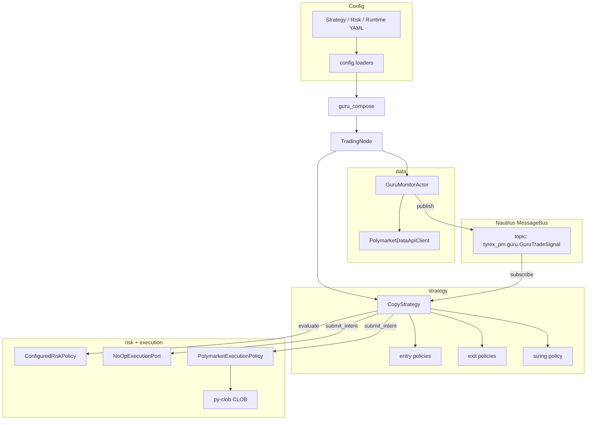

# Tyrex_PM — architecture overview

Grounded in the current codebase (`src/tyrex_pm/`). For day-to-day runbooks, see [OPERATIONS.md](OPERATIONS.md). For YAML field tables, see [CONFIG_MODEL.md](CONFIG_MODEL.md).

**Per-module detail:** [modules/README.md](modules/README.md).

---

## A. Project purpose

**What Tyrex_PM is:** a Python package for **Polymarket** automation, organized around **NautilusTrader** patterns (actors, strategies, message bus) while keeping **venue I/O** and **risk** in explicit layers.

**Current v1 scope:** a **guru-follow copy** path — poll a wallet’s trades from the public Data API, turn them into internal signals, size them, run **fail-closed risk**, and either **log-only shadow** execution or **live CLOB** orders via `py-clob-client`.

**Implemented now:**

- Incremental **Data API** polling (`GET /activity`, `type=TRADE`) + watermark + optional dedup + `GuruTradeSignal` publication (`data/guru_monitor.py`, `data/guru_watermark.py`).
- Entry / exit / sizing policies (`signal/`).
- `CopyStrategy` orchestration (`strategy/copy_strategy.py`).
- Typed YAML split: strategy / risk / runtime (`config/loaders.py`).
- `ConfiguredRiskPolicy` (`risk/configured.py`).
- `NoOpExecutionPort` vs `PolymarketExecutionPolicy` (`execution/`).
- `scripts/run_guru.py` + `runtime/guru_compose.py` wiring into `TradingNode`.

**Intentionally not in scope yet (as of this codebase):**

- Guru **discovery / ranking / analytics** (keep separate; do not fold into the live copy path).
- Full **Nautilus-native Polymarket execution client** (kernel runs with empty `data_clients` / `exec_clients`; CLOB is app-level today).
- **Position-synced** risk (exposure uses session assumptions after live submit, not venue positions).
- Rich **reporting** and **indicators** packages (placeholders only).

---

## B. Architectural principles

| Principle | What it means here |
|-----------|-------------------|
| **Modularity** | Packages under `src/tyrex_pm/*` with small public surfaces (`__init__.py` exports where useful). |
| **Separation of concerns** | Strategy orchestrates; `signal/` is pure policy; `data/` owns external read I/O; `risk/` and `execution/` own gates and venue translation. |
| **Shadow → live continuity** | Same `CopyStrategy`, same `OrderIntent`, same composition; only **`execution_mode`** and the **`ExecutionPort`** implementation change. |
| **Strategy / risk / execution** | Strategy calls `RiskPolicy.evaluate` then `ExecutionPort.submit_intent` — it does **not** embed limit formulas, kill-switch rules, or `py-clob` calls. |
| **Secrets vs config** | `.env` (or env vars) for keys; YAML for non-secrets — see [CONFIG_MODEL.md](CONFIG_MODEL.md). |
| **Data / strategy / runtime split** | **Data** publishes facts; **strategy** decides; **runtime** wires Nautilus + policies + config loaders. |
| **Fail-closed risk** | Missing price, over limit, or kill switch → reject with stable `ReasonCode` strings (`core/reason_codes.py`). |

---

## C. High-level module map

| Module path | Role |
|-------------|------|
| **core** | Shared types (`GuruTradeSignal`, `OrderIntent`), `ReasonCode`, legacy app YAML helpers, logging bits. |
| **config** | Typed settings dataclasses + YAML loaders for **strategy / risk / runtime** (no secrets). |
| **data** | Market helpers (allowlist, resolution, book check), Data API HTTP client, guru parse/dedup, **`GuruMonitorActor`**. |
| **signal** | Reusable decision + sizing logic **without** Nautilus or HTTP. |
| **risk** | `RiskPolicy` protocol, `ShadowAllPassRisk` (tests), `ConfiguredRiskPolicy` (operations). |
| **execution** | `ExecutionPort` protocol, `NoOpExecutionPort`, `PolymarketExecutionPolicy`. |
| **strategy** | Nautilus `Strategy` subclasses: `BaseComposableStrategy`, **`CopyStrategy`**. |
| **runtime** | `build_guru_trading_node`, `build_clob_client_from_env`, older `live_stub`. |
| **reporting** | Placeholder for future run reports. |

`indicator/` exists as a stub; see [modules/indicator/README.md](modules/indicator/README.md).

---

## D. Module interaction diagram



Live path only: after a successful CLOB submit, `PolymarketExecutionPolicy` calls `ConfiguredRiskPolicy.note_fill_assumption` (session exposure).

**ASCII (same idea):**

```
  [YAML] -> loaders -> guru_compose -> TradingNode
                              |-> GuruMonitorActor --(bus)--> CopyStrategy
                              |                               |-> signal policies
                              |                               |-> RiskPolicy
                              |                               |-> ExecutionPort
                              +-> (shadow: NoOp)   (live: PolymarketExecutionPolicy -> CLOB)
```

---

## E. Runtime flow (`scripts/run_guru.py`)

1. **CLI** parses `--strategy-conf`, `--risk-conf`, `--live-conf`.
2. **Env:** `python-dotenv` loads repo `.env` or `TYREX_PM_DOTENV` (does not replace shell overrides).
3. **Config:** `load_strategy_settings`, `load_risk_settings`, `load_runtime_settings` validate and return dataclasses.
4. **Composition:** `build_guru_trading_node(strategy, risk, runtime)`:
   - Builds `TradingNodeConfig` (`trader_id`, `LoggingConfig`, empty data/exec clients).
   - Instantiates `GuruMonitorActor` (wallet, poll interval, dedup path, Data API URL).
   - Instantiates `CopyStrategy` with allowlist + `copy_scale` + `execution_mode` from runtime.
   - Injects `ConfiguredRiskPolicy` and either `NoOpExecutionPort` (**shadow**) or `PolymarketExecutionPolicy` (**live**, with `on_submit_ok` for exposure note).
   - Registers **actor** and **strategy** on the trader **before** `build()`.
5. **Lifecycle:** `node.build()` then `node.run()` — Nautilus starts clocks; actor `on_start` runs first poll + timer; strategy subscribes to guru topic.
6. **Signal flow:** each poll fetches **recent** `TRADE` activity after the stored watermark; rows newer than the watermark emit `GuruTradeSignal` (dedup as safety net) on the bus → `CopyStrategy._on_guru_trade` → …
7. **Logs:** structured `event=` lines (`guru_signal_emitted`, `guru_poll_error` on transient API faults, `copy_skip`, `shadow_order_intent` / `live_order_intent`). Operators: [OPERATIONS.md](OPERATIONS.md).

---

## F. Shadow vs live

| Aspect | Shared | Shadow only | Live only |
|--------|--------|-------------|-----------|
| **`CopyStrategy`** | Same code path | — | — |
| **`OrderIntent`** | Always built the same way | — | — |
| **`ConfiguredRiskPolicy`** | Same checks | — | — |
| **`ExecutionPort`** | Interface | **`NoOpExecutionPort`** (records / no I/O) | **`PolymarketExecutionPolicy`** |
| **Mode flag** | `CopyStrategyConfig.execution_mode` mirrors runtime | `"shadow"` | `"live"` |
| **CLOB / keys** | — | Not used | `.env` + `build_clob_client_from_env(runtime)` |
| **Exposure note** | — | `note_fill_assumption` not called | Called after successful submit |

**Why:** operators validate behavior in **shadow** without order-side risk; flipping **`execution_mode`** swaps only the execution adapter — no strategy rewrite.

---

## G. Limitations and extension points

| Area | Current state | Sensible extension |
|------|---------------|-------------------|
| **Guru input** | Single wallet, **recent `/activity` polling** + watermark file | Full history belongs in **analytics / guru-finder**, not `GuruMonitorActor`. |
| **Risk exposure** | Session estimate from fills | Wire Nautilus portfolio or CLOB positions into `RiskPolicy` or a cache the policy reads. |
| **Execution** | Sync `create_and_post_order` | Queue + worker, cancel/replace, idempotency keys — stay behind `ExecutionPort`. |
| **Nautilus venues** | Empty `exec_clients` | Optional Polymarket adapter if you want first-class `Order` events in the kernel. |
| **New strategies** | `CopyStrategy` only | New `Strategy` + policies in `signal/`; reuse risk/execution ports. |
| **Guru finder** | Not in repo | Separate service or package that **outputs** wallets / lists — does not replace the **`run_guru`** pipeline. |
| **Reporting** | Stub | Consume logs or internal events; avoid coupling to `CopyStrategy` internals. |

---

## Where to read next

1. **[modules/README.md](modules/README.md)** — index of per-module docs.
2. **[modules/strategy/README.md](modules/strategy/README.md)** — copy flow detail.
3. **[DEVELOPMENT.md](DEVELOPMENT.md)** — tests, conventions.
4. **[OPERATIONS.md](OPERATIONS.md)** — run and safety.
