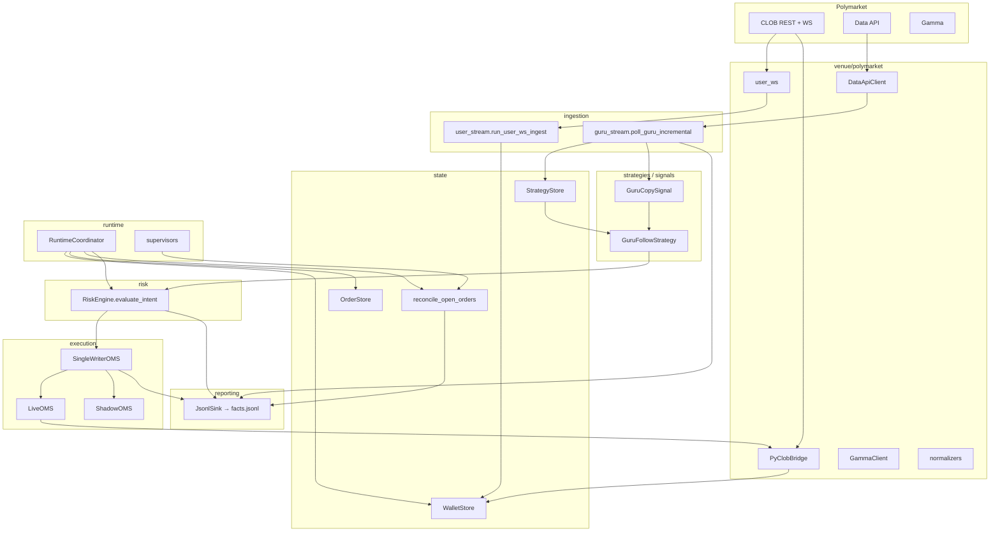

# Architecture

**Hub:** [README.md](README.md) · **Live truth:** [LIVE_ARCHITECTURE.md](LIVE_ARCHITECTURE.md) · **Modules:** [modules/README.md](modules/README.md)

---

## 1. What Tyrex_PM is

A modular Polymarket trading stack composed of:

- a small **runtime** (`runtime.app`, supervisors, coordinator),
- **venue adapters** for Polymarket (CLOB REST, user/market WS, Gamma, Data API),
- **explicit state stores** (`WalletStore`, `OrderStore`, `StrategyStore`),
- **thin strategies** that emit `Intent`s,
- a **fail-closed `RiskEngine`** that produces `RiskDecision`s,
- a **single-writer OMS** (shadow or live) for submit/cancel,
- a **structured reporting** layer (`facts.jsonl` per run).

NautilusTrader is **not** the runtime spine; the bot owns its own bus, state machines, and reconcile.

---

## 2. Core principles

| Principle | What it means in code |
|-----------|------------------------|
| **One writer per wallet** | `SingleWriterOMS` serializes `submit`/`cancel` onto one queue (`execution/oms.py`). |
| **Strategies never touch the venue** | `GuruFollowStrategy` consumes a normalized `GuruCopySignal` and returns `Intent`s. No HTTP/WS. |
| **Separated state** | `WalletStore` (venue truth: positions, balance, open orders), `OrderStore` (local OMS with provisional repair), `StrategyStore` (guru watermark + dedup). |
| **Fast path vs slow path** | User WS is primary live truth; REST `/data/orders`, `/balance-allowance`, `/positions` are bootstrap + repair backstop. |
| **Venue truth vs local truth** | See [LIVE_ARCHITECTURE.md](LIVE_ARCHITECTURE.md) for reconcile state machines (provisional repair, venue adoption, WS-terminal tombstones). |
| **Fail-closed risk** | `RiskEngine.evaluate_intent` returns a `RiskDecision` with a stable `reason_code`. Missing prices, stale wallet, drift, missing capital all deny. |
| **Reporting is first-class** | Every decision emits a fact to `facts.jsonl` keyed by `run_id` + `correlation_id`. |
| **Quantized USD evidence** | `risk/evidence_format.py` standardizes 6-decimal USD strings in facts so reports are diff-friendly. |

---

## 3. Runtime diagram



Component owners (one writer each): `runtime.app` wires everything; `RuntimeCoordinator` holds shared state; supervisors (heartbeat, venue refresh, provisional repair, user-WS staleness) are the only producers of their respective truth deltas.

---

## 4. Three engines

1. **Data engine** — `ingestion/*` + `venue/polymarket/*` turn Polymarket feeds into normalized `GuruTradeSignal`, `OpenOrderView`, `WalletPosition`, and `TradeFillRecord` records that flow into `state/*` stores.
2. **Trading engine** — `execution/oms.py` (`SingleWriterOMS`) serializes submit/cancel onto one queue; `LiveOMS`/`ShadowOMS` are pluggable backends; `execution/order_lifecycle.py` owns provisional → confirmed → terminal transitions.
3. **Strategy / risk engine** — `signals/*` and `strategies/*` produce `Intent`s; `risk/engine.py` evaluates them through a fixed gate sequence and emits `RiskDecision`s.

---

## 5. Package map (`src/tyrex_pm/`)

| Package | Role | Key files |
|---------|------|-----------|
| **core** | Shared dataclasses, ids, enums, time, errors, reason codes. | `models.py`, `enums.py`, `ids.py`, `reason_codes.py`, `events.py`, `bus.py` |
| **venue/polymarket** | Pure I/O adapter. CLOB bridge, REST clients (Gamma, Data API), WS, normalizers, auth, heartbeat. | `clob_bridge.py`, `clob_wallet_sync.py`, `clob_heartbeat.py`, `gamma_client.py`, `data_api_client.py`, `user_ws.py`, `market_ws.py`, `normalizers.py`, `auth.py`, `clob_env.py`, `positions_sync.py` |
| **state** | Internal truth: stores + reconcile. | `wallet_store.py`, `order_store.py`, `market_store.py`, `strategy_store.py`, `reconcile.py`, `shadow_wallet.py` |
| **ingestion** | Long-lived inputs and watermark-driven guru polling. | `guru_stream.py`, `user_stream.py`, `market_stream.py`, `historical_backfill.py` |
| **signals** | Reusable signal building blocks (no HTTP). | `base.py`, `guru_copy_signal.py` |
| **strategies** | Composition only — filters + sizing + exits → intents. | `base.py`, `guru_follow/{strategy,filters,sizing,exits}.py` |
| **risk** | Fail-closed `RiskEngine` + per-policy modules. | `engine.py`, `pretrade.py`, `deployment.py`, `capital.py`, `inventory.py`, `concurrency.py`, `health.py`, `kill_switch.py`, `venue_min_size.py`, `in_flight.py`, `evidence_format.py` |
| **execution** | OMS, order builder, lifecycle, cancel manager, slippage / liquidity guards. | `oms.py`, `live_oms.py`, `adapters.py`, `order_builder.py`, `order_lifecycle.py`, `cancel_manager.py`, `router.py`, `slippage.py`, `liquidity_guard.py` |
| **runtime** | App entrypoint, config loading, coordinator, supervisors, modes. | `app.py`, `config.py`, `coordinator.py`, `pipeline.py`, `live_supervisor.py`, `supervisors.py`, `health_runtime.py`, `healthchecks.py`, `live_attest.py`, `risk_contexts.py`, `dependency_graph.py`, `modes.py` |
| **reporting** | Facts schema + sinks + summarizer. | `facts.py`, `schema_v2.py`, `oms_payload.py`, `summarize.py`, `sinks/jsonl.py` |

Per-module READMEs live under [modules/](modules/README.md).

---

## 6. Canonical data model (`core/models.py`)

```python
GuruTradeSignal(guru_wallet, token_id, side, size, price, notional_usd,
                dedup_key, ts_venue, raw_ref, conviction_score)

EnterIntent(token_id, side, size, limit_price, order_style, intent_id)
ExitIntent(...)        # SELL of an existing position
ReduceIntent(...)      # partial close
CancelIntent(venue_order_id, client_order_id, intent_id)
Intent = EnterIntent | ExitIntent | ReduceIntent | CancelIntent

ApprovedIntent(intent, client_order_id, run_id)
ApprovedCancel(venue_order_id, client_order_id, run_id, intent_id)

RiskDecision(approved: bool,
             reason_codes: tuple[str, ...],
             approved_intent: ApprovedIntent | None,
             detail: str | None,
             approved_cancel: ApprovedCancel | None,
             extensions: dict | None)   # operator-visible evidence

WalletPosition(token_id, qty, avg_price_usd)
OpenOrderView(token_id, side, remaining_size, limit_price,
              client_order_id, venue_order_id,
              original_size, size_matched,
              venue_state_source, order_status)
TradeFillRecord(token_id, side, size, price, status, ts_utc, source)

RiskContext(execution_mode, wallet_positions, open_orders,
            usdc_balance, usdc_allowance, last_wallet_sync_ts,
            mark_prices, kill_switch, health_ok, heartbeat_ok,
            clob_session_ok, in_flight_order_count,
            orders_in_flight_by_token, reconcile_drift,
            venue_truth_stale, in_flight_buy_reservations,
            # V2-native additions:
            first_v2_sync_complete,   # gates new-order risk eval until first venue truth rebuild
            market_info)              # {token_id: MarketInfo} per-market venue truth (tick, mos, neg-risk, fee, outcomes)
```

`RiskContext` is built by `RuntimeCoordinator.build_risk_context(app)` on every signal, so risk always sees the freshest store snapshot.

---

## 7. The `RiskEngine` gate sequence

`risk/engine.py::evaluate_intent` runs a deterministic ordered sequence (any failure returns immediately):

1. **Kill switch** — `kill_switch.check_kill_switch`.
2. **Cancel intents** — short-circuit; need `venue_order_id` or `client_order_id`.
3. **Concurrency** — `concurrency.check_concurrency` (max in-flight).
4. **Aggressive readiness** — wallet sync freshness, heartbeat, user WS, reconcile drift, plus the V2 first-sync gate `bootstrap_not_complete` (denies new-order intents in live mode until the first successful `refresh_wallet_from_clob` flips `HealthRuntime.first_v2_sync_complete`) — see `health.check_aggressive_readiness`.
5. **Notional** — min/max with `cap` or `deny` policy (`pretrade.apply_notional_min_max`). Always attaches the in-flight reservation totals to the decision.
6. **Deployment caps** — token + portfolio USD caps, including in-flight BUY reservations and mark requirement (`deployment.evaluate_deployment_caps`).
7. **Capital (BUY only)** — Polymarket USD balance + allowance net of in-flight reservations (`capital.evaluate_capital_buy`).
8. **Inventory (SELL/Reduce)** — venue position required when configured (`inventory.check_inventory_sell`).
9. **Venue minimum size** — venue's hard `min_order_size` (sourced from `MarketInfoCache` via `RiskContext.market_info` when live, falling back to `cfg.default_min_size` for shadow mode and tests); `deny` or `bump` (then re-validate gates 6 + 7) (`venue_min_size.evaluate_venue_min_size`). Evidence row records `venue_min_size_source = "venue" | "config_default"`.

Approved intents get a fresh `ClientOrderId` and become `ApprovedIntent`. The decision's `extensions` field carries operator-visible evidence (notional policy, deployment numbers, in-flight reservations, capital math, venue-min-size policy) and is merged into the `risk_decision` fact.

See [modules/risk/README.md](modules/risk/README.md) for per-policy detail.

---

## 8. Execution model

| Mode | Backend | Side effects |
|------|---------|--------------|
| **shadow** | `ShadowOMS` returns `"shadow_ack"`/`"shadow_cancel_ack"` immediately. | A synthetic fill is applied to `WalletStore` (`apply_local_shadow_fill=True`) so downstream risk sees the new position. |
| **live** | `LiveOMS` wraps `PyClobBridge` (sync `py-clob-client-v2.create_and_post_order` run on a thread). | Real submit; positions/balance update via user-WS + REST refresh loop; no synthetic fill. |

Both backends are wrapped by `SingleWriterOMS` so submits and cancels never overlap for the same wallet.

After a successful live ack the pipeline calls `refresh_wallet_coordinated_after_live_submit` to pull venue open orders one or two times, smoothing the REST-vs-WS race so the next signal sees the new resting order.

---

## 9. State stores

| Store | Owns | Mutated by |
|-------|------|------------|
| **WalletStore** | venue positions, USDC balance + allowance, merged `open_orders` (user WS primary, REST backstop), `_ws_cancel_tombstones`, `trade_fill_records`, `last_sync_ts`, `last_positions_sync_ts`. | `clob_wallet_sync.refresh_wallet_from_clob`, `positions_sync.refresh_positions_from_data_api`, `user_stream._apply_order_event`, `shadow_wallet.apply_*`. |
| **OrderStore** | local `LocalOrder` rows (`provisional` → `venue_confirmed`), `in_flight_by_token`, `pending_repair_fingerprints`, `terminal_audit`. | `execution.order_lifecycle.{register_submit,ack_submit,release_after_ack,apply_venue_open_order_to_local_orders,remove_local_resting_by_venue_order_id,sync_local_open_orders_from_venue_wallet}`. |
| **MarketStateStore** | order books / trades scaffolding (when market WS is enabled). | `ingestion.market_stream`. |
| **StrategyStore** | `guru_watermark` + `guru_seen_dedup` set. | `ingestion.guru_stream.ingest_guru_signals`. |

`reconcile.reconcile_open_orders(wallet, orders, **kw)` is the single function that compares local vs venue truth and produces a `ReconcileResult` with `drift_flags`, `blocking_drift_flags`, and `reconcile_severity`. The result drives `HealthRuntime.apply_reconcile` (which gates new orders) and is emitted as a `reconcile` fact (deduped by signature so unchanged states don't flood the log).

Full state-machine details: [LIVE_ARCHITECTURE.md](LIVE_ARCHITECTURE.md).

---

## 10. Reporting model

Every run writes to `var/reporting/runs/<run_id_or_name>/`:

```
manifest.json     # run_id, schema_version, git_sha, execution_mode, run_kind
facts.jsonl       # one fact per line; see reporting_fact_model.md
run_summary.json  # iteration counts, last guru_poll
```

Facts are deduped where it makes operational sense:
- `reconcile` facts are suppressed when the operator-relevant state tuple is unchanged (`pipeline._reconcile_signature`).
- `wallet_sync` facts are suppressed when balance/allowance/positions/open-order counts/marks are unchanged (timestamps are intentionally **excluded** from the dedup signature — see `pipeline._wallet_sync_signature`).

USD figures in evidence are quantized to 6 decimal places (`risk/evidence_format.py::s_usd`) so diffs across runs are stable.

Catalog: [reporting_fact_model.md](reporting_fact_model.md).

---

## 11. Configuration model (summary)

YAML files live under `config/` and merge in this order (later overrides earlier):

```
config/risk/default.yaml
config/runtime/default.yaml
config/strategies/<strategy>.yaml      # via --strategy
config/scenarios/<scenario>.yaml       # via --scenario (deep-merged into risk / runtime / strategy)
```

Secrets are **never** in YAML; they live in `.env` and are loaded by `runtime.app._maybe_load_dotenv` when `python-dotenv` is installed.

Authoritative reference: [CONFIG_MODEL.md](CONFIG_MODEL.md).

---

## 12. Where to read next

- **How risk decides:** [modules/risk/README.md](modules/risk/README.md)
- **Why a fact appeared (or didn't):** [reporting_fact_model.md](reporting_fact_model.md)
- **Why a venue order appeared "unmatched":** [LIVE_ARCHITECTURE.md](LIVE_ARCHITECTURE.md) §3 (reconcile)
- **How to add a new strategy:** [developer_guide.md](developer_guide.md) §4
- **How to run live for the first time:** [OPERATIONS.md](OPERATIONS.md)
