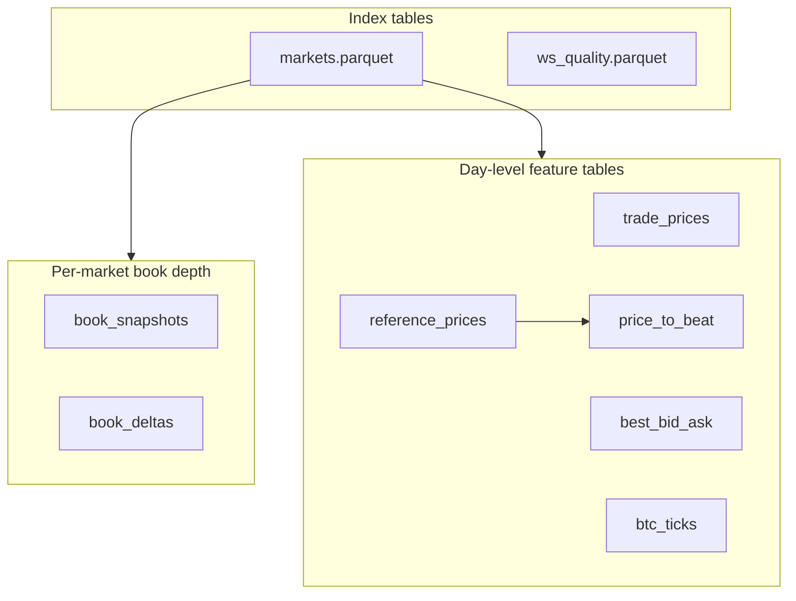

# Tyrex_PM Data Lake (M2B.3)

## Purpose

The data lake is a **derived, regenerable** layer built from immutable raw recordings:

```text
var/recordings/<YYYY-MM-DD>/   ← immutable archive (JSONL / JSONL.zst)
var/parquet/date=<YYYY-MM-DD>/ ← analysis-ready Parquet tables
```

M2B.3 does **not**:

- compute strategy features (M2B.6)
- label survival cases (M2B.7)
- replay strategy code (M2B.5)
- change live runtime behavior

## Import boundary

```text
research/ may import src/tyrex_pm/*
src/tyrex_pm/** must NEVER import research.*
```

Live trading, record mode, and strategy code do not depend on pandas/pyarrow.

Install optional deps:

```bash
pip install 'tyrex-pm[research]'
```

## Input layout

```text
var/recordings/<YYYY-MM-DD>/
  heartbeat.json
  coverage_report.json
  btc_5m_YYYYMMDD_HHMM/
    manifest.json
    events-00001.jsonl[.zst]
    # PM events: book_snapshot, book_delta, last_trade_price, best_bid_ask,
    # tick_size_change, market_resolved, price_to_beat_observed (when RTDS enabled)
  external/btc_binance/                    # when external_btc.enabled
    manifest.json
    events-00001.jsonl[.zst]
  external/polymarket_rtds_chainlink/      # when reference_prices.enabled (M2B.3-A)
    manifest.json
    events-00001.jsonl[.zst]
```

Rich recorder scenario (PM + Binance + RTDS Chainlink):

```bash
python -m tyrex_pm.runtime.app record --scenario config/scenarios/record_btc5m_rich.yaml
```

Requires `pip install 'tyrex-pm[record]' 'tyrex-pm[live]'`. RTDS reference ticks land in
`external/polymarket_rtds_chainlink/`; the normalizer picks them up automatically when that
directory exists (no extra CLI flag).

## CLI

```bash
python -m research.normalize.run \
  --recordings var/recordings/2026-07-05 \
  --out var/parquet \
  --include-external-btc \
  --overwrite
```

| Flag | Description |
|------|-------------|
| `--recordings` | Day folder or recordings root |
| `--out` | Parquet root (e.g. `var/parquet`) |
| `--date` | `YYYY-MM-DD` when `--recordings` is a root |
| `--market-id` | Normalize one market only |
| `--include-external-btc` | Include `external/btc_binance/` |
| `--strict` | Fail on corrupt JSONL rows |
| `--overwrite` | Replace existing Parquet output |

RTDS Chainlink (`external/polymarket_rtds_chainlink/`) is included automatically when present.

## Output layout

```text
var/parquet/date=YYYY-MM-DD/
  markets.parquet
  ws_quality.parquet
  lifecycle_events.parquet
  btc_ticks.parquet
  clock_sync.parquet
  normalize_summary.json
  market_id=<market_id>/
    book_snapshots.parquet
    book_deltas.parquet
```

### M2B.3-A tables (data completeness)

| Table | Source events |
|-------|----------------|
| `trade_prices.parquet` | `last_trade_price` |
| `tick_size_changes.parquet` | `tick_size_change` |
| `best_bid_ask.parquet` | `best_bid_ask` |
| `market_resolutions.parquet` | `market_resolved` |
| `reference_prices.parquet` | `reference_price_tick` (RTDS Chainlink) |
| `price_to_beat.parquet` | `price_to_beat_observed` (derived at record time) |

`markets.parquet` enriched with `price_to_beat`, `final_reference_price`, `winning_outcome`, event-type counts.

See [`polymarket_data_coverage.md`](Implementation/phase2b_data_backbone/polymarket_data_coverage.md) for provider audit.

## Folder structure

Example partition: `var/parquet/date=2026-07-05/`

```text
var/parquet/date=2026-07-05/
├── normalize_summary.json          ← run stats (row counts, quality)
│
├── markets.parquet                 ← INDEX: one row per market (metadata + PTB summary)
├── ws_quality.parquet              ← INDEX: per-market data quality scorecard
│
├── market_id=btc_5m_20260705_1700/   ← PER-MARKET book depth (large, partitioned)
│   ├── book_snapshots.parquet
│   └── book_deltas.parquet
├── market_id=btc_5m_20260705_1705/
│   ├── ...
│   └── ...
│   ... (one folder per recorded market)
│
├── trade_prices.parquet            ← DAY-LEVEL feature tables (all markets combined)
├── best_bid_ask.parquet
├── tick_size_changes.parquet
├── market_resolutions.parquet
├── price_to_beat.parquet
├── reference_prices.parquet
├── lifecycle_events.parquet
├── btc_ticks.parquet               ← EXTERNAL (Binance, not per-market)
└── clock_sync.parquet
```

Three layers:

```text
INDEX          → markets.parquet, ws_quality.parquet
PER-MARKET     → market_id=*/book_snapshots, book_deltas  (order-book depth)
DAY-LEVEL      → trade_prices, best_bid_ask, price_to_beat, reference_prices, btc_ticks, …
```



### Day-level tables (root of the partition)

#### `markets.parquet` — market index

One row per BTC 5m market. **Start here** for joins.

| What it holds | Why it matters |
|---------------|----------------|
| `market_id`, `event_slug`, token IDs | Identity |
| `event_start_ts`, `event_end_ts` | 5-minute window boundaries |
| `price_to_beat`, `final_reference_price`, `direction_vs_price_to_beat` | Derived from RTDS Chainlink at start/end |
| `trade_price_count`, `best_bid_ask_count`, `book_snapshot_count` | Event counts per type |
| `coverage_status`, `dropped_events` | Recording health |

Join key: `market_id`

#### `reference_prices.parquet` — Chainlink BTC/USD

RTDS Chainlink ticks, **global** (not per PM market).

| Column | Meaning |
|--------|---------|
| `value` | BTC/USD price |
| `source_ts` | When Chainlink recorded it |
| `recv_ts` | When the recorder received it |
| `latency_ms` | Network/processing delay |
| `feed` | `chainlink` when using `record_btc5m_rich.yaml` |

**Role:** External reference price stream. Feeds price-to-beat derivation.

Recorded from Polymarket RTDS (`wss://ws-live-data.polymarket.com`, topic
`crypto_prices_chainlink`, filter `{"symbol":"btc/usd"}`). Subscription must use
`"type": "*"` (not `msg_type`). On connect, RTDS may send a historical snapshot
(`type: "subscribe"`, `payload.data[]`); each row becomes one tick. The recorder
filters to the configured feed topic only (`chainlink` → `crypto_prices_chainlink`).

#### `price_to_beat.parquet` — boundary prices

Typically two rows per market: one at **start** (`observed`), one at **end** (`complete`).

| Column | Meaning |
|--------|---------|
| `price_to_beat` | Chainlink BTC price at market open (first tick ≥ `event_start_ts`) |
| `final_reference_price` | Chainlink price at market close |
| `direction_vs_price_to_beat` | `up` / `down` / `flat` (final vs open) |
| `status` | `observed`, `complete`, or `missing` |

**Role:** Links BTC spot movement to each 5m market outcome. Not official Gamma settlement — derived from RTDS Chainlink reference ticks.

#### `trade_prices.parquet` — PM trade prints

Every `last_trade_price` WS event across all markets.

| Column | Meaning |
|--------|---------|
| `market_id`, `token_id` | Which leg (YES/NO) |
| `price`, `size`, `side` | Trade details |
| `recv_ts`, `source_ts` | Timing |

**Role:** Actual traded prices on Polymarket — useful for fill simulation, momentum, volume.

#### `best_bid_ask.parquet` — top-of-book quotes

Live best bid/ask from PM WS (`custom_feature_enabled: true` on subscribe).

| Column | Meaning |
|--------|---------|
| `best_bid`, `best_ask`, `spread` | Top of book per token |
| `market_id`, `token_id` | Which market/leg |

**Role:** Spread, mid-price proxy, liquidity — lighter than full book.

#### `btc_ticks.parquet` — Binance BTCUSDT

Direct Binance WS (`bookTicker` + `aggTrade`), independent of RTDS.

| Column | Meaning |
|--------|---------|
| `bid`, `ask`, `mid` | bookTicker |
| `price`, `quantity` | aggTrade |
| `stream` | `bookTicker` or `aggTrade` |

**Role:** High-frequency external BTC for lead/lag vs Chainlink and PM prices.

#### `clock_sync.parquet` — clock alignment

Periodic Binance time sync events.

**Role:** Measure clock drift between the recorder host and Binance.

#### `lifecycle_events.parquet` — non-book PM events

Mostly `ws_seq_gap`. Also `market_discovered`, `new_market`, etc.

**Role:** Debugging, gap analysis, discovery audit. Very large — filter by `event_type` when analyzing.

#### `ws_quality.parquet` — per-market quality

| Column | Meaning |
|--------|---------|
| `gap_rate` | Fraction of events that are sequence gaps |
| `recording_duration_s` | How long that market was recorded |
| `max_staleness_s` | Worst recv − source delay |
| `status` | `recorded` / `partial` / etc. |

**Role:** Decide which markets are analysis-ready.

#### Smaller tables

| Table | Role |
|-------|------|
| `tick_size_changes.parquet` | PM tick-size changes near resolution prices |
| `market_resolutions.parquet` | `market_resolved` WS events (when emitted) |
| `normalize_summary.json` | Row counts and quality totals for the normalize run |

### Per-market folders: `market_id=btc_5m_YYYYMMDD_HHMM/`

One folder per recorded market. Naming: `btc_5m_YYYYMMDD_HHMM` where `HHMM` is the **market start time** (UTC).

Each folder contains **only order-book depth** — the heaviest data, kept separate so one market can be loaded at a time.

#### `book_snapshots.parquet`

Full order book snapshots from PM WS. One row **per price level** per snapshot.

| Feature | Explanation |
|---------|-------------|
| `token_id`, `side` | YES or NO token, BUY/SELL side |
| `bid_price`, `bid_size`, `ask_price`, `ask_size` | Individual level |
| `best_bid`, `best_ask`, `mid`, `spread` | Top-of-book summary |
| `book_hash`, `venue_cursor` | Sequence / dedup |
| `raw_json` | Full original payload |

#### `book_deltas.parquet`

Incremental book changes (`price_change` events). One row per level change.

| Feature | Explanation |
|---------|-------------|
| `price`, `size`, `side` | Changed level |
| `change_type` | How the delta was encoded |

Most sessions are snapshot-heavy; delta volume varies by market and WS behavior.

### How tables relate (for M2B.4 analysis)

```text
reference_prices (global BTC)
        │
        ▼
price_to_beat ──► markets.parquet ◄── ws_quality
        │                │
        │                ├──► market_id=*/book_snapshots  (depth)
        │                ├──► market_id=*/book_deltas     (updates)
        │                │
        ├── trade_prices (prints)
        ├── best_bid_ask (quotes)
        └── btc_ticks    (Binance, parallel timeline)
```

Typical analysis join:

1. Pick markets from `markets.parquet` where `price_to_beat` is not null
2. Filter `trade_prices` / `best_bid_ask` by `market_id`
3. Align timestamps with `reference_prices` or `btc_ticks`
4. Load `book_snapshots` only for markets that need microstructure

## Tables and columns

### `markets` (one row per Polymarket market)

| Column | Type | Notes |
|--------|------|-------|
| date | string | Partition date |
| market_id | string | e.g. `btc_5m_20260703_1935` |
| event_slug | string | From `market_discovered` |
| yes_token_id / no_token_id | string | From manifest |
| recording_started_ts / recording_ended_ts | string | ISO-8601 |
| event_start_ts / event_end_ts | string | From discovery payload |
| event_count | int | Parsed events |
| segment_count | int | Manifest segments |
| compressed | bool | zstd segments |
| dropped_events | int | From manifest |
| coverage_status | string | recorded / partial / skipped / missing |
| coverage_pct | float | From coverage_report |
| first_recv_ts / last_recv_ts | string | Event stream bounds |
| book_snapshot_count / book_delta_count | int | Event type counts |
| ws_seq_gap_count | int | Gap events |
| market_discovered_count | int | |
| max_staleness_s | float | recv − source max |
| duplicate_event_count | int | Duplicate event_id skipped |
| corrupt_row_count | int | Unparseable rows |
| source_manifest_path | string | Path to manifest.json |
| price_to_beat | string | First Chainlink tick at/after `event_start_ts` (M2B.3-A) |
| price_to_beat_ts | string | Timestamp of PTB tick |
| price_to_beat_source | string | `polymarket_rtds_chainlink` |
| price_to_beat_lag_ms | float | PTB tick lag vs `event_start_ts` |
| final_reference_price | string | Chainlink tick at/after `event_end_ts` |
| final_reference_price_ts | string | Timestamp of final reference tick |
| direction_vs_price_to_beat | string | `up` / `down` / `flat` |
| trade_price_count | int | `last_trade_price` events |
| best_bid_ask_count | int | `best_bid_ask` events |
| tick_size_change_count | int | `tick_size_change` events |
| market_resolved_count | int | `market_resolved` events |
| winning_outcome | string | From `market_resolved` when emitted |

### `book_snapshots`

One row per bid/ask level in each `book_snapshot` event.

| Column | Notes |
|--------|-------|
| side | BUY / SELL |
| bid_price, bid_size, ask_price, ask_size | Level fields |
| best_bid, best_ask, mid, spread | Top-of-book summary |
| book_hash, venue_cursor | Sequence metadata |
| raw_json | Full event payload JSON |

### `book_deltas`

One row per change in each `book_delta` (`price_changes[]` or `changes[]`).

| Column | Notes |
|--------|-------|
| side, price, size | Delta level |
| best_bid, best_ask, mid, spread | When present on change |
| change_type | `price_change` or `changes` |
| raw_json | Full payload |

### `ws_quality`

Per-market quality scorecard.

| Column | Notes |
|--------|-------|
| gap_rate | ws_seq_gap_count / event_count |
| max_inter_event_gap_s | Largest recv_ts gap |
| max_staleness_s | Largest recv − source |
| recording_duration_s | last − first recv |
| status | recorded / partial / skipped / corrupt |

### `btc_ticks`

From `external_btc_tick` events.

| Column | Notes |
|--------|-------|
| source, symbol, stream | e.g. binance / BTCUSDT / bookTicker |
| bid, ask, mid | bookTicker |
| price, quantity, trade_id | aggTrade |
| raw_json | Full payload |

### `clock_sync`

From `clock_sync` events.

| Column | Notes |
|--------|-------|
| latency_ms | recv − source when source_ts known; null otherwise |
| raw_json | Full payload |

### `lifecycle_events`

Non-book Polymarket lifecycle events (`market_discovered`, `ws_seq_gap`, etc.).

| Column | Notes |
|--------|-------|
| source | `polymarket` |
| event_type | Canonical EventType value |
| payload_json | Full payload JSON |

### `reference_prices` (M2B.3-A)

From `reference_price_tick` events in `external/polymarket_rtds_chainlink/`.

| Column | Notes |
|--------|-------|
| source | `polymarket_rtds` |
| feed | `chainlink` when using rich scenario |
| symbol | `btc/usd` |
| value | BTC/USD price (string, decimal-safe) |
| source_ts / recv_ts | Chainlink time vs local receive time |
| latency_ms | recv − source when source_ts known |
| raw_json | Full payload including original RTDS message |

### `price_to_beat` (M2B.3-A)

From `price_to_beat_observed` events (derived at record time from Chainlink ticks).

| Column | Notes |
|--------|-------|
| market_id | BTC 5m market |
| event_start_ts / event_end_ts | Market window (epoch seconds) |
| price_to_beat | Chainlink value at open boundary |
| price_to_beat_ts | Timestamp of open-boundary tick |
| price_to_beat_source | `polymarket_rtds_chainlink` |
| price_to_beat_lag_ms | ms after `event_start_ts` |
| status | `observed`, `complete`, or `missing` |
| final_reference_price | Chainlink value at close boundary |
| final_reference_price_ts | Timestamp of close-boundary tick |
| final_reference_lag_ms | ms after `event_end_ts` |
| direction_vs_price_to_beat | `up` / `down` / `flat` |
| raw_json | Full payload |

### `trade_prices` (M2B.3-A)

From `last_trade_price` PM WS events.

| Column | Notes |
|--------|-------|
| market_id, token_id | Market and YES/NO leg |
| price, size, side | Trade print |
| fee_rate_bps, transaction_hash | When present on payload |
| raw_json | Full payload |

### `best_bid_ask` (M2B.3-A)

From `best_bid_ask` PM WS events (requires `custom_feature_enabled: true`).

| Column | Notes |
|--------|-------|
| market_id, token_id | Market and leg |
| best_bid, best_ask, spread | Top of book |
| raw_json | Full payload |

### `tick_size_changes` (M2B.3-A)

From `tick_size_change` PM WS events.

| Column | Notes |
|--------|-------|
| market_id, token_id | Market and leg |
| old_tick_size, new_tick_size | Tick size transition |
| raw_json | Full payload |

### `market_resolutions` (M2B.3-A)

From `market_resolved` PM WS events.

| Column | Notes |
|--------|-------|
| market_id | Resolved market |
| winning_outcome | Outcome when emitted |
| raw_json | Full payload |

## Quality metrics

Combined from manifest, coverage_report, and parsed event stream:

- `coverage_pct`, `gap_count`, `gap_rate`
- `dropped_events`, `duplicate_event_count`, `corrupt_row_count`
- `first_recv_ts`, `last_recv_ts`
- `max_inter_event_gap_s`, `max_staleness_s`, `recording_duration_s`

`normalize_summary.json` also reports M2B.3-A row counts: `reference_price_rows`,
`price_to_beat_rows`, `trade_price_rows`, `best_bid_ask_rows`, `tick_size_change_rows`,
`market_resolution_rows`.

## Regeneration

Raw JSONL is never modified. To rebuild Parquet:

```bash
rm -rf var/parquet/date=2026-07-03   # or use --overwrite
python -m research.normalize.run --recordings var/recordings/2026-07-03 --out var/parquet --overwrite --include-external-btc
```

## Reading Parquet files

Hive-style directories (`date=YYYY-MM-DD/`) contain multiple table files. Read a **specific** file path (not the partition directory) to avoid pyarrow dataset merge errors:

```python
import pandas as pd
df = pd.read_parquet("var/parquet/date=2026-07-03/markets.parquet")
```

Or: `pyarrow.parquet.ParquetFile(path).read()`.

## Known limitations

- Book tables explode levels/changes; one event may produce multiple rows.
- `bookTicker` external ticks have null `source_event_ts`; clock_sync latency may be null until aggTrade arrives.
- **`price_to_beat` is derived** from the first RTDS Chainlink tick at/after `event_start_ts`; it is not the live Gamma `eventMetadata.priceToBeat` field. Gamma post-settlement backfill is deferred.
- **`price_to_beat` status = `missing`** when the recorder starts after a market's `event_start_ts` (no boundary tick available). Filter on non-null `price_to_beat` in `markets.parquet` for analysis.
- **`market_resolutions.parquet` may be empty** if no `market_resolved` WS events were emitted during the session.
- **`lifecycle_events.parquet` is dominated by `ws_seq_gap`** diagnostic events; high `gap_rate` in `ws_quality` does not imply dropped data if `dropped_events = 0`.
- RTDS historical snapshot on subscribe creates multiple `reference_price_tick` rows in quick succession; event IDs are deterministic per tick.
- Do not treat `direction_vs_price_to_beat` or `final_reference_price` as official settlement without independent validation.
- Full-day acceptance pending until 24h recording artifact is available.

### RTDS recording fix (M2B.3-A, 2026-07-05)

An earlier recorder build sent `"msg_type"` instead of `"type"` in the RTDS subscription payload, producing zero Chainlink ticks and `missing` price-to-beat for all markets. Fixed in `build_reference_price_subscription()`. Recordings made before the fix will normalize correctly but retain `missing` PTB unless re-recorded.
