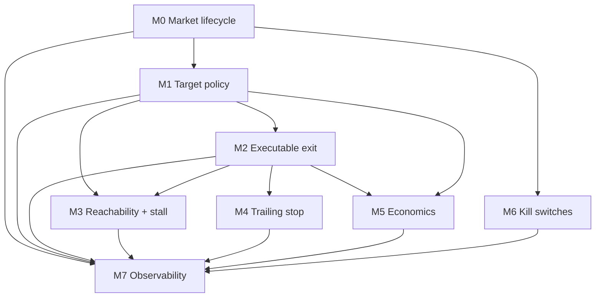

# Phase 1 — Milestones index

**Design source:** [phase1.md](phase1.md)  
**Status:** Wave C — COMPLETE · Wave D — COMPLETE · Post-Wave-D hardening — COMPLETE — see [Implementation Waves](#implementation-waves--validation-gates) and [phase1_validation_protocol.md](phase1_validation_protocol.md)

### Wave C → Wave D carry-forward

- Pre-entry economics hook is not wired yet; optional/future unless Wave D adds advisory-only entry facts.
- Enforce-mode OMS dispatch is intentionally not wired.
- `survivor_executable_exit_evaluated`: Wave D uses **Option A** — emit once per material survivor advisory tick (deduped by `snapshot_id`); validator also accepts executable evidence embedded in reachability/stall/trailing/economics facts when the dedicated fact is absent (legacy replay).

### Post-Wave-D advisory hardening

- `scripts/preflight_phase1_live_scenario.py` rejects placeholder metadata and `shadow_test_market`.
- Resolution survivor exits without OMS sell emit dedicated accounting facts; PnL marked `resolution_cashflow_missing` when payout unknown.
- `stop_background_tasks_after_strategy_done` reduces post-DONE WS/heartbeat noise.
- Survival periodic facts deduped via `survival.observability.min_emit_interval_s` (default 5s).

---

## Implementation Waves / Validation Gates

Milestones are grouped into waves that can be implemented and validated together **before** any major live test.

**Rule:** Do not run live until Waves A–D pass their non-live validation gates.

First live run must use **advisory-only** survival (`enforcement_mode: advisory` on all survival modules). After live advisory validation, enable enforce modes **one at a time only** — never all enforce flags together.

### Wave A — Runtime foundation, no survival behavior

**Includes:**

- M0 — Market-aware strategy lifecycle runtime
- Early M7: lifecycle fact constants, lifecycle fact emitters, Phase 2 regression test harness

**Purpose:** Fix premature `max_runtime` force-flatten while keeping survival behavior disabled.

**Validation gate:** unit tests, runtime integration tests, Phase 2 regression tests — **no live run**

**Exit criteria:**

- With `event_end_ts` known, open survivor is not force-flattened only because old `max_runtime_s` elapsed.
- With `survival.enabled: false`, Phase 2 lifecycle behavior remains unchanged.
- Unknown `event_end_ts` uses fallback runtime and emits warning fact.
- Pre-close flatten uses existing reduce-only shutdown path.

### Wave B — Survival core primitives, no enforcement

**Includes:** M1, M2, early M7 (survival fact constants, shared evidence payload builder)

**Purpose:** Survival package, ledger-based targets, executable liquidity evidence — before advisory/enforce logic.

**Validation gate:** target-policy unit tests, executable-exit unit tests, `survival.enabled: false` regression — **no live run**

**Exit criteria:**

- Ledger target math; impossible/unrealistic classification; full recovery not automatic after loser exit.
- `SurvivalExitPlanner` provides executable evidence; touch bid not authoritative when `survival.enabled: true`.
- With `survival.enabled: false`, old repricing/monitor unchanged.

### Wave C — Advisory survival intelligence, offline validation

**Includes:** M3, M4, M5, M7 replay/advisory summary pieces

**Purpose:** Advisory-only survival modules emit facts and replay summaries before behavior change.

**Validation gate:** M3/M4/M5 unit tests, advisory integration test, offline replay on live1/live3/live5 — **no live run yet**

**Exit criteria:**

- Advisory emits facts only; no extra OMS submit.
- Stall catches no-progress; trailing does not arm on touch/stale/wide/thin book.
- Economics uses ledger + executable estimate; replay summary shows what survival would advise.

### Wave D — Safety controls and final pre-live validation

**Includes:** M6, M7 final validator, replay script, scenario overlay, live protocol

**Validation gate:** full unit + integration suite (69 tests Wave A–D subset), Phase 2 regression, replay smoke, validator tests — **no live until operator protocol**

**Protocol:** [phase1_validation_protocol.md](phase1_validation_protocol.md)

**Exit criteria:**

- Kill switches deny entry; flatten uses reduce-only path; no hard cancel-all.
- `PHASE1_RUNTIME_PREMATURE_EXIT` and `PHASE1_SURVIVAL_PASS` classifications exist.
- `live_paired_binary_phase1_tiny.yaml` exists with advisory-only survival.

### First major live gate (advisory-only config)

```yaml
survival:
  enabled: true
  reachability:
    enforcement_mode: advisory
  stall_exit:
    enforcement_mode: advisory
  trailing_stop:
    enforcement_mode: advisory
  economics:
    enforcement_mode: advisory

runtime:
  strategy_lifecycle:
    mode: market_aware
    exit_clock_source: event_end_ts
    max_runtime_s: null
```

---

## Milestone order

| Order | ID | Document | Title |
|------:|----|----------|-------|
| 0 | M0 | [milestone_0_market_lifecycle.md](milestone_0_market_lifecycle.md) | Market-aware strategy lifecycle runtime |
| 1 | M1 | [milestone_1_survival_models_and_target_policy.md](milestone_1_survival_models_and_target_policy.md) | Survival models and ledger-based target policy |
| 2 | M2 | [milestone_2_executable_exit_adapter.md](milestone_2_executable_exit_adapter.md) | Depth-aware executable survival exit adapter |
| 3 | M3 | [milestone_3_reachability_and_stall.md](milestone_3_reachability_and_stall.md) | Reachability and stall / no-progress detection |
| 4 | M4 | [milestone_4_trailing_stop.md](milestone_4_trailing_stop.md) | Survivor trailing stop |
| 5 | M5 | [milestone_5_economics_gate.md](milestone_5_economics_gate.md) | Fee/slippage-aware economics gate |
| 6 | M6 | [milestone_6_kill_switches.md](milestone_6_kill_switches.md) | Kill switches |
| 7 | M7 | [milestone_7_observability_validation_and_live_protocol.md](milestone_7_observability_validation_and_live_protocol.md) | Observability, validator, replay, live protocol |

---

## Dependency graph



```text
M0 blocks everything (mandatory foundation).
M1 needs survival skeleton (can stub config with enabled:false before M1 merges).
M2 should land before enforcing M3 or M4.
M3 advisory can run after M1 + M2.
M4 depends on M2 (and M0 for near-close disable).
M5 depends on M1 + M2.
M6 stub early OK; force-flatten only after M0 stable.
M7 evolves throughout; final validator/live protocol after M0–M6.
```

---

## Blocking vs parallel work

| Milestone | Blocking? | Can parallel with |
|-----------|-----------|-------------------|
| **M0** | **Yes — blocks all** | None (start here) |
| M1 | Blocks M3/M5 target integration | M0 in progress only after lifecycle API stubbed |
| M2 | Blocks M3/M4 **enforce** | M1 unit tests (pure policy) |
| M3 | No (advisory) | M4, M5 after M2 |
| M4 | No (advisory) | M5 |
| M5 | No | M6 stubs |
| M6 | No for stubs; flatten needs M0 | M5 |
| M7 | Final gate only | Incremental fact/schema work from M0 onward |

---

## Advisory-only at first

These milestones ship with **`enforcement_mode: advisory`** (or `survival.enabled: false` globally) until replay + tiny-live pass:

| Module | Config key | Enforce allowed after |
|--------|------------|------------------------|
| Reachability | `survival.reachability.enforcement_mode` | M7 replay live3/live5 |
| Stall exit | `survival.stall_exit.enforcement_mode` | M7 replay |
| Trailing stop | `survival.trailing_stop.enforcement_mode` | M7 tiny-live |
| Economics | `survival.economics.enforcement_mode` | M7 tiny-live |
| Target policy dynamic | implicit via reachability/stall | Same as reachability |

**M0 lifecycle** is not advisory — it changes loop behavior when `strategy_lifecycle` config is present. Use back-compat default (absent block = old tick budget) until scenarios opt in.

**M2** is infrastructure — required before any survival module treats touch bid as authoritative.

---

## When enforcement is allowed

```text
1. M0 merged + tests green (including Phase 2 regression with survival disabled).
2. M1–M2 merged; ledger targets + executable adapter available.
3. M3–M5 running advisory in tiny-live; facts match replay expectations.
4. M7 replay on live1/live3/live5 shows advisory would improve outcomes without regression.
5. **Fill/PnL reconciliation:** no unresolved authoritative-fill discrepancy; `pnl_status: final` on validator output (or manual reconciliation documented via `scripts/reconcile_run_cashflows.py`).
6. Enable enforce ONE module at a time in live_paired_binary_phase1_tiny.yaml.
7. Re-run tiny-live + validator after each enforce toggle.
```

Never enable all enforce flags simultaneously on first live slice.

---

## Global constraints (all milestones)

```text
Do not reopen Phase 2 unless a real safety issue is found.
Do not add external BTC / Chainlink / OBI / volatility signals.
Do not add ML-based alpha.
Do not optimize for positive EV yet.
Do not scale capital.
Do not remove Phase 2 safety gates.
Do not create a giant monitor.py patch.
Do not change Phase 2 behavior when survival.enabled: false.
```

---

## Recommended first implementation milestone

**Start with [Milestone 0 — Market-aware strategy lifecycle runtime](milestone_0_market_lifecycle.md).**

Rationale: fixes live3/live5 premature max_runtime exit; unblocks correct survivor hold time for all downstream modules; includes Phase 2 regression test requirement.

---

## Traceability to phase1.md

| phase1.md section | Milestone |
|-------------------|-----------|
| §5 Phase 1.0 foundation | M0 |
| §6 Phase 1.1 target policy | M1 |
| §6 Phase 1.4 depth-aware exit | M2 |
| §6 Phase 1.3 reachability | M3 |
| §6 Phase 1.3b stall | M3 |
| §6 Phase 1.2 trailing stop | M4 |
| §6 Phase 1.5 economics | M5 |
| §6 Phase 1.6 kill switches | M6 |
| §11–13 facts, tests, acceptance | M7 |
| §5.8 entry vs exposure precedence | M0 (gating), M3–M6 (survival exits) |
| §7 executable liquidity | M2, enforced in M3–M5 |
| §11 config rollout | M1, M7 scenario |
