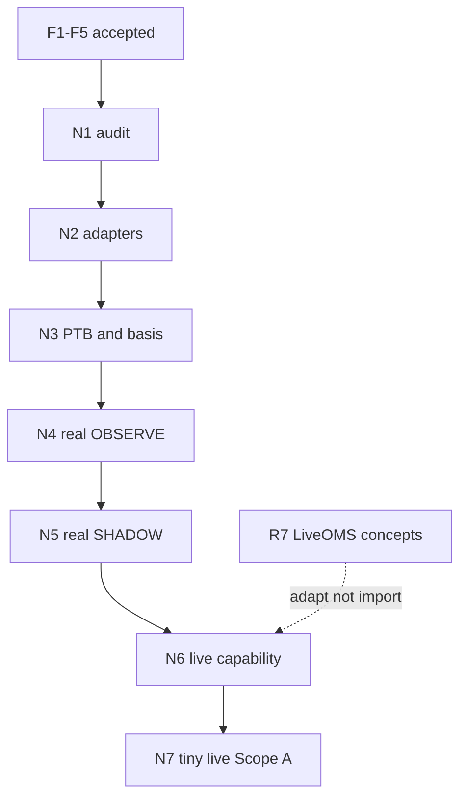

# Implementation evidence

Chronological phase reports, incidents, live-validation evidence, and acceptance notes.

**Current accepted checkpoint:** R8 — see [r8_framework_acceptance.md](r8_framework_acceptance.md).  
**Current how-to docs:** [`../latest/`](../latest/README.md).  
**Z-Gap decision path:** F1–F5 accepted (fixture OBSERVE/SHADOW + resolution shadow).  
**Next production-readiness track:** **N1–N7** (folders below).

Key anchors:

| Document | Role |
|----------|------|
| [r8_framework_acceptance.md](r8_framework_acceptance.md) | Framework acceptance matrix |
| [r7_successful_live_acceptance.md](r7_successful_live_acceptance.md) | Third live success evidence |
| [r7f_operator_runbook.md](r7f_operator_runbook.md) | Closed R7 runbook |
| [r7_exit_floor_policy.md](r7_exit_floor_policy.md) | Exit-floor formulas |
| [r7b_first_live_incident.md](r7b_first_live_incident.md) | Live 1 — settlement race |
| [r7d2_second_live_incident.md](r7d2_second_live_incident.md) | Live 2 — wrong SELL price |

### Z-Gap P0 design baseline (pre-implementation)

| Document | Role |
|----------|------|
| [z0_z_gap_design_audit.md](z0_z_gap_design_audit.md) | Legacy Phase A evidence audit (what was implemented) |
| [z0_z_gap_full_strategy_spectrum.md](z0_z_gap_full_strategy_spectrum.md) | Accepted full economic strategy (corrections A–F) |
| [z_gap_full_strategy_implementation_plan.md](z_gap_full_strategy_implementation_plan.md) | Architecture + F1–F5 implementation preparation |

### Z-Gap implementation milestones (accepted)

| Document | Role |
|----------|------|
| [f1_generic_strategy_contracts.md](f1_generic_strategy_contracts.md) | F1 — neutral `StrategyDecision` / `IntentLike` / protocol |
| [f2_z_gap_model_and_policies.md](f2_z_gap_model_and_policies.md) | F2 — PTB/time/indicators/valuations/policies (pure) |
| [f3_z_gap_observe.md](f3_z_gap_observe.md) | F3 — fixture OBSERVE wiring (no OMS) |
| [f4_z_gap_shadow_lifecycle.md](f4_z_gap_shadow_lifecycle.md) | F4 — fixture SHADOW entry/exit lifecycle |
| [f5_z_gap_resolution_shadow.md](f5_z_gap_resolution_shadow.md) | F5 — resolution-aware fixture SHADOW |

P0–F5 documents remain in place; do not move or rename them as part of N1–N7 planning.

---

## Z-Gap production readiness — N1–N7

Authoritative milestone plans live in dedicated folders (one `README.md` each):

| Milestone | Folder | Role |
|-----------|--------|------|
| **N1** | [n1_source_and_legacy_audit/](n1_source_and_legacy_audit/) | Evidence audit: PTB/Chainlink, latency, discovery, `old/` keep-adapt-reject |
| **N2** | [n2_real_data_adapters/](n2_real_data_adapters/) | Real read-only adapters (RTDS, Binance, CLOB, time sync) |
| **N3** | [n3_ptb_and_reference_alignment/](n3_ptb_and_reference_alignment/) | PTB lifecycle + Chainlink/Binance basis alignment |
| **N4** | [n4_real_observe/](n4_real_observe/) | Real-input OBSERVE (no OMS); one-run + continuous |
| **N5** | [n5_real_data_shadow/](n5_real_data_shadow/) | Real-input SHADOW (ShadowOMS); labeled simulation |
| **N6** | [n6_live_execution_and_reconciliation/](n6_live_execution_and_reconciliation/) | Generic live OMS + recon design (Scope A/B); not Z-Gap money |
| **N7** | [n7_tiny_operator_live/](n7_tiny_operator_live/) | Operator-gated tiny live one-shot (Scope A) |

### Mode ladder (do not collapse)

| Mode | Inputs | Execution | Economics labels | Money |
|------|--------|-----------|------------------|-------|
| Fixture OBSERVE (F3) | Fixtures | None | counterfactual / estimated | No |
| Fixture SHADOW (F4/F5) | Fixtures | ShadowOMS | `simulated_shadow` / estimated | No |
| Real-input OBSERVE (N4) | Live public feeds | None | counterfactual / estimated | No |
| Real-input SHADOW (N5) | Live public feeds | ShadowOMS | `simulated_shadow` / estimated | No |
| Tiny live (N7, Scope A) | Live feeds + auth | LiveOMS | confirmed fills when known | Yes (tiny) |
| Later production live | TBD | LiveOMS (+ Scope B if built) | confirmed + redeem if any | Yes (separate acceptance) |

### Concise roadmap

```text
N1  Source & legacy audit (evidence only)
 └► N2  Real read-only adapters
      └► N3  PTB capture + reference alignment
           └► N4  Real-input OBSERVE (engineering sample)
                └► N5  Real-input SHADOW (simulated execution)
                     └► N6  Generic live execution + reconciliation (no Z-Gap enable)
                          └► N7  Tiny operator-controlled live (Scope A, one-shot)
```

### Critical path and dependencies



| Blocks | Dependency |
|--------|------------|
| N2 coding | N1 frozen source recommendations |
| N3 lock/entry policy | N1 boundary + confirmation semantics |
| N4 product OBSERVE | N2 + N3 |
| N5 | N4 engineering acceptance |
| N6 implementation | N5 + generic reuse of execution stack |
| N7 money | N1–N6 evidence + operator go/no-go |

### Safe parallel work

| Parallelizable | Constraint |
|----------------|------------|
| N1 browser/PTB proof vs latency capture scripts | Both read-only; freeze jointly before N2 |
| Adapter normalize fixtures vs TimeAuthority design | After N1 provisional sources known |
| N6 design detailing vs N4/N5 implementation | N6 **code** should not enable Z-Gap live before N5 |
| Calibration notebook sketches vs N4 facts | Non-blocking research |
| Docs/runbook drafts for N7 | No credentials, no mutate flags on |

### Decision gates

| Gate | Must freeze before |
|------|--------------------|
| Boundary sampling + PTB confirmation source | N3 implementation complete |
| Direct Binance vs RTDS Binance for \(S\) | N2 primary wiring |
| Max skew / basis freshness | N3 gates |
| Real OBSERVE sample size | N4 acceptance |
| SHADOW fill assumptions | N5 acceptance |
| Live Scope A vs B | N6/N7 (recommend A) |
| Order type + tiny caps + one-shot workflow | N7 |
| Deployment / clock sync | N4 continuous + N7 |
| Resolution finality / redeem ownership | Scope B only (after N7 A) |

### Technical live-readiness gates (blocking)

- Correct market identity and token map  
- PTB/display (or attestation) agreement; lock immutability  
- Dual-reference basis fail-closed; Binance ≠ Chainlink truth  
- Feed freshness + TimeAuthority READY  
- Sealed epochs; no mixed windows  
- UNKNOWN inventory → block + recon  
- Execution truth from fills/balances, not submitted price  
- Restart/recon recovery  
- Kill switch + ack timeout + ambiguous-order stop  
- Operator opt-in; mutations default OFF  
- Post-trade recon clean  

### Profitability / calibration (intentionally non-blocking)

Useful from N4+ facts; **not** required to start N7 Scope A:

- Fair-value calibration / Brier  
- Entry threshold / vol half-life tuning  
- Basis behavior studies  
- Entry timing, rich/thesis/time exit performance  
- Hold-vs-sell comparisons (needs Scope B or sim)  
- Actual vs estimated slip/fees (needs live fills)  
- Performance by exit family / regime  
- Missed / counterfactual opportunities  

### Recommended commit boundary per milestone

| Milestone | Commit theme |
|-----------|--------------|
| N1 | `Audit Z-Gap PTB sources, latency, discovery, and legacy reuse` |
| N2 | `Add read-only RTDS, dual-reference, and time-sync adapters` |
| N3 | `Align PTB capture and Chainlink/Binance reference basis` |
| N4 | `Wire real-input Z-Gap OBSERVE with window rollover` |
| N5 | `Run Z-Gap SHADOW on real inputs with labeled simulated execution` |
| N6 | `Add generic live OMS composition and reconciliation for strategies` |
| N7 | `Add operator-gated tiny Z-Gap live one-shot (Scope A)` |

### Frozen architectural principles (N1–N7)

1. Strategy owns economic decisions and intents.  
2. Framework owns data/state, risk, plans, OMS, fills, Portfolio, lifecycle, persistence, reconciliation, reporting, operations.  
3. Keep `ZGapStrategy` thin.  
4. Real providers enter through reusable ports/adapters.  
5. No provider-specific network access inside strategy or valuation code.  
6. No Z-Gap-specific branching in generic runtime, RiskEngine, planner, OMS, Portfolio, or lifecycle.  
7. OBSERVE and SHADOW use the same sealed decision path.  
8. One-run and continuous-run modes use the same adapters and contracts; only orchestration differs.  
9. Atomic epochs and window identities remain mandatory.  
10. UNKNOWN inventory or conflicting state must block action and trigger reconciliation.  
11. Do not use submitted order price as execution truth.  
12. Do not use Binance as official Chainlink or resolution truth.  
13. No imports from `old/`, `runtime/r7*`, or `config/r7/`.  
14. R7 operational concepts may be selectively reimplemented; R7 must not become a Z-Gap dependency.  
15. Live capability must remain explicitly operator enabled and fail-closed.  

### Recommended architecture defaults (provisional until N1/N3 freeze)

| Topic | Recommendation |
|-------|----------------|
| Settlement reference feed | Polymarket RTDS `crypto_prices_chainlink` / `btc/usd` |
| Trading reference \(S\) | Direct Binance Spot WebSocket |
| RTDS Binance | Comparison / fallback only |
| PTB hot path | Structured RTDS (+ attestation); HTML secondary only |
| Basis | \(b_t=\ln(C_t/B_t)\); \(\hat{C}_t=B_t e^{b}\) — never raw \(B\) vs \(K\) |
| First live | **Scope A** (no resolution hold, no redeem) |
| Caps | ~$5 fee-inclusive BUY; one position; one-shot |

### Consolidated open decisions

| # | Decision | Why it matters | Decide by | Provisional default |
|---|----------|----------------|-----------|---------------------|
| 1 | Exact Chainlink boundary sampling semantics | Wrong \(K\) invalidates model | End N1 / before N3 done | First RTDS tick with `source_ts ≥ event_start` within max lag — **unproven until N1** |
| 2 | PTB confirmation source | Live entry gate | End N1 | Display agreement and/or dual-source bps; structured preferred |
| 3 | Direct Binance vs Polymarket-proxied Binance | Latency / basis quality | End N1 | Direct Binance primary |
| 4 | Max Chainlink/Binance timestamp skew | Pairing validity | N1 measure → N3 | Open — do not invent |
| 5 | Basis drift/freshness thresholds | Entry/validity gates | N3 (tune later) | Wire config; start from legacy-order magnitudes, label provisional |
| 6 | Required real OBSERVE engineering sample | N4 acceptance bound | N4 start | **5** consecutive windows |
| 7 | SHADOW fill assumptions | Honesty of N5 PnL | N5 start | Latency + slip ticks; no queue model |
| 8 | Initial live Scope A vs B | Redeem/finality burden | Before N6 impl / N7 | **Scope A** |
| 9 | Initial order type / marketable limit | Fill semantics | N6 | FAK-style marketable limit (R7-validated family) |
| 10 | Tiny per-order / per-window / daily limits | Risk | Before N7 run | $5 order; 1 pos/window; daily loss TBD numeric freeze |
| 11 | Live one-shot operator workflow | Safety ceremony | N7 | Explicit opt-in; preflight; post recon; disable after |
| 12 | Deployment location and clock sync | τ / boundary lag | N4 continuous + N7 | Stable host; SNTP+cross-check READY |
| 13 | Resolution finality and redemption ownership | Scope B only | Before any Scope B live | Framework settlement/redeem ports; strategy never redeems |

Unresolved items above are **not** accepted decisions. Assumptions are labeled provisional.

---

All files in this directory are preserved as historical evidence (plus the P0 design baseline, F1–F5 milestone reports, and N1–N7 planning folders above).
