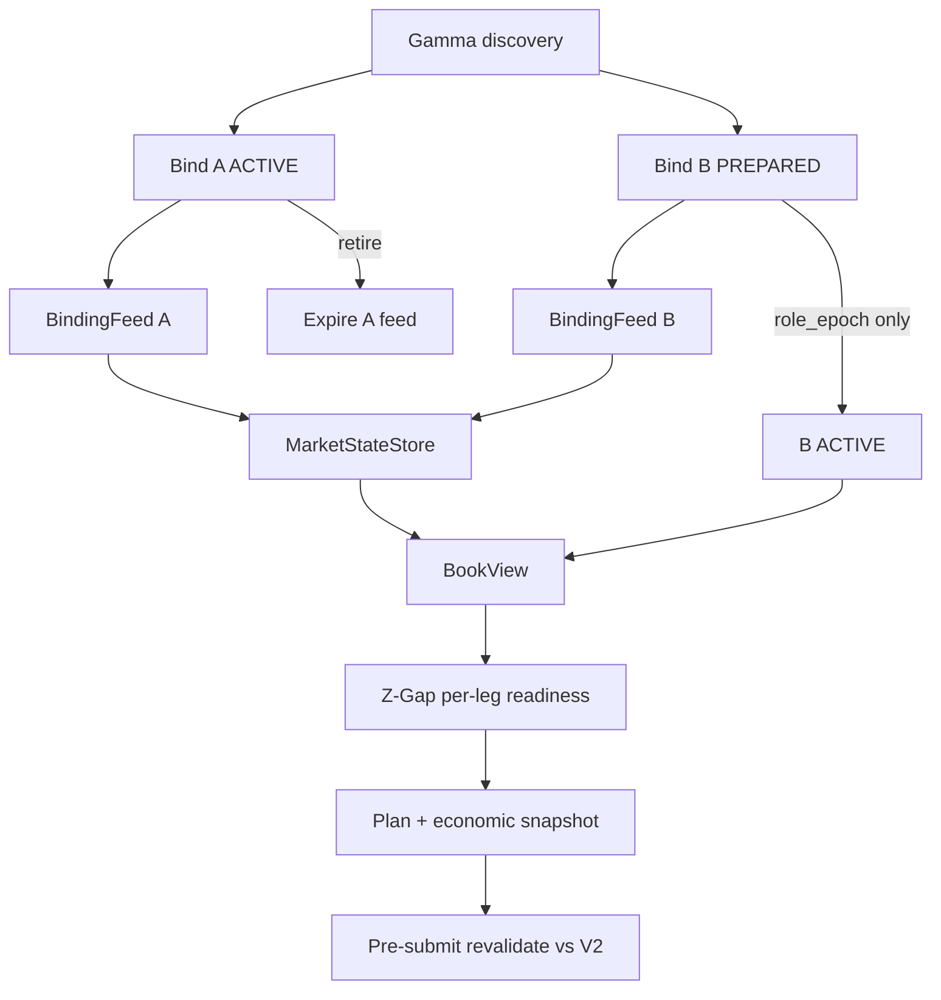

# Book-state architecture — implementation plan

**Status:** planning only (not authorized for code changes)  
**Plan date:** 2026-07-29  
**Revised:** 2026-07-29 (PASS_WITH_REQUIRED_REVISIONS applied)  
**Filename note:** `impelmentation_plan.md` spelling is intentional (task request).

```text
Prior review verdict: PASS_WITH_REQUIRED_REVISIONS
IMPLEMENTATION_READINESS = READY
```

---

## Revision Decision Record

Corrections adopted from architectural review (all applied throughout this document; contradictory prior language removed):

| ID | Correction adopted |
|----|--------------------|
| R1 | Four distinct identities: `binding_id`, `role_epoch`, `connection_epoch`, `book_version`. Promotion changes role only; does not invalidate warm books. |
| R2 | Default feed topology = binding-scoped feeds (ACTIVE + PREPARED_NEXT). Union/dynamic membership is not the default. |
| R3 | REST/WS sync barrier state machine with buffering before snapshot apply; local `book_version` primary; venue hash diagnostic only. |
| R4 | Book-version change triggers revalidation, not automatic reject. Hard invalidators listed explicitly. |
| R5 | Separate sync health, connection liveness, and per-side liquidity/depth. No global `BOOK_EXPLICITLY_EMPTY` sync state. |
| R6 | Single runtime quote path: Store → BookView → strategy. No dual session mirrors / permanent `use_store_books` fallback. |
| R7 | Task order: contracts → store/view → REST → supervisor → host switch → full WS sync → warm lifecycle → reasons/reporting → revalidation → SHADOW → tiny-LIVE gate. |
| R8 | Rollover: promote correct market identity even if book not ready; block trading; continue recovery; retire expired feed events. |
| R9 | Preserve per-leg Z-Gap policy: one eligible leg can suffice; BookView exposes per-leg readiness. |

### Points deliberately not adopted as defaults (with evidence)

| Topic | Decision | Evidence |
|-------|----------|----------|
| One physical WS with dynamic `operation: subscribe/unsubscribe` as default topology | **Not default.** Official docs document these frames (see §2 protocol sources, 2026-07-29). Current Tyrex adapter does **not** implement them (`PolymarketMarketWsAdapter` sends only initial `{assets_ids, type}`). No in-repo read-only harness proves membership updates across rollover without cold gap. Default remains two binding-scoped feeds. Optional later proof task may revisit. |
| Exact book-version equality at submit | **Rejected.** Continuous books would block nearly all orders (R4). |
| Requiring both UP and DOWN executable legs | **Rejected.** Existing `select_leg` evaluates whichever legs are ready (R9). |
| High-frequency REST polling (e.g. 500 ms) | **Rejected.** Official rate limits support bootstrap/recovery; WS is low-latency path. |
| Wholesale `old/` restore or second quote store | **Rejected.** Option C hybrid retained. |

---

## 1. Objective and success definition

### Operational problem

N7 LIVE composition (`run_live_zgap_compose`) can count thousands of Polymarket market-channel events while the sealed active session still exposes null UP/DOWN bids/asks to Z-Gap. Run `var/runs/z_gap/yaml_live_20260727T124621Z/` proved host-side unusable books (not venue emptiness): deltas discarded, `MarketStateStore` bypassed, no REST bootstrap, PREPARED_NEXT unwarmed, hard-coded freshness, `BOOK_NOT_READY` before edge math.

### Success definition

1. Exactly one authoritative reconstructed-book owner: token-keyed `MarketStateStore`.
2. REST = bootstrap / verification / recovery; WebSocket = low-latency continuous updates; sync barrier makes that combination safe.
3. ACTIVE and PREPARED_NEXT each have a binding-scoped feed; prepared books stay warm across promotion (`binding_id` unchanged).
4. Strategy reads only immutable `BookView` (per-leg readiness preserved).
5. Sync health ≠ connection liveness ≠ liquidity emptiness ≠ depth shortfall.
6. Eval→submit uses revalidation on version change, not exact-version equality.
7. Reporting separates received/decoded/matched/applied outcomes; persists token IDs.
8. No Z-Gap signal thresholds, PTB math, risk budgets, or OMS redesign.

---

## 2. Reviewed repository state

```text
Branch: rest_project
HEAD: 18235c84c99bb0066bcc5271bd761fb191b0548c
Dirty tree: yes (pre-existing unrelated workspace changes preserved)
Relevant run: var/runs/z_gap/yaml_live_20260727T124621Z/
Host evaluation cadence: EVAL_MIN_INTERVAL_S = 1.0 in live_zgap_compose.py
```

### Documents / code reviewed (revision pass)

Same paths as prior plan plus re-check of: `market_data/executable.py` (`ExecutableQuote`, `executable_vwap`), `strategies/z_gap/policies.select_leg`, `adapters/polymarket/ws_adapter.py` (library `ping_interval=20`, no application `PING`), `MarketStateStore`, N4/N7 compose quote path.

### Official protocol sources

Review date: **2026-07-29**. Protocol claims use only these sources:

| Topic | URL |
|-------|-----|
| Market WebSocket channel | https://docs.polymarket.com/market-data/websocket/market-channel |
| Realtime data | https://docs.polymarket.com/market-data/realtime-data |
| Market WSS API reference | https://docs.polymarket.com/api-reference/wss/market |
| Prices / order books (REST) | https://docs.polymarket.com/trading/orderbook |
| REST get order book | https://docs.polymarket.com/api-reference/market-data/get-order-book |
| Rate limits | https://docs.polymarket.com/api-reference/rate-limits |

**Documented facts (official):**

- Market WS: `wss://ws-subscriptions-clob.polymarket.com/ws/market`.
- Subscribe with `assets_ids` + `type: "market"`.
- Application heartbeat: send text `PING` every **10 seconds**; server replies `PONG`.
- Events: `book`, `price_change` (size `"0"` removes level), `last_trade_price`, `tick_size_change`; `best_bid_ask` / `new_market` / `market_resolved` with `custom_feature_enabled: true`.
- Docs also describe mid-connection `operation: subscribe|unsubscribe` frames — **documented**, not yet proven in Tyrex.
- REST: `GET /book?token_id=`; `POST /books` (≤500). Limits: `/book` 1500/10s; `/books` 500/10s.
- REST responses include levels, `hash`, `tick_size`, `min_order_size`, timestamps; normalize level order explicitly.

**Tyrex safety policies (not claimed as venue sequence guarantees):**

- No formal venue sequence number assumed.
- Venue `hash` = diagnostic / consistency signal unless transition semantics proven.
- Local monotonic `book_version` = primary correctness mechanism.
- Sync barrier buffering before accepting READY.

---

## 3. Current-state evidence

```text
YAML live → n7 → live_zgap_compose
→ Gamma ACTIVE + PREPARED_NEXT
→ MarketSession.up_*/down_* quote fields (second truth on N7)
→ WS adapter (ACTIVE tokens; websockets library ping, not app PING)
→ normalize → BookSnapshotReceived | BookDeltaReceived
→ on_book_snap → _apply_book(session tops)
→ on_book_delta → count only (discard)
→ prepare_aligned_eval → yes_quote from session
→ assemble → value_entry_leg → BOOK_NOT_READY if ask is None
```

**Earliest proven break:** `on_book_delta` discards payloads while incrementing `clob_book_events`; N7 bypasses `MarketStateStore`. ObserveHost already attaches the store — modes diverge.

July 27 wire mix / subscribed asset IDs remain historically unprovable from artifacts.

---

## 4. Architecture decision

### Options (unchanged selection)

| Option | Verdict |
|--------|---------|
| A — Restore `old/` wholesale | Reject: different runtime/facts; stub WS; conflicts with current contracts |
| B — Patch session tops / apply deltas into `MarketSession` | Reject: dual truth; no depth/recovery/atomic view/warm prepared |
| **C — Hybrid** | **Selected:** current lifecycle/OMS/reporting + shared store + old bootstrap/delta/recovery concepts + official protocol |

| Category | Items |
|----------|-------|
| Reuse | `BookSnapshot`/`BookLevel`; Option-B events; `DiscoveredMarketBinding`; `ExecutableQuote`/`executable_vwap`; ObserveHost freshness pattern; planner/OMS boundaries; `select_leg` one-leg policy |
| Extend | `MarketStateStore`; WS adapter (app PING, connection_epoch); normalize; new supervisor + BindingFeed; BookView; N4/N7 quote source; reasons/gates/reporting |
| Retire | N7 authoritative `_apply_book`; session quote ownership; aggregate-only success counter; hard-coded `_fresh(True)` on compose eval path |
| Do not copy | old coordinator, Jsonl fact taxonomy, shadow env flags, stub `market_ws.py` |
| Outside task | Z-Gap thresholds; PTB/FV math; risk budgets; OMS redesign; SDK migration; full reporting redesign |

---

## 5. Identity model (R1)

| Identity | Meaning | Changes when | Used for |
|----------|---------|--------------|----------|
| `binding_id` | Permanent identity of one discovered market + UP/DOWN token map | Never during that market’s life | Ownership, store asset membership, audit, plan token check |
| `role_epoch` | Assignment of a binding as PREPARED or ACTIVE | Role change / promote | Lifecycle role, which binding is strategy-active |
| `connection_epoch` | One WS connection/session for a BindingFeed | Reconnect / feed replace | Reject stale connection events |
| `book_version` | Local reconstructed-book revision (per token; pair view carries both) | Each successful snapshot apply or meaningful delta apply | Audit, revalidation trigger — **not** hard equality at submit |

Promotion:

```text
Binding B (PREPARED) → Binding B (ACTIVE)
same binding_id, same token IDs, same store books, same BindingFeed if healthy
role_epoch increments only
```

Promotion must **not** invalidate B’s books solely because role changed.

Suggested field mapping (adapt to project naming):

- `binding_id`: stable string from `condition_id` + window slug (or UUID assigned at discovery and persisted).
- `role_epoch`: integer on supervisor role table.
- `connection_epoch`: existing `ConnectionGeneration` / adapter generation, scoped per BindingFeed.
- `book_version`: monotonic int on `BookState` (and `pair_version` = tuple/hash of both legs’ versions at capture).

Store keys remain **outcome token `InstrumentId`**, indexed under owning `binding_id` for retirement filters.

---

## 6. Current-to-target mapping

| Concern | Current | Target | Action |
|---------|---------|--------|--------|
| Quote truth | N7 `MarketSession.up_*` or ObserveHost store | Store → BookView only | Unify |
| Delta apply | Discarded on N7 | Store apply | Wire |
| REST | Absent on N7 compose | Bootstrap/recovery via BindingFeed sync machine | New |
| Feeds | One adapter; promote rebuilds cold | Supervisor + BindingFeed ACTIVE + PREPARED | New |
| Promotion | New session null quotes | Same binding_id books remain | Fix lifecycle |
| Freshness | Hard-coded true | Monotonic local timing + sync/connection dimensions | Fix |
| Readiness | Collapsed BOOK_FEE_READY | Sync / liquidity / depth / fee separated; per-leg | Extend |
| Submit check | Synthetic `_book_from_session` | Revalidate vs current BookView | Extend |
| Token evidence | Missing in run | Persist before subscribe | Add |

---

## 7. Feed topology (R2)

### Default (required)

```text
BookFeedSupervisor
├── BindingFeed(binding_id=A, role=ACTIVE)
│   └── WS connection subscribed to A.UP + A.DOWN
│   └── REST bootstrap/resync for A
└── BindingFeed(binding_id=B, role=PREPARED_NEXT)
    └── WS connection subscribed to B.UP + B.DOWN
    └── REST bootstrap/resync for B
```

Rollover:

```text
B feed stays alive
→ role_epoch: B becomes ACTIVE, A becomes EXPIRED
→ strategy reads B’s already-warm store books
→ retire A feed/state; drop late A connection_epoch / binding_id events
→ discover C; create BindingFeed(C); warm to READY (or SYNCING)
```

Two public WS connections are acceptable. Prefer this over undocumented-in-Tyrex dynamic membership.

### Optional future (not VS, not default)

Official docs document:

```json
{"assets_ids":["..."], "operation":"subscribe"}
{"assets_ids":["..."], "operation":"unsubscribe"}
```

(https://docs.polymarket.com/market-data/websocket/market-channel, reviewed 2026-07-29).

A single-connection topology may be considered **only after** a dedicated read-only proof task documents: operation usage, membership evidence, failure/recovery, and measured cold-gap avoidance. Until then, implementers must not depend on it.

---

## 8. REST/WS synchronization barrier (R3)

Unsafe: `REST snapshot → later connect WS` (misses gap).

### Per-token / per-BindingFeed sync state machine

```text
UNINITIALIZED
→ WS_CONNECTING
→ WS_BUFFERING          # accept matching events into bounded buffer; do not apply to authoritative book yet
→ SNAPSHOT_ACQUIRING    # REST and/or wait for full WS `book`
→ RECONCILING           # apply snapshot; drain buffer under rules below
→ READY                 # only if reconciliation defensible
→ DESYNCED              # ambiguous ordering/hash/ts → resnapshot
```

(Also surface as store sync health: `UNINITIALIZED | SYNCING | READY | STALE | DESYNCED`.)

### Rules

| Topic | Rule |
|-------|------|
| Buffer start | When BindingFeed enters WS_BUFFERING (after socket up / subscribe ack path) |
| Buffer end | After successful RECONCILING → READY, or overflow/timeout → DESYNCED + clear |
| Buffer bound | Cap N events or max age (implementation chooses; default proposal: 2048 events or 5s — overflow ⇒ DESYNCED, REST resnapshot) |
| Apply gate | Only events with matching `binding_id` tokens and current `connection_epoch` |
| Snapshot apply | Complete replace of token book; bump `book_version`; record apply monotonic ts |
| Buffer drain | Apply buffered events only if they can be established as **not older than** the snapshot under local receive order and available source timestamps; if ambiguous → DESYNCED + new snapshot |
| No venue sequence | Do not invent one; prefer another authoritative snapshot when unsure |
| Venue hash | Diagnostic / optional equality check after REST vs WS book; hash mismatch alone may force DESYNCED resnapshot; hash is not a sequence |
| Stale REST | Capture `book_version` / apply monotonic at REST request start; if store advanced with newer authoritative applies from same recovery epoch, discard late REST unless forced recovery replace |
| Heartbeat | Application `PING` every 10s (official); treat missed `PONG`/disconnect as connection failure → new `connection_epoch` + resync machine |
| Quiet book | If sync=READY but data-age (monotonic time since last accepted apply or authoritative confirmation) exceeds threshold → STALE → verification REST or wait for confirming `book`/`price_change`; do not use wall-clock alone |

---

## 9. Multi-dimensional health (R5)

### Synchronization (per token)

`UNINITIALIZED | SYNCING | READY | STALE | DESYNCED`

### Connection (per BindingFeed)

`CONNECTING | LIVE | DEGRADED | RECONNECTING | CLOSED`

### Per-side liquidity (per token, only meaningful when sync ∈ {READY, STALE})

`AVAILABLE | EXPLICITLY_EMPTY | UNKNOWN`

### Depth

`available_quantity`, `required_quantity`, `shortfall` (share units — see §12.1)

Valid example: `sync=READY`, `connection=LIVE`, `ask=EXPLICITLY_EMPTY`, `bid=AVAILABLE`.

### Decision reasons (reporting)

```text
BOOK_UNAVAILABLE   # never acquired / no BookView
BOOK_SYNCING
BOOK_STALE
BOOK_DESYNCED
VENUE_BID_EXPLICITLY_EMPTY
VENUE_ASK_EXPLICITLY_EMPTY
INSUFFICIENT_DEPTH
FEE_UNAVAILABLE
NO_ECONOMIC_EDGE   # only after executable price+depth+fee existed and edge computed
```

### Freshness (monotonic local timing)

Distinguish:

1. Connection liveness / heartbeat age.
2. Time since last accepted book apply or authoritative confirmation (data-age).
3. Venue source-timestamp lag (diagnostic).

Quiet-but-connected books that exceed data-age → STALE → verify/resync; never hard-code fresh.

---

## 10. Single quote source (R6)

Invariant:

```text
MarketStateStore → immutable BookView → strategy evaluation / planning inputs
```

- No independently writable session quote mirrors.
- No permanent production `use_store_books` fallback.
- No strategy path through `_apply_book`.
- If `MarketSession.up_*` / `down_*` remain temporarily, they are **derived read-only projections** only (optional debug), never authoritative, never mutated by adapters, never strategy inputs.
- Rollback = git/deploy rollback, not dual runtime paths.

---

## 11. Target flows

### 11.1 Bootstrap + sync (per BindingFeed)

```text
Persist binding_id + token IDs
→ start WS (connection_epoch) → WS_BUFFERING
→ REST and/or WS full book → apply snapshot
→ reconcile buffer → READY or DESYNCED→retry
→ continuous price_change/book under READY
```

### 11.2 Steady state

```text
book → replace; bump book_version
price_change → apply levels (size 0 deletes); bump version on meaningful change
tick_size_change → Tyrex invalidation policy: mark DESYNCED/SYNCING until new snapshot (see §12.3)
best_bid_ask → optional consistency diagnostic (deferrable)
unknown token / wrong binding / old connection_epoch → reject + account
BookView.capture for strategy
```

### 11.3 Reconnect

```text
disconnect → connection RECONNECTING; tokens DESYNCED/SYNCING
→ new connection_epoch
→ ignore old epoch events
→ sync machine from WS_BUFFERING + snapshot again
```

### 11.4 Rollover (R8)

```text
At boundary:
  promote market identity: prepared binding_id becomes ACTIVE (role_epoch++)
  if prepared sync READY → strategy may evaluate
  if not READY → still promote identity; mark BOOK_SYNCING/DESYNCED/UNAVAILABLE; block trading; continue recovery
  do not keep expired market as ACTIVE merely because new book is cold
  retire expired BindingFeed; reject late events from expired binding_id/connection_epoch
  discover + warm next PREPARED
```

Separate:

```text
correct active market identity
≠ permission to evaluate/trade on its book
```



---

## 12. Component and contract design

### 12.1 Executable quantity semantics

| Boundary | Unit |
|----------|------|
| CLOB book `size` / `BookLevel.quantity` | **Outcome shares** (conditional token size) |
| Price | USDC per share (probability price in \[0,1\]) |
| `target_notional` (Z-Gap / risk) | **USDC notional** |
| Share quantity for a BUY | derived as `shares ≈ notional / limit_or_ask` (existing intent sizing path); depth checks must convert consistently |
| `executable_vwap(..., quantity)` | Walks **share** quantities on levels |

Strategy/execution-facing structure (extend or wrap existing `ExecutableQuote` / `VwapResult`; name may be `ExecutableBookQuote`):

```text
ExecutableBookQuote
- binding_id
- token_id
- side
- requested_quantity   # shares
- filled_quantity      # shares
- VWAP
- worst_price
- available_depth      # shares at relevant side
- shortfall            # shares
- book_version
- sync_health
- liquidity_side_state
```

Reuse `market_data.executable.executable_vwap` for depth walks; do not invent a second math path.

### 12.2 Components

| Component | Responsibility | Module / symbol | Kind |
|-----------|----------------|-----------------|------|
| Binding record | Persist `binding_id`, tokens, window, role | extend discovery binding + compose artifacts | Extend |
| BookFeedSupervisor | Owns ACTIVE+PREPARED BindingFeeds, rollover role_epoch | new `market_data/book_feed_supervisor.py` or `runtime/` | New |
| BindingFeed | One binding’s WS+REST sync machine | new, under supervisor | New |
| RestBookBootstrap | REST fetch → normalized snapshot apply | `adapters/polymarket/rest_book.py` | New |
| WS adapter | Per-feed connection; app PING; connection_epoch | extend `ws_adapter.py` | Extend |
| Normalize | Wire → events | extend `normalize.py` | Extend |
| MarketStateStore | Authoritative books + versions + metrics | extend `book_store.py` | Extend |
| BookView | Immutable per-leg + pair capture | new `market_data/book_view.py` | New |
| Hosts | Lifecycle only; consume BookView | `live_zgap_compose`, `n4_observe_runtime`, `observe_host`, N5 | Extend |
| Z-Gap | Per-leg valuation/selection unchanged policy | valuations/policies/reporting | Extend reasons only |
| Pre-submit | Revalidate plan vs current BookView | N7 / LiveOMS boundary | Extend |

**Concurrency:** serialize store applies on the dispatcher/owner thread; REST completes into apply queue.

### 12.3 Tick-size handling

Official protocol emits `tick_size_change`. **Tyrex policy (conservative):** treat as invalidation of local levels → sync DESYNCED/SYNCING until authoritative snapshot; open execution plans must revalidate (tick/min-size may invalidate order). This is a safety policy layered on documented events, not a claim of additional venue sequencing.

### 12.4 Heartbeat and reconnect

| Item | Requirement |
|------|-------------|
| Official | Market channel application `PING` every 10s → `PONG` (docs 2026-07-29) |
| Current gap | Adapter uses websockets `ping_interval=20` only; must add application `PING` |
| Tests | Heartbeat send; timeout/failure; disconnect; reconnect; connection_epoch bump; resync; reject old-epoch messages |

### 12.5 BookView (strategy-facing)

Includes binding_id, role_epoch, per-leg token ids, book_versions, tops+sizes, ExecutableBookQuote inputs, sync/connection/liquidity/depth fields, tick/min_size, timestamps (source/receive/apply), ages.

**Per-leg readiness (R9):** expose UP and DOWN sync/liquidity/depth independently. Existing `select_leg` / `value_entry_leg` may proceed with one ready leg. Do **not** require both legs for entry eligibility.

Atomic capture: `capture_pair(binding_id)` returns one immutable view with both legs’ versions frozen together for audit; eligibility remains per-leg.

### 12.6 Evaluation → submission revalidation (R4)

```text
Eval uses BookView V1 → plan records binding_id, token_id, economic inputs, V1 versions
Pre-submit captures BookView V2
If relevant state unchanged → continue
If book_version changed → recompute quote/depth/fees/edge; continue only if still acceptable; else abandon
```

**Hard invalidators (abandon without “soft continue”):**

- active `binding_id` changed;
- intended token mismatch;
- sync STALE/DESYNCED/UNAVAILABLE or connection not LIVE (policy: DEGRADED may hard-fail);
- executable price outside limit/tolerance;
- required depth shortfall;
- fee inputs unavailable;
- tick/min-order constraints invalidate order;
- recalculated edge fails threshold.

Irrelevant distant-level version bumps: audit + revalidate, not unconditional reject.

Market data does not submit orders.

### 12.7 Counter accounting (R3.4)

Mutually exclusive stages (adapt names to reporter; every received event reaches one terminal outcome):

```text
received = decoded + decode_rejected
decoded  = matched + identity_rejected + unsupported
matched  = applied + ignored_noop + application_rejected
```

Report **snapshots and deltas separately**, per `binding_id` / token.

Do **not** require `applied_deltas > 0` when the venue emitted no deltas. Acceptance uses: applied snapshots ≥ 1 per seeded token after READY, and if deltas were received then applied+noop+rejected reconciles to matched.

### 12.8 Numeric cold-gap acceptance (R3.5)

Host cadence: `EVAL_MIN_INTERVAL_S = 1.0`.

A rollover **passes** cold-gap acceptance when all hold:

1. Promoted `binding_id` had sync=READY (or authoritative BookView) for both tokens **before** role promotion, **or** first post-promotion strategy skip reason is clearly `VENUE_*_EMPTY` / true liquidity — not `BOOK_UNAVAILABLE` caused by feed restart.
2. If books were READY pre-promote: time from promote → first evaluation attempt that sees non-UNAVAILABLE book state ≤ **2 × EVAL_MIN_INTERVAL_S (2.0s)**.
3. Artifacts record whether first post-promotion block was rollover/sync vs explicit empty/unavailable venue liquidity.

---

## 13. Ordered implementation tasks

### BS-0 — Baseline / protocol evidence lock *(VS)*

```text
Objective: Freeze Option C, identities, binding-scoped feeds, sync barrier, single quote path.
Dependencies: none
Files: this plan only until approval
Acceptance: written approval to implement
Non-goals: code
```

### BS-1 — Binding and identity contracts *(VS)*

```text
Objective: Persist binding_id, UP/DOWN token strings, window, role_epoch; no generation-on-promote of binding_id.
Why: R1; July 27 missing tokens.
Dependencies: BS-0
Files: discovery_binding helpers; live_zgap_compose discovery/promote; compose/bindings artifact; manifest
Actions: write bindings before subscribe; promote updates role_epoch only
Tests: serialization; duplicate/missing tokens fail; promote preserves binding_id and token IDs
Evidence: bindings.json in out_dir
Acceptance: tokens persisted before WS connect
Rollback: artifact-only
Non-goals: strategy math
```

### BS-2 — MarketStateStore + BookView contracts *(VS)*

```text
Objective: Extend store with book_version, sync health, connection_epoch filter hooks, metrics stubs, capture_pair/BookView with per-leg readiness; keep snapshot/delta semantics.
Dependencies: BS-0
Files: market_data/book_store.py; new book_view.py; test_r3_book_store.py
Actions: map initialized/recovery_required → sync enum; liquidity sides; no BOOK_EXPLICITLY_EMPTY as sync state
Tests: snapshot/delta/size0; delta without snapshot → DESYNCED/SYNCING; capture_pair; empty ask liquidity vs UNINITIALIZED
Acceptance: unit tests green; ObserveHost still attachable
Non-goals: supervisor yet
```

### BS-3 — REST adapter / normalization *(VS)*

```text
Objective: REST GET /book (optional /books) → normalize levels/hash/tick/min_size → store snapshot apply API.
Dependencies: BS-2
Files: adapters/polymarket/rest_book.py; readonly_transport
Actions: explicit level-order normalize; stale REST guard using book_version/apply monotonic; retry/backoff
Tests: fixture REST; empty book → liquidity EXPLICITLY_EMPTY while sync READY; bad token failure
Acceptance: both tokens seedable without WS
Non-goals: polling loops
```

### BS-4 — Minimal binding-scoped BookFeedSupervisor *(VS)*

```text
Objective: Supervisor + BindingFeed skeleton implementing sync state machine with REST snapshot path (WS may still be stubbed/connect-only in VS); one feed per binding.
Dependencies: BS-1, BS-2, BS-3
Files: new book_feed_supervisor.py; BindingFeed; wire into compose/observe behind same interface
Actions: UNINITIALIZED→…→READY via REST+buffer rules (buffer may be empty if WS not yet consuming)
Tests: sync machine unit tests; overflow DESYNCED; late REST discarded
Acceptance: supervisor is the only composition entry for book lifecycle
Non-goals: full delta apply (BS-6); dual-role warm (BS-7)
```

### BS-5 — Host/strategy switch to authoritative BookView *(VS completion)*

```text
Objective: N4/N7/Observe/Shadow evaluate from BookView only; retire authoritative session quote path.
Dependencies: BS-4
Files: n4_observe_runtime.prepare_aligned_eval; live_zgap_compose; observe_host; n5_shadow_runtime; n7_live_session._book_from_session; assemble path
Actions: remove strategy dependency on MarketSession.up_*; delete or neuter _apply_book as mutator; optional derived projection only if marked read-only non-input
Tests: harness REST-seeded store → non-null asks in Z-Gap diagnostics; one-leg ready still selectable
Evidence: OBSERVE/SHADOW analytics show real asks when seeded
Acceptance: VS proves binding→REST store→BookView→quotes→fee/edge reachable when inputs exist; mutations disabled
Rollback: git revert (no dual-path flag)
Non-goals: LIVE submit
```

### BS-6 — Full WebSocket snapshot/delta synchronization *(SH)*

```text
Objective: BindingFeed consumes book+price_change; apply through store; app PING; connection_epoch; received/applied accounting.
Dependencies: BS-4, BS-5
Files: ws_adapter.py; normalize.py; BindingFeed; counters
Actions: implement application PING/10s; reject old epoch; reconcile buffer with WS book; deltas under READY
Tests: golden fixtures; heartbeat; reconnect; old epoch reject; size0 delete; counter reconciliation identities
Acceptance: if deltas received, matched accounting balances; READY after sync machine
Non-goals: best_bid_ask required
```

### BS-7 — ACTIVE + PREPARED_NEXT warm lifecycle + rollover failure *(SH)*

```text
Objective: Two BindingFeeds; promote role_epoch only; prepared stays warm; R8 failure behavior; retire expired events.
Dependencies: BS-1, BS-6
Files: supervisor; live_zgap_compose promote loop; n4 promote_prepared_next integration
Actions: cold-gap metrics; block trading when new active not book-ready; continue recovery
Tests: rollover READY; rollover not-ready still promotes identity and blocks; late expired events ignored
Evidence: two public read-only 5m rollovers meet §12.8
Acceptance: no BOOK_UNAVAILABLE caused by feed restart when pre-promote READY
Non-goals: dynamic union subscribe
```

### BS-8 — Readiness reasons + reporting evidence *(SH)*

```text
Objective: Emit BOOK_*/VENUE_*/FEE_*/NO_ECONOMIC_EDGE correctly; per-leg; counters; manifest tokens.
Dependencies: BS-5, BS-6
Files: reasons.py; valuations/policies gating; reporting.build_zgap_gates; compose summary; manifest
Actions: NO_ECONOMIC_EDGE only after priced edge; demote aggregate clob_book_events
Tests: reason matrix; counter identities; empty vs unavailable
Acceptance: null-ask candidates never primary-labeled NO_ECONOMIC_EDGE
Non-goals: full reporting redesign
```

### BS-9 — Execution-plan revalidation *(LV)*

```text
Objective: Plans carry binding_id/token/economic snapshot/V1 versions; pre-submit revalidate vs V2 per R4.
Dependencies: BS-5, BS-8
Files: intent/plan metadata; n7 / LiveOMS pre-submit checks; reuse planner/risk boundaries
Tests: version bump soft revalidate; hard invalidators; irrelevant level change path
Acceptance: submit blocked only on hard invalidators / failed revalidation
Non-goals: changing risk budgets/thresholds
```

### BS-10 — OBSERVE/SHADOW acceptance runbook evidence *(SH)*

```text
Objective: Same market-data component across modes; complete §15 checklist without mutations.
Dependencies: BS-6, BS-7, BS-8
Files: docs/run artifacts only as produced by tools; test suites
Acceptance: §15 all items
Non-goals: LIVE
```

### BS-11 — Tiny-LIVE readiness assessment *(LV gate, no execute)*

```text
Objective: Checklist evidence only; includes separate CLOB V2/execution-SDK gate as independent.
Dependencies: BS-9, BS-10
Acceptance: human review package; no --live in this task
Non-goals: mutations; SDK migration
```

### BS-12 — Optional best_bid_ask + optional dynamic-subscribe proof *(DEF)*

```text
Objective: Optional diagnostics; optional read-only proof of operation subscribe/unsubscribe before any topology change.
Dependencies: BS-6
Acceptance: documented proof or remain deferred; default topology unchanged
```

### Membership

| Gate | Tasks |
|------|-------|
| First vertical slice | BS-0, BS-1, BS-2, BS-3, BS-4, BS-5 |
| Before SHADOW | + BS-6, BS-7, BS-8, BS-10 |
| Before tiny-LIVE assessment | + BS-9, BS-11 |
| Deferred | BS-12 |

---

## 14. Test and validation matrix

- Store snapshot/delta/size0; delta without snapshot recovery  
- Sync state machine; buffer overflow; stale REST discard  
- Malformed / unknown token / unsupported / old connection_epoch  
- Application heartbeat send/timeout; reconnect; epoch replace; resync  
- ACTIVE/PREPARED rollover warm; R8 not-ready promote+block  
- Explicit empty ask/bid vs UNAVAILABLE; STALE quiet-book verify  
- Per-leg readiness; one-leg select_leg unchanged  
- Depth shortfall (shares vs notional conversion)  
- Revalidation soft vs hard invalidators  
- Counter reconciliation identities; snapshot/delta separate  
- Cold-gap numeric criteria (§12.8)  
- Golden/official wire fixtures replay  
- OBSERVE/SHADOW suites share supervisor/store/view  

---

## 15. Read-only operational acceptance

1. Official wire examples + golden fixtures replay into store.  
2. Both token IDs persisted before subscription.  
3. ACTIVE and PREPARED_NEXT seeded/observable.  
4. Counters prove application with reconciliation identities (not receipt-only; not requiring deltas if none sent).  
5. Size-zero deltas remove levels.  
6. Wrong-token and old-epoch events cannot mutate.  
7. Two consecutive public read-only 5m rollovers meet §12.8 cold-gap definition.  
8. Freshness uses monotonic local timing; dimensions separated.  
9. Explicit empty venue ask distinguishable from unavailable.  
10. Real asks reach Z-Gap in OBSERVE/SHADOW.  
11. Economic edge calculated when inputs exist (or correct non-edge reason).  
12. Per-leg policy preserved (one eligible leg sufficient).  
13. No order mutation required.

---

## 16. Tiny-LIVE readiness gate

Before any mutation-capable attempt (not authorized here):

- §15 green on operator host.  
- BS-9 revalidation harness green.  
- Book-health shows READY books and honest reasons during in-band windows.  
- Separate **CLOB V2 / execution-SDK compatibility** checklist reviewed (does not block public book work).  
- Existing N7 preflight / fake rehearsal still meaningful.  
- Explicit human approval for `--live`.

---

## 17. Risks, unresolved questions, exclusions

### Established by code

- N7 discards deltas; session quote dual path; store exists for ObserveHost; `select_leg` is one-leg capable; eval cadence 1.0s; adapter lacks application PING.

### Confirmed by official docs (2026-07-29)

- Market WS events, app PING/10s, REST books/limits, documented subscribe/unsubscribe operations.

### Choices

- Option C; binding-scoped dual feeds default; sync barrier; revalidation not equality; multi-dimension health; single quote path.

### Unresolved (non-blocking)

- None that block starting BS-1–BS-5 after approval.  
- Watch: REST level-order vs live payloads; buffer bound tuning; whether DEGRADED connection hard-fails submit (policy choice inside BS-9 tests).

### Exclusions

Z-Gap thresholds; PTB/FV; risk budgets; OMS redesign; wholesale old restore; dual quote systems; SDK migration as part of this task; dynamic union topology without proof.

---

## 18. Recommended execution sequence

| Order | Tasks | Milestone |
|------:|-------|-----------|
| 1 | BS-0 | Approval |
| 2 | BS-1 ∥ BS-2 | Identities + store/view contracts |
| 3 | BS-3 | REST |
| 4 | BS-4 | Supervisor/BindingFeed boundary |
| 5 | BS-5 | **Earliest reviewable read-only path** (REST→Store→BookView→Z-Gap) |
| 6 | BS-6 | Full WS sync + heartbeat |
| 7 | BS-7, BS-8, BS-10 | Warm rollover + reasons + SHADOW acceptance |
| 8 | BS-9, BS-11 | Revalidation + tiny-LIVE assessment package |
| 9 | BS-12 | Optional |

---

## 19. Final readiness

```text
IMPLEMENTATION_READINESS = READY
```

An implementer has unambiguous answers for: identities; store ownership; REST/WS sync barrier; binding-scoped feed topology; rollover (including not-ready); multi-dimension health/readiness; BookView + per-leg policy; eval→submit revalidation; reporting/acceptance evidence.

No runtime implementation is authorized until this revised plan is approved.

```text
RUNTIME_CODE_CHANGED = NO
IMPLEMENTATION_STARTED = NO
```
