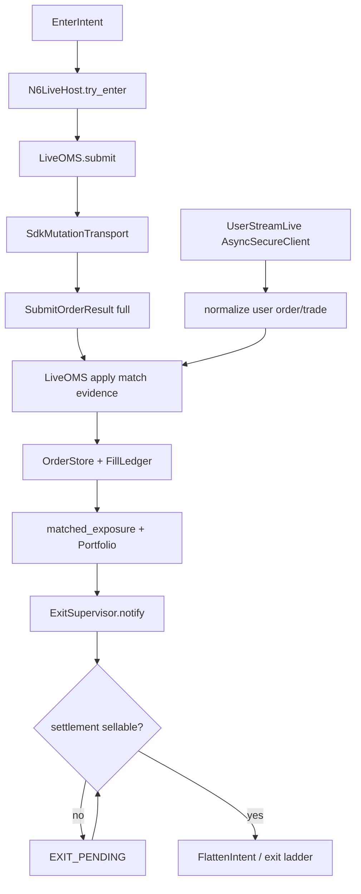
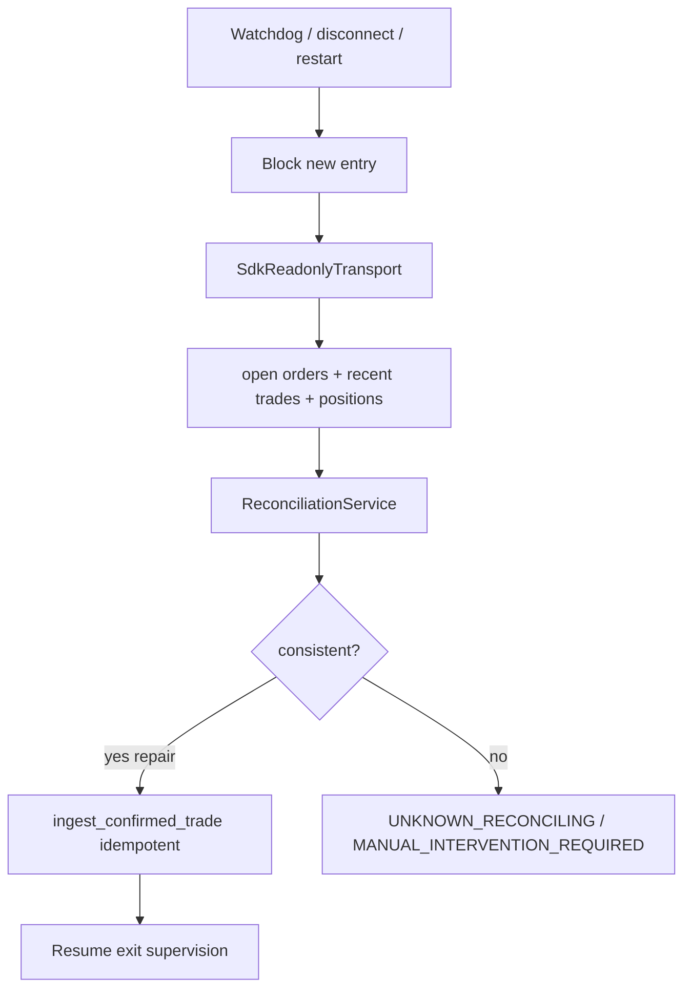

# Tyrex_PM Event-Driven Execution Lifecycle — Implementation Plan (Phases 1–6)

**Status:** PLANNING ONLY — no runtime code changes authorized by this document  
**Date:** 2026-08-03  
**Scope:** Complete Strategy → Intent → Risk → Planner → OMS → Portfolio → Exit → Reconciliation for Polymarket LIVE  
**Prior incident:** `yaml_live_20260731T143127Z` (manual liquidation complete; defect remains)  
**Branch context at planning:** `rest_project` / HEAD `18235c84…` (verify before implement)

---

## A. Executive implementation verdict

```text
REUSE_FIRST                         = YES
REWRITE_REQUIRED                    = NO
N7_BYPASSES_EXISTING_LIFECYCLE      = YES (PROVEN)
R7_SETTLEMENT_MODEL_REUSABLE        = YES
FALSE_PASS_POSSIBLE_TODAY           = YES (PROVEN)
NEXT_TINY_LIVE_SAFE_TODAY           = NO
FIRST_CODE_SLICE                    = Phase 1 terminal-safety (no new mutations enabled)
LIVE_REMAIN_BLOCKED_UNTIL           = Phase 6 admission gate
MANUAL_LIQUIDATION_PREREQUISITE     = DONE (operator; not an implementation task)
```

**One-sentence plan:** Wire Polymarket submission evidence + authenticated user stream into the existing single-writer OMS (`LiveOMS` / `OrderStore` / `FillLedger` / `Portfolio`), reuse R7 settlement/sellability (`settlement.py` / `MutationPhase`), replace N7’s `sleep(3)+is_flat` orchestration with exposure-driven exit supervision, and forbid PASS unless flatness is baseline-aware and authoritative.

**First awareness of MATCHED (target):** `LiveOMS` (or a thin helper it calls) when processing `SubmitOrderResult` / user-stream size_matched / trade events — **not** the strategy, **not** the portfolio alone.

---

## B. Verified current architecture

### B.1 Finding verification (re-checked against code)

| # | Finding | Verdict | Evidence |
|---|---------|---------|----------|
| 1 | User stream only in preflight | **PROVEN** | `n7_preflight.py` → `observe_user_stream_readonly`; `n7_live_session.py` has zero user-stream wiring; live transport = `SdkMutationTransport` |
| 2 | Submit adapter drops/ignores match evidence | **PROVEN** | `_submit_result_from_sdk` (`mutation_transport.py:78-118`) omits `trade_ids`; `LiveOMS.submit` (`live_oms.py:241-273`) uses `ok`/`venue_order_id`/`uncertain`/`error` only |
| 3 | N7 uses sleep(3) + local portfolio check | **PROVEN** | `n7_live_session.py:358-369` |
| 4 | Empty portfolio ⇒ `is_flat()==True` | **PROVEN** | `portfolio.py:75-76` (`all([])` is True) |
| 5 | Exit depends on local non-flat portfolio | **PROVEN** | session gate + `N6LiveHost.try_exit` `no_confirmed_inventory` (`n6_live_host.py:603-605`) |
| 6 | Fill/settlement components exist but N7 unwired | **PROVEN** | `ingest_confirmed_trade` only via test helpers; `wait_for_entry_settlement` only in `r7b_live_once.py` |
| 7 | Compose teardown before submit (stale path) | **PROVEN (pattern)**; **~14s duration STRONGLY INFERRED** from run evidence, not a code constant | `stop_requested` (`n7_live_session.py:130-132`) → compose `finally` stops feeds (`live_zgap_compose.py:613-617`) → then `try_enter` |
| 8 | PASS ignores UNRESOLVED recon | **PROVEN** | outcome from `econ["flat"]` only (`n7_live_session.py:371-381`); `recon_blocks_entry` stored but unused |
| — | Changed since audit | **RULED OUT** | All eight defects still present |

### B.2 Actual N7 call chain (current)

```text
cli run --mode live --live
→ n7_operator_run.run_n7_operator
→ n7_preflight.run_n7_preflight          # RO user stream ~2s
→ n7_live_session.run_live_oneshot_session
→ live_zgap_compose.run_live_zgap_compose
→ _capture_intents → EnterIntent + stop_requested
→ compose teardown (feeds stop)
→ N7OneShotHost + SdkMutationTransport
→ arm_operator_live → try_enter → LiveOMS.submit → OrderAccepted
→ sleep(3) → if not Portfolio.is_flat(): exit ladder
→ economics_report → post_trade_reconcile
→ PASS_N7_ONE_SHOT_FLAT if local flat
```

### B.3 LIVE authorization today (keep during all phases)

| Gate | Location |
|------|----------|
| CLI `--live` | `application/cli.py`, `n7_operator_run` |
| YAML `live.enabled` / `mutations_enabled` fail-closed false | `yaml_config/resolve.py`, `config/execution/polymarket_live.yaml` |
| CI / pytest / `TYREX_N7_FORBID_LIVE=1` | `n7_oneshot_host._ci_forbids_live` |
| OMS `mutations_enabled` only after arm | `N7OneShotHost.arm_operator_live` |

**Rule for this plan:** no slice may weaken these gates. Add an additional hard gate: `execution_lifecycle_ready` / terminal-safety flag that remains false until Phase 6 admission.

---

## C. Confirmed reusable components

| Component | Path / symbol | Reuse role |
|-----------|---------------|------------|
| `EnterIntent` / `FlattenIntent` | `core/intents.py` | Unchanged strategy boundary |
| `RiskEngine` | risk package via `N6LiveHost.try_enter` | Unchanged policy |
| `ExecutionPlanner` | `planning/planner.py` | Unchanged |
| `SubmissionLineage` / `LineageRegistry` | `execution/lineage.py` | Ownership spine |
| `LiveOMS` | `execution/polymarket/live_oms.py` | Single-writer command gateway — **first MATCHED awareness** |
| `OrderStore` / `OrderStatus` | `execution/order_store.py` | Order aggregate |
| `FillLedger` | `execution/fill_ledger.py` | Fill ledger |
| `Portfolio` | `portfolio/portfolio.py` | Projection (not flatness oracle) |
| `TradeLifecycle` | `lifecycle/trade_lifecycle.py` | FLAT→ENTRY_PENDING→ACTIVE |
| `EventDispatcher` | `engine/dispatcher.py` | In-process bus |
| `fill_events_from_trade` | `execution/polymarket/normalize.py` | Fill event factory |
| `N6LiveHost.ingest_confirmed_trade` | `runtime/n6_live_host.py:551` | Apply venue trade as fill truth |
| `ReconciliationService` | `execution/polymarket/reconciliation.py` | Recovery + terminal authority |
| `TradeSettlementStatus` / `SettlementPhase` / `wait_for_entry_settlement` | `execution/polymarket/settlement.py` | MATCHED≠CONFIRMED; sellability |
| `MutationPhase` / `MutationLifecycle` | `execution/polymarket/mutation_lifecycle.py` | Rich phase vocabulary (R7) — adopt for N7 terminality |
| `SdkReadonlyTransport` | `execution/polymarket/sdk_readonly.py` | REST recovery reads |
| `observe_user_stream_readonly` / `AsyncSecureClient` | `user_stream_readonly.py`, `sdk_secure.py` | Basis for live user-stream loop |
| `FakeTransport.add_fill` / `emit_user_event` | `fake_transport.py` | Deterministic tests |
| `tests/helpers_n6.py` / `helpers_n7.py` `fill_order` | tests | Pattern to replace with production path tests |
| R7B settlement orchestration | `runtime/r7b_live_once.py` | Reference sequence (do not duplicate wholesale) |
| N7 host shell | `n7_oneshot_host.py`, `n7_live_session.py` | Rewire, do not rewrite |

---

## D. Gaps requiring implementation

| Gap | Class | Primary home |
|-----|-------|--------------|
| False PASS on vacuous flat + UNRESOLVED | semantic / orchestration | `n7_live_session.py`, new terminal classifier |
| No execution obligation after ACK | missing state | new small module or `LiveOMS` tracking |
| `trade_ids` / match amounts discarded | contract | `transport.SubmitOrderResult`, `_submit_result_from_sdk` |
| LiveOMS ignores response status/match | wiring | `LiveOMS.submit` |
| No live authenticated user stream | missing orchestration | new `user_stream_live.py` + N6/N7 host attach |
| No matched_exposure projection | missing projection | extend Portfolio or add `MatchedExposureStore` |
| Exit wake = sleep + is_flat | unsafe orchestration | replace in `n7_live_session` |
| Settlement wait unused by N7 | unwired reuse | call `wait_for_entry_settlement` / sellability helpers |
| `SdkMutationTransport` lacks account reads | missing recovery | compose readonly client into recon path |
| `FILL_MISSING_LOCAL` not auto-applied | missing recovery | `ReconciliationService` + host |
| Compose teardown before submit | latency / orchestration | Phase 5 redesign of `run_live_oneshot_session` |
| No LIVE lifecycle readiness gate | safety | config + host arm check |
| Tests inject fills via helpers only | test gap | Phase 2–6 suites |

---

## E. Target lifecycle and source-of-truth model

### E.1 Target lifecycle

```text
EnterIntent
→ RiskEngine + ExecutionPlanner + SubmissionLineage
→ LiveOMS.submit (local order CREATED/SUBMITTED)
→ SdkMutationTransport → AcceptedOrder (full preserve)
→ LiveOMS applies response match evidence (idempotent)
→ UserStreamLive (account-wide) → order/trade events
→ OrderStore + FillLedger (exactly-once deltas)
→ matched_exposure projection + Portfolio projection
→ ExitSupervisor wake (exposure > 0)
→ settlement/sellability (reuse settlement.py)
→ FlattenIntent / exit ladder for actionable qty
→ cancel/track remainder per order policy
→ ReconciliationService (+ REST readonly)
→ NO_FILL_CONFIRMED | FLAT_CONFIRMED | non-PASS uncertainty
```

### E.2 Source-of-truth hierarchy

| Rank | Source | Authority |
|------|--------|-----------|
| 1 | Submission response | Immediate identifiers + insert status (`live`/`matched`/`delayed`) + trade_ids/amounts |
| 2 | Authenticated account-wide user stream | Primary low-latency `size_matched` / trade status updates |
| 3 | Single-writer OMS + FillLedger | Idempotent local execution truth |
| 4 | matched_exposure / Portfolio projections | Derived from accepted deltas only |
| 5 | Settlement/inventory projection | CONFIRMED ∩ sellable balance (R7 rules) |
| 6 | REST orders/trades | Recovery + reconciliation (not normal fast path) |
| 7 | Venue positions/balances | Inventory + final flatness cross-check; **not** sole fill trigger |

### E.3 Conflict resolution

| Conflict | Resolution |
|----------|------------|
| Response `matched`, WS delayed | Apply response trade_ids/amounts as provisional match; WS confirms via trade_id / size_matched HWM |
| WS before HTTP | Stage/apply by `client_order_id` or late-bind when `venue_order_id` arrives; one OMS row |
| Local filled ≠ venue `size_matched` | Prefer venue cumulative HWM; emit `ORDER_STATUS_MISMATCH`; repair toward venue |
| Exposure > 0, position API lag | Keep exposure; SELL waits on sellability; never clear from API lag alone |
| Position > 0, no local trade | `FILL_MISSING_LOCAL` / `POSITION_MISMATCH` → REST trades repair or `MANUAL_INTERVENTION_REQUIRED` |
| Settlement FAILED | Non-PASS; do not invent flat |
| UNRESOLVED / unknown obligation | Non-PASS always |

### E.3 diagrams

#### Current broken lifecycle

```mermaid
sequenceDiagram
  participant Z as ZGap
  participant C as live_zgap_compose
  participant H as N7OneShotHost
  participant OMS as LiveOMS
  participant T as SdkMutationTransport
  participant V as Polymarket
  participant P as Portfolio

  Z->>C: ENTRY_CANDIDATE + EnterIntent
  C->>C: stop_requested; stop feeds
  C->>H: try_enter (stale book)
  H->>OMS: SubmitOrderCommand
  OMS->>T: submit_order
  T->>V: place_limit_order
  V-->>T: AcceptedOrder full
  T-->>OMS: ok + venue_order_id only
  OMS->>OMS: OrderAccepted
  H->>H: sleep 3s
  H->>P: is_flat?
  P-->>H: true empty
  Note over H: exit skipped; PASS_N7_ONE_SHOT_FLAT
```

#### Target fast path



#### Recovery path



---

## F. Phase 1 plan — Safety invariants and authoritative contracts

**Goal:** Make false-PASS / false-flat impossible even before fill wiring is complete.  
**LIVE mutations:** remain blocked for product use; tests use FakeTransport only.

### F.1 Work items

| ID | Phase | Dependency | Existing file/symbol | Change type | Exact implementation | Contracts/state affected | Tests | Acceptance evidence | Risk |
|----|-------|------------|----------------------|-------------|----------------------|--------------------------|-------|---------------------|------|
| P1-01 | 1 | — | new `execution/polymarket/execution_obligation.py` | add state/event | `ExecutionObligation` dataclass: lineage ids, venue_order_id, state∈{OPEN,RESOLVED_NO_FILL,RESOLVED_FILLED,UNKNOWN,FAILED}; registry on host | new | unit: create on ACK; cannot PASS while OPEN | report field `obligations` | low |
| P1-02 | 1 | P1-01 | `LiveOMS.submit` / `N6LiveHost.try_enter` | extend existing | On VENUE_ACCEPTED create obligation OPEN; on REJECTED resolve FAILED | SubmissionAttemptState + obligation | unit | audit `execution_obligation_opened` | low |
| P1-03 | 1 | — | `transport.SubmitOrderResult` | add contract | Add `trade_ids: tuple[str,...]`, `making_amount`, `taking_amount` (optional Decimal/str); keep `raw` complete | SubmitOrderResult producers: `_submit_result_from_sdk`, Fake/Spy | contract tests | raw includes trade_ids | med — update all constructors |
| P1-04 | 1 | P1-03 | `_submit_result_from_sdk` | extend existing | Map SDK `AcceptedOrder.trade_ids`, amounts, status; never drop | SubmitOrderResult | unit with mock AcceptedOrder | fixture dump | low |
| P1-05 | 1 | — | new `runtime/n7_terminal.py` (or `n7_ptb_policy.py` neighbor) | add contract | `classify_n7_terminal(econ, recon, obligations, lifecycle) -> outcome`; PASS flat only if checklist | outcome strings | unit matrix false-flat | contradiction table in report | low |
| P1-06 | 1 | P1-05 | `n7_live_session.run_live_oneshot_session` | rewire orchestration | Replace `elif flat: PASS_N7_ONE_SHOT_FLAT` with classifier; map to `FLAT_CONFIRMED` / `UNKNOWN_RECONCILING` / `MANUAL_INTERVENTION_REQUIRED` / `NO_FILL_CONFIRMED` | outcomes | test_n7_oneshot updates | never PASS+UNRESOLVED | **high** if tests expect old PASS |
| P1-07 | 1 | P1-06 | `n7_live_session` exit gate | deprecate unsafe path | If obligation OPEN and portfolio flat → do **not** treat as success; enter wait/reconciling (temporary: non-PASS) until Phase 2/3 | outcomes | unit | sleep path cannot PASS | med |
| P1-08 | 1 | — | `n7_preflight` / `live_preflight` | extend existing | Persist RO baseline snapshot: open_orders count, position rows for selected market tokens, obligation empty | preflight payload | test_preflight | `account_baseline` artifact | low |
| P1-09 | 1 | P1-08 | reporting | reporting correction | Emit contradiction event if `flat and (recon_blocks_entry or obligations_open)` | analytics/audit | unit | visible in summary | low |
| P1-10 | 1 | — | `n7_oneshot_host.arm_operator_live` | add safety gate | Refuse arm unless `lifecycle_safety_invariants_enabled` config true (default true) and Phase-1 classifier present; keep CI forbid | arm path | unit | cannot arm without safety module | low |
| P1-11 | 1 | — | docs + `TYREX_N7_FORBID_LIVE` | test/evidence only | Document LIVE still forbidden; historical run preserved | — | — | plan linked from n7 docs | none |

**Why new `execution_obligation.py`:** no existing type represents “submission unresolved until venue truth.” `SubmissionAttemptState.ACKNOWLEDGED` currently means HTTP ack, not obligation closed. Keep lineage; add obligation beside it.

**Why new `n7_terminal.py`:** terminal classification is currently inline string soup in `n7_live_session`; needs a testable pure function reused by fake/live.

### F.2 Phase 1 invariants (must test)

1. ACK ≠ fill.  
2. Real submission ⇒ obligation OPEN.  
3. `PASS_*FLAT` impossible if obligation OPEN, `recon_blocks_entry`, `requires_manual`, `UNRESOLVED`, or lifecycle `ENTRY_PENDING` with venue_order_id and zero local fill evidence.  
4. Empty portfolio after mutation ≠ flatness evidence.  
5. OBSERVE/SHADOW unchanged (no mutation path).  

### F.3 Phase 1 gate

```text
No real submission can terminate as PASS while venue outcome, fills,
trades, open-order state, obligations, or inventory remain unknown.
Deterministic tests prove false-flat prevention.
LIVE product path remains non-admitted.
```

### F.4 Slices / commits

1. **Slice 1.A** — `SubmitOrderResult` + mapper + tests (no behavior change in OMS).  
2. **Slice 1.B** — `ExecutionObligation` + open on ACK.  
3. **Slice 1.C** — `classify_n7_terminal` + wire session + update N7 tests.  
4. **Slice 1.D** — preflight baseline + contradiction reporting.  

After each slice: full targeted N7/N6 tests green; LIVE still requires `--live` and remains operationally forbidden.

---

## G. Phase 2 plan — Real-time order/trade/fill/matched-exposure

**Goal:** One match ⇒ one strategy-owned exposure delta.  
**Depends on:** Phase 1 gate.

### G.1 Work items

| ID | Phase | Dependency | Existing file/symbol | Change type | Exact implementation | Contracts/state affected | Tests | Acceptance evidence | Risk |
|----|-------|------------|----------------------|-------------|----------------------|--------------------------|-------|---------------------|------|
| P2-01 | 2 | P1-03 | `LiveOMS.submit` | extend existing | If `result.status=="matched"` or trade_ids/nonzero amounts: build `VenueTradeSnapshot`(s) and publish fill events via same path as `ingest_confirmed_trade` (extract shared helper) | OrderStatus PARTIALLY_FILLED/FILLED | FakeTransport matched response | filled_quantity>0 | med — amount unit semantics |
| P2-02 | 2 | P2-01 | new helper in `normalize.py` | extend existing | `fill_events_from_accepted_order(result, order_rec)`; document BUY taking/making mapping from SDK | normalize | unit table | — | med |
| P2-03 | 2 | — | new `execution/polymarket/user_stream_live.py` | add recovery/orchestration | Long-lived `AsyncSecureClient.subscribe(UserSpec(markets=None))`; dispatch normalized events; reconnect with backoff; no discard | user events | fake async stream tests | stream_alive fact | med |
| P2-04 | 2 | P2-03 | `N6LiveHost` / `N7OneShotHost` | rewire | Start user stream **before** `arm_operator_live` mutations; stop on terminate | readiness `mark_user_stream` | integration fake | preflight+live stream | med |
| P2-05 | 2 | P2-03 | `normalize.py` + new parsers | extend | Parse user order (`size_matched`) and trade (`MATCHED/MINED/CONFIRMED…`) into domain events | TradeSettlementStatus | schema fixtures | — | med |
| P2-06 | 2 | P2-05 | `OrderStore` / `LiveOMS` | extend | Apply size_matched HWM; never decrease; map to partial/full | OrderStatus | out-of-order tests | HWM monotonic | med |
| P2-07 | 2 | P2-01,P2-06 | `N6LiveHost.ingest_confirmed_trade` | reuse + rewire | Production callers: response path + stream path + recon repair | FillLedger, Portfolio | duplicate trade_id | exactly-once | low |
| P2-08 | 2 | P2-07 | new `portfolio/matched_exposure.py` **or** fields on Portfolio | add projection | `matched_qty` / `matched_notional` per instrument+lineage; updated only by fill deltas | exposure API for exit | unit | exposure>0 on match | low |
| P2-09 | 2 | P2-04 | `SdkMutationTransport` vs readonly | extend | Host holds both mutation transport and `SdkReadonlyTransport` (or widen protocol) | PolymarketTransport Protocol optional methods | — | recon can query | med |
| P2-10 | 2 | P2-08 | lineage | extend | Bind exposure to `SubmissionLineage` ids; forbid orphan exposure | lineage | unit | — | low |
| P2-11 | 2 | P2-01 | audit reporting | reporting | Log status, trade_ids, amounts on `mutation.venue_submit_result` | audit payload | — | compare to incident gap | low |

**Why `user_stream_live.py` (new):** `user_stream_readonly.py` is a timed probe that discards events. Extending it into a dual-purpose module risks breaking preflight contracts; keep probe, add live supervisor.

**First MATCHED awareness:** `LiveOMS` after submit result and/or stream handler calling into OMS/host ingest — **single writer**.

### G.2 HTTP/WS ordering

| Order | Behavior |
|-------|----------|
| HTTP first | Apply response; WS confirms idempotently by trade_id / HWM |
| WS first | Buffer by `client_order_id` if known, else by `venue_order_id` when present; HTTP correlates and does not double-apply |

### G.3 Phase 2 gate

```text
Match via response OR user stream ⇒ exactly one strategy-owned exposure delta.
Duplicate/out-of-order events do not double-count.
User stream running before mutation arm in N7 host tests.
```

### G.4 Slices

1. **2.A** Response-match → fills (FakeTransport).  
2. **2.B** User stream live supervisor + normalize.  
3. **2.C** Wire host start/stop; mark_user_stream.  
4. **2.D** Matched exposure projection + lineage.  
5. **2.E** Dual-transport host (mutation + readonly).  

---

## H. Phase 3 plan — Exposure, settlement, inventory, exit activation

**Goal:** Matched quantity immediately supervised; exits remain actionable until resolved.  
**Do not change** Z-Gap theta/z/tau/thesis/time-flatten **policy numbers** — only reachability.

### H.1 Work items

| ID | Phase | Dependency | Existing file/symbol | Change type | Exact implementation | Contracts/state affected | Tests | Acceptance evidence | Risk |
|----|-------|------------|----------------------|-------------|----------------------|--------------------------|-------|---------------------|------|
| P3-01 | 3 | P2-08 | new `runtime/exit_supervisor.py` | add orchestration | Subscribe to exposure changes; wake exit coroutine; replace sleep(3) control | N7 session | unit wake tests | no sleep control | med |
| P3-02 | 3 | P3-01 | `n7_live_session` | rewire | Remove lifecycle `asyncio.sleep(3.0)` as control; wait on supervisor events with recovery deadline | session | integration | — | med |
| P3-03 | 3 | P2 | `settlement.wait_for_entry_settlement` / `evaluate_sell_readiness` | reuse | After ENTRY_MATCHED, run settlement wait (bounded); set sellable qty | SettlementPhase, MutationPhase | reuse R7 tests patterns | phase facts | med |
| P3-04 | 3 | P3-03 | `N7OneShotHost.run_bounded_exit_ladder` | extend | Allow `EXIT_PENDING` when matched>0 but sellable==0; retry on `InventorySellable` | exit report | pending→exit | — | med |
| P3-05 | 3 | P3-01 | `MutationLifecycle` | reuse | Drive N7 phases: ENTRY_ACCEPTED→ENTRY_MATCHED→ENTRY_SETTLING→ENTRY_CONFIRMED→POSITION_ACTIVE→EXIT_*→FLAT_CONFIRMED | MutationPhase | unit transitions | — | low |
| P3-06 | 3 | P2 | `LiveOMS.cancel` | reuse | Cancel GTC remainder when policy requires after partial; track CANCEL_PENDING | OrderStatus | partial+cancel | — | med |
| P3-07 | 3 | P3-04 | kill / thesis / time-flatten | rewire only | Ensure existing strategy exit intents route through supervisor when exposure>0 (no math change) | intents | shadow/live fake | — | low |
| P3-08 | 3 | P3-03 | settlement FAILED | add behavior | Map to MANUAL_INTERVENTION_REQUIRED; keep provisional exposure until recon | outcomes | unit | — | low |
| P3-09 | 3 | P3-02 | obligation resolve | extend | Resolve obligation only when entry terminal + (no fill ∥ exit terminal ∥ explicit NO_FILL) | ExecutionObligation | unit | — | low |

**Polymarket invariant correction:** Immediate SELL on MATCHED may be invalid until CONFIRMED/sellable balance — **already encoded in `settlement.py`**. Plan keeps: **risk/supervision at MATCHED**; **SELL submit at sellable**.

### H.2 Phase 3 gate

```text
Every matched entry qty is supervised immediately.
Exit requests remain actionable across non-sellable gaps.
sleep(3) is not the lifecycle controller.
```

---

## I. Phase 4 plan — Recovery, reconnect, restart, reconciliation

**Goal:** Disconnect/timeout/restart ⇒ reconstruct or block with non-PASS.  
**REST is recovery, not fast path.**

### I.1 Work items

| ID | Phase | Dependency | Existing file/symbol | Change type | Exact implementation | Contracts/state affected | Tests | Acceptance evidence | Risk |
|----|-------|------------|----------------------|-------------|----------------------|--------------------------|-------|---------------------|------|
| P4-01 | 4 | P2-09 | `ReconciliationService.reconcile_from_transport` | extend | Ensure N7 host always passes transport with get_open_orders/get_trades/get_positions | ReconcileClass | unit missing methods impossible | — | low |
| P4-02 | 4 | P4-01 | recon `FILL_MISSING_LOCAL` | add recovery | Safe auto-repair: call `ingest_confirmed_trade` when trade correlates to owned venue_order_id | repaired_fill_ids | unit | — | med |
| P4-03 | 4 | P2-03 | `user_stream_live` | add recovery | On disconnect: set stream gap → `mark_user_stream(False)` → block entry → REST backfill window | readiness | disconnect test | — | med |
| P4-04 | 4 | P1-01 | watchdog | add behavior | Configurable `match_evidence_deadline_ms` (default e.g. 1500–3000): if obligation OPEN and no size_matched/trades → REST get_order | config | timeout+exists | no blind sleep success | low |
| P4-05 | 4 | P4-04 | unknown submission | extend | Keep `UNKNOWN_SUBMISSION` / obligation UNKNOWN until REST resolves | LiveOMS.resolve paths | existing + new | — | low |
| P4-06 | 4 | P1-08 | baseline-aware recon | extend | Compare positions to pre-run baseline; only strategy tokens/lineage count for flatness; historical externals stay acknowledged | FlatClassification | baseline test | — | med |
| P4-07 | 4 | P4-03 | restart | add behavior | On host start: load `runtime_state.json`, REST rebuild open orders/fills before arming entry | persistence | restart fixture | block entry until rebuilt | med |
| P4-08 | 4 | P4-02 | terminal classifier | extend | UNRESOLVED/requires_manual → MANUAL_INTERVENTION_REQUIRED or UNKNOWN_RECONCILING (never PASS) | n7_terminal | matrix | — | low |

### I.2 Phase 4 gate

```text
After disconnect, timeout, or restart: consistent reconstruction OR
explicit non-PASS block. New entries blocked until recovery completes.
```

---

## J. Phase 5 plan — Low-latency continuous LIVE orchestration

**Goal:** Remove compose-teardown-before-submit; authoritative termination; measured latency.

### J.1 Work items

| ID | Phase | Dependency | Existing file/symbol | Change type | Exact implementation | Contracts/state affected | Tests | Acceptance evidence | Risk |
|----|-------|------------|----------------------|-------------|----------------------|--------------------------|-------|---------------------|------|
| P5-01 | 5 | P3 | `n7_live_session.run_live_oneshot_session` | rewire orchestration | **Do not** stop market/user feeds before submit. Options (pick one in impl): (A) promote compose to hold feeds and call host.try_enter inside loop; (B) start host+stream earlier, compose only signals intent over queue. Prefer (A) minimal: `stop_requested` stops *evaluation* but not feeds until session end | session architecture | latency test with fake clocks | feeds_alive_at_submit | **high** |
| P5-02 | 5 | P5-01 | `_capture_intents` / try_enter | extend | Immediate pre-submit revalidation: refresh book from `MarketStateStore`, re-check edge/gates (reuse strategy gate functions; **no threshold changes**) | decision evidence | stale-book reject test | `presubmit_revalidation` fact | med |
| P5-03 | 5 | P5-01 | reporting | add | Monotonic timestamps: market_event → eval → intent → risk → plan → revalidate → sign → http_start → http_end → first_match → exposure → exit_wake | analytics | histogram in summary | — | low |
| P5-04 | 5 | P3-01 | deadlines | extend | Event-driven wait: `exposure_wait_deadline_ms`, `settlement_wait` (existing config), `exit_ack_timeout`; no fixed 3s success path | config sealed N7 | — | — | low |
| P5-05 | 5 | P1-05 | terminal state machine | extend | Explicit outcomes (prefer extending names): `NO_FILL_CONFIRMED`, `ENTRY_MATCHED`, `PARTIAL_ENTRY`, `EXIT_PENDING`, `FLAT_CONFIRMED`, `UNKNOWN_RECONCILING`, `MANUAL_INTERVENTION_REQUIRED`, `FAILED`; map legacy `PASS_N7_ONE_SHOT_FLAT` → only when `FLAT_CONFIRMED` | MutationPhase alignment | matrix | — | med |
| P5-06 | 5 | P5-05 | baseline flatness | extend | Success ⇒ venue position for strategy tokens == baseline (0 delta) + no open owned orders + obligations resolved | economics_report | — | — | med |
| P5-07 | 5 | P5-03 | latency budget | config | Soft budget metric (e.g. candidate→dispatch p95 target); fail closed only if revalidation fails, not if budget missed (report WARN) — decide in R1 | config | — | — | low |

### J.2 Phase 5 gate

```text
Candidate-to-dispatch on continuous feeds with presubmit revalidation.
One-shot success requires authoritative terminal evidence (FLAT_CONFIRMED / NO_FILL_CONFIRMED).
```

---

## K. Phase 6 plan — Deterministic validation, shadow, tiny-LIVE admission

**Goal:** Prohibit next tiny-LIVE until mandatory tests pass.

### K.1 Deterministic scenario matrix (minimum)

| # | Scenario | Phase coverage | Primary test module (planned) |
|---|----------|----------------|-------------------------------|
| 1 | Response immediate match | 2 | `tests/test_exec_lifecycle_response_match.py` |
| 2 | HTTP before WS | 2 | same |
| 3 | WS before HTTP | 2 | same |
| 4 | Resting unfilled live | 2 | same |
| 5 | Zero-fill FAK / unmatched reject | 2 | `tests/test_exec_lifecycle_order_types.py` |
| 6 | Partial entry | 2–3 | `tests/test_exec_lifecycle_partial.py` |
| 7 | Full entry | 2–3 | same |
| 8 | Match after old 3s boundary | 3 | `tests/test_exec_lifecycle_exit_wake.py` |
| 9 | Duplicate trade | 2 | dedupe tests |
| 10 | Repeated size_matched | 2 | HWM tests |
| 11 | Out-of-order events | 2 | same |
| 12 | Submit timeout + venue order exists | 4 | `tests/test_exec_lifecycle_recovery.py` |
| 13 | Stream disconnect during fill | 4 | same |
| 14 | Reconnect missed trade | 4 | same |
| 15 | Restart open order | 4 | same |
| 16 | Venue inventory w/o local fill | 4 | recon repair |
| 17 | Settlement confirmation | 3 | settlement tests |
| 18 | Settlement retry | 3 | same |
| 19 | Settlement failure | 3 | same |
| 20 | Exit before sellable | 3 | exit pending |
| 21 | Exit partial | 3 | same |
| 22 | Duplicate exit execution | 3 | idempotent exit |
| 23 | Unresolved recon | 1+4 | terminal classifier |
| 24 | False-flat prevention | 1 | terminal classifier |
| 25 | Confirmed no-fill | 2+5 | NO_FILL_CONFIRMED |
| 26 | Authoritative flatness | 5 | FLAT_CONFIRMED |
| 27 | No mutation in unit/contract tests | all | assert FakeTransport / arm denied |

### K.2 Gates

1. **Unit** — obligations, classifier, HWM, normalize.  
2. **Contract** — SubmitOrderResult, user event schemas, MutationPhase.  
3. **Integration** — N7 host + FakeTransport full entry→exit.  
4. **Replay** — sanitize captured `yaml_live_20260731T143127Z` audit into fixture; prove classifier would non-PASS; prove fill path would create exposure if response/stream present.  
5. **OBSERVE** — unchanged behavior smoke.  
6. **SHADOW** — same OMS lifecycle with ShadowOMS / no real mutations.  
7. **RO LIVE preflight** — baseline healthy, stream auth, no unexpected selected-market exposure.  
8. **Tiny-LIVE admission** — Section S checklist signed off.  
9. **Post-run review** — contradiction-free summary.  
10. **Rollback/kill** — `TYREX_N7_FORBID_LIVE=1`; disable arm; operator flatten runbook.

### K.3 Phase 6 gate

```text
Next tiny-LIVE prohibited until all mandatory lifecycle, recovery,
false-flat, and terminal-classification tests pass.
```

---

## L. Cross-phase dependency graph

```text
P1 safety/contracts
  → P2 response+stream fills+exposure
    → P3 settlement+exit supervisor
      → P4 recovery/recon repair
        → P5 continuous orchestration+latency
          → P6 validation+admission
```

Hard blockers:

- P2 cannot enable PASS-on-flat shortcuts removed in P1.  
- P3 must not SELL before sellability (R7).  
- P5 must not run before P3 wake path exists (else continuous path still blind).  
- P6 admission is the only unlock for operator `--live`.

---

## M. File and symbol change matrix

| File | Symbols | Phases | Notes |
|------|---------|--------|-------|
| `execution/polymarket/transport.py` | `SubmitOrderResult` | 1–2 | extend fields |
| `execution/polymarket/mutation_transport.py` | `_submit_result_from_sdk`, `SdkMutationTransport` | 1–2 | preserve trade_ids |
| `execution/polymarket/live_oms.py` | `submit`, tracking | 1–2 | match apply; obligation hook |
| `execution/polymarket/normalize.py` | `fill_events_from_*` | 2 | response+stream |
| `execution/polymarket/reconciliation.py` | `ReconciliationService` | 4 | auto-repair |
| `execution/polymarket/settlement.py` | `wait_for_entry_settlement` | 3 | reuse from N7 |
| `execution/polymarket/mutation_lifecycle.py` | `MutationPhase` | 3–5 | drive from N7 |
| `execution/polymarket/user_stream_readonly.py` | observe probe | 1–2 | keep; don’t overload |
| `execution/polymarket/user_stream_live.py` | **NEW** | 2–4 | live supervisor |
| `execution/polymarket/execution_obligation.py` | **NEW** | 1–5 | obligation registry |
| `execution/polymarket/sdk_readonly.py` | readonly transport | 2–4 | attach to N7 |
| `execution/order_store.py` | `OrderStatus` apply | 2 | HWM |
| `execution/fill_ledger.py` | `FillLedger` | 2 | reuse |
| `execution/lineage.py` | `SubmissionLineage` | 1–2 | ownership |
| `portfolio/portfolio.py` | `is_flat` docs + maybe helpers | 1–3 | not oracle |
| `portfolio/matched_exposure.py` | **NEW** (or Portfolio fields) | 2–3 | exposure |
| `runtime/n7_live_session.py` | `run_live_oneshot_session`, `_capture_intents` | 1,3,5 | core rewire |
| `runtime/n7_oneshot_host.py` | `try_enter`, `arm_*`, `economics_report` | 1–5 | stream+classifier |
| `runtime/n7_terminal.py` | **NEW** | 1–5 | pure classifier |
| `runtime/exit_supervisor.py` | **NEW** | 3–5 | wake path |
| `runtime/n6_live_host.py` | `ingest_confirmed_trade`, `post_trade_reconcile`, `try_exit` | 2–4 | wire production |
| `runtime/live_zgap_compose.py` | feed teardown / should_stop | 5 | keep feeds |
| `runtime/n7_preflight.py` / `live_preflight.py` | baseline | 1,6 | RO baseline |
| `runtime/n7_sealed.py` / YAML execution config | deadlines, flags | 1–5 | config |
| `fake_transport.py` | matched response helpers | 2–6 | tests |
| `tests/test_n7_oneshot.py` et al. | update expectations | 1–6 | no false PASS |
| Docs under this folder | reports | 6 | evidence |

---

## N. State, command and event contracts

### N.1 Commands (prefer existing)

| Command | Existing? | Producer | Consumer |
|---------|-----------|----------|----------|
| `SubmitOrderCommand` | yes | N6 try_enter | LiveOMS |
| `CancelOrderCommand` | yes | exit/remainder | LiveOMS |
| `EnterIntent` / `FlattenIntent` | yes | strategy / supervisor | host |
| `ReconcileExecution` | **add as host method** | watchdog/terminate | ReconciliationService |
| `RecoverSession` | **add as host method** | startup/disconnect | readonly+OMS |

### N.2 Events (map to existing where possible)

| Event (logical) | Existing mapping | Producer | Consumer | Idempotency key |
|-----------------|------------------|----------|----------|-----------------|
| OrderSubmissionAccepted | `OrderAccepted` | LiveOMS | OrderStore, lineage, obligation | `local_order_id` |
| OrderLive | status=`live` fact / optional new | LiveOMS | obligation | `venue_order_id` |
| OrderMatchObserved | fill events / new fact | LiveOMS/stream | exposure | `(venue_order_id, trade_id)` or size_matched HWM |
| FillDeltaApplied | `OrderPartiallyFilled`/`OrderFilled` | dispatcher | FillLedger, Portfolio | `execution_id` / trade_id |
| MatchedExposureChanged | **new** or fact | exposure store | ExitSupervisor | `(lineage, instrument, seq)` |
| SettlementChanged | settlement facts / MutationPhase | settlement wait | ExitSupervisor | trade_id+status |
| InventorySellable | sellability result | settlement | ExitSupervisor | instrument+qty |
| ExitRequested | FlattenIntent | supervisor/strategy | try_exit | intent_id |
| ExitOrderSubmitted | OrderAccepted (sell) | LiveOMS | obligation exit | order_id |
| FlatnessConfirmed | terminal + MutationPhase.FLAT_CONFIRMED | classifier | reporting | run_id |
| ExecutionBecameUnknown | obligation UNKNOWN | watchdog/OMS | classifier | order_id |

### N.3 Order / trade / exposure states

- **Order:** reuse `OrderStatus`; interpret insert `delayed` as ACCEPTED + obligation UNKNOWN/RECONCILING until clarified.  
- **Trade settlement:** reuse `TradeSettlementStatus`.  
- **Session mutation:** reuse `MutationPhase`.  
- **Exposure:** `matched_qty`, `confirmed_qty`, `sellable_qty`, `exit_requested_qty`, `exit_filled_qty`.  

### N.4 Correlation keys

```text
intent_id → plan_id → request_fingerprint → submission_attempt_id
→ local_order_id → client_order_id → venue_order_id → trade_id
+ market_id + token_id + window_id
```

---

## O. Test and evidence matrix

| Phase | Mandatory tests | Evidence artifact |
|-------|-----------------|-------------------|
| 1 | false-flat matrix; obligation OPEN blocks PASS; SubmitOrderResult fields | `tests/test_n7_terminal_safety.py` |
| 2 | response match; WS/HTTP order; dedupe; HWM; stream before arm | `tests/test_exec_lifecycle_*.py` |
| 3 | exit wake on exposure; pending until sellable; partials | `tests/test_exec_lifecycle_exit_wake.py` |
| 4 | disconnect; timeout; restart; repair; baseline | `tests/test_exec_lifecycle_recovery.py` |
| 5 | feeds alive at submit; presubmit revalidation; latency facts | `tests/test_n7_continuous_submit.py` |
| 6 | full matrix §K.1; replay incident; OBSERVE/SHADOW smoke | admission checklist doc |

All deterministic tests: **zero venue mutations** (FakeTransport / spies only).

---

## P. Migration and backward compatibility

| Mode | Impact |
|------|--------|
| OBSERVE | No mutation; classifier unused; feeds unchanged until Phase 5 optional |
| SHADOW | Prefer same OMS lifecycle with non-network transport; update tests that assumed helper fills only |
| N7 LIVE | Outcomes rename/extend — update operator docs; treat legacy `PASS_N7_ONE_SHOT_FLAT` as alias of `FLAT_CONFIRMED` only when checklist passes |
| R7B path | Keep; optionally later converge on shared ExitSupervisor (not required for N7 admission) |
| Incident artifacts | Preserve `var/runs/z_gap/yaml_live_20260731T143127Z` untouched |

Atomic contract changes: any `SubmitOrderResult` field add must update FakeTransport, SpyMutationTransport, and all test constructors in the same commit (Slice 1.A).

---

## Q. Commit sequence

Recommended commit boundaries (each keeps tests green; LIVE still non-admitted):

1. `feat(exec): extend SubmitOrderResult with trade_ids and amounts`  
2. `feat(exec): add ExecutionObligation registry`  
3. `fix(n7): forbid PASS when obligation open or recon unresolved`  
4. `feat(n7): record preflight account baseline for selected market`  
5. `feat(oms): apply AcceptedOrder match evidence into fill path`  
6. `feat(exec): add UserStreamLive supervisor`  
7. `feat(n7): start user stream before mutation arm`  
8. `feat(portfolio): matched exposure projection`  
9. `feat(n7): ExitSupervisor replaces sleep-based exit control`  
10. `feat(n7): wire settlement sellability before exit submit`  
11. `feat(recon): readonly transport + FILL_MISSING_LOCAL repair`  
12. `feat(n7): recovery watchdog and restart reconstruction`  
13. `feat(n7): continuous feeds through submit + presubmit revalidation`  
14. `test(exec): full lifecycle matrix + incident replay classifier`  
15. `docs(n7): tiny-LIVE admission gate signed checklist`  

No commit enables operator LIVE admission until #15 + Section S.

---

## R. Risks, unknowns and decisions required

| ID | Item | Type | Decision needed |
|----|------|------|-----------------|
| R1 | BUY `making_amount`/`taking_amount` → share qty mapping | UNKNOWN until SDK fixture verified | Spike in Slice 2.A with installed `AcceptedOrder` samples / official docs |
| R2 | GTC `marketable_limit` vs FAK for tiny-LIVE | policy (not Z-Gap math) | Confirm order_type for next LIVE (recommend FAK for oneshot to avoid resting remainder) |
| R3 | Phase 5 structural option A vs B | architecture | Prefer A (keep feeds, submit inside session) unless proven intractable |
| R4 | Whether matched tokens can SELL before CONFIRMED | PROVEN in-repo: no (R7) | Keep supervision≠sell |
| R5 | Latency budget hard vs soft fail | product | Default soft WARN + hard fail only on revalidation |
| R6 | Unrelated account positions | PROVEN preflight acknowledges externals | Baseline-aware flatness only |
| R7 | Shadow host parity effort | schedule | Minimum: FakeTransport N7 path; full shadow OMS optional |

---

## S. Tiny-LIVE admission gate

All must be **YES** before operator `--live`:

```text
[ ] false PASS impossible (Phase 1 tests)
[ ] complete submission evidence retained (status, trade_ids, amounts, raw)
[ ] authenticated user stream active before submission
[ ] HTTP/WS event-order independence tested
[ ] matched exposure derived exactly once
[ ] strategy lineage preserved intent→exit
[ ] exit supervisor activated by exposure events (no sleep controller)
[ ] settlement/sellability tracked (R7 rules)
[ ] read-only recovery operational on N7 host
[ ] reconnect/restart reconstruction tested
[ ] partial/duplicate/delayed-fill tests passing
[ ] candidate-to-submit stale teardown removed
[ ] current book/edge revalidated before dispatch
[ ] final flatness baseline-aware and authoritative
[ ] reporting contradiction-free
[ ] RO preflight healthy: no unexpected selected-market exposure; open orders 0
[ ] TYREX_N7_FORBID_LIVE unset only on operator host intentionally
[ ] budget: one account, one 5m market, one lineage, ~$5 fee-inclusive, no re-entry
```

**Success demonstration for admission run:**

```text
decision → dispatch → match awareness → strategy-owned exposure
→ settlement/sellability → exit activation → exit execution → exit fill
→ authoritative return to pre-run baseline
```

Uncertainty ⇒ automatic non-PASS (`UNKNOWN_RECONCILING` / `MANUAL_INTERVENTION_REQUIRED`).

---

## T. Final implementation recommendation

1. **Do not rewrite** Strategy/Risk/Planner/OMS — **complete the wiring**.  
2. **Phase 1 first** — terminal safety + obligations + full `SubmitOrderResult` (manual position already cleared; still RO-preflight before any future LIVE).  
3. **Phase 2** — `LiveOMS` becomes first MATCHED consumer; `UserStreamLive` feeds the same single writer.  
4. **Phase 3** — reuse `settlement.py`; `ExitSupervisor` replaces `sleep(3)+is_flat`.  
5. **Phase 4** — readonly recon + repair + restart.  
6. **Phase 5** — continuous feeds + presubmit revalidation + latency metrics.  
7. **Phase 6** — prove matrix; only then admit one monitored tiny-LIVE.  

### Execution backlog (strict order for a coding agent)

1. Extend `SubmitOrderResult` + `_submit_result_from_sdk` + FakeTransport constructors; add unit tests.  
2. Add `ExecutionObligation` registry; open on VENUE_ACCEPTED.  
3. Implement `classify_n7_terminal`; wire `n7_live_session`; update N7 tests so UNRESOLVED/empty-portfolio-after-ACK cannot PASS.  
4. Add preflight `account_baseline` for selected market; report contradictions.  
5. Implement response-match → shared fill apply helper → `OrderStore`/`Portfolio` update (FakeTransport).  
6. Add `UserStreamLive`; normalize user order/trade; wire start-before-arm / stop-on-terminate.  
7. Add matched-exposure projection bound to lineage.  
8. Attach `SdkReadonlyTransport` alongside mutation transport on N7 host.  
9. Implement `ExitSupervisor`; remove sleep-based exit control; pending-until-sellable via `settlement.py`.  
10. Drive `MutationPhase` transitions from host.  
11. Recon auto-repair for owned `FILL_MISSING_LOCAL`; watchdog deadline; restart rebuild.  
12. Rework session so feeds remain alive through submit; add presubmit book/edge revalidation.  
13. Latency monotonic facts; terminal outcome vocabulary aligned with `FLAT_CONFIRMED` / `NO_FILL_CONFIRMED`.  
14. Full deterministic matrix + incident replay classifier test.  
15. OBSERVE/SHADOW smoke; RO preflight; complete Section S checklist; **then** operator may run one tiny-LIVE.

---

## Appendix — Required invariants checklist (enforce in tests)

1. ACK is never a fill.  
2. Real submission creates unresolved execution obligation.  
3. Every execution delta applied exactly once.  
4. Cumulative matched quantity cannot double-count exposure.  
5. Matched exposure activates protection/exit supervision immediately.  
6. Strategy ownership from immutable order lineage only.  
7. Partial fills expose only executed quantity.  
8. Unfilled remainder canceled or tracked per order policy.  
9. Local flatness after mutation is not authoritative.  
10. Reconciliation failure/uncertainty never returns PASS.  
11. Exit requests survive temporary non-sellable inventory.  
12. Reconnect/restart blocks entry until recovery completes.  
13. Older/duplicate events cannot move state backward.  
14. HTTP vs WS order cannot change final OMS result.  
15. Venue inventory cannot silently become strategy-owned without recon evidence.  
16. Successful flatness requires positive, baseline-aware venue evidence.  
17. OBSERVE/SHADOW/LIVE share lifecycle contracts (only LIVE mutates).  
18. Reporting must expose contradictions.

**Polymarket-specific refinement:** supervision at MATCHED is required; **sellable inventory may lag CONFIRMED** — already the R7 model; do not “fix” this by selling on insert match alone.
