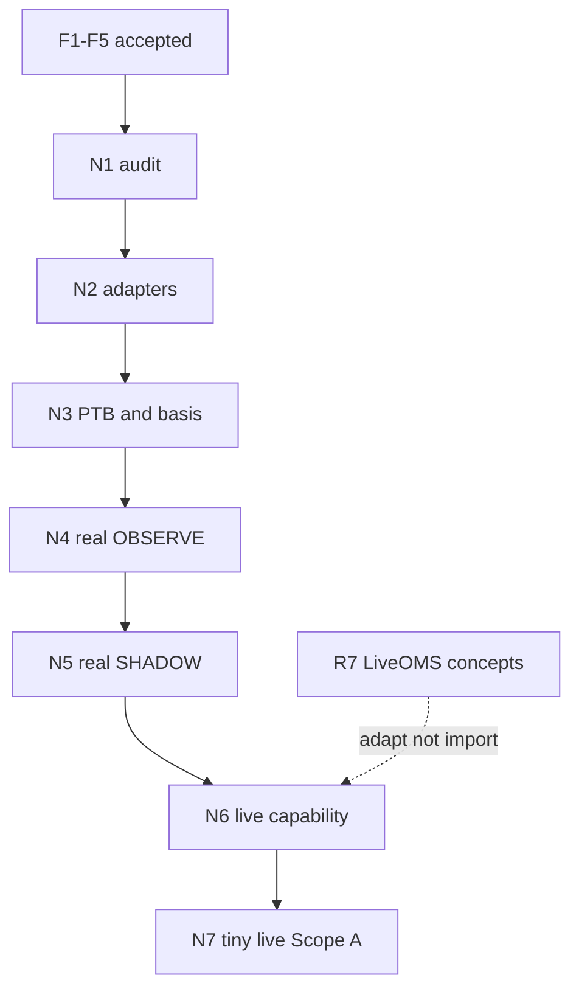

# Z-Gap production readiness (N1–N7)

**Status:** N1 `PASS_WITH_BLOCKERS` · N2–N5 `PASS_WITH_ENVIRONMENT_BLOCKER` · N6 `PASS` · N7 simplified (`--live` operator command; no phrase ceremony)  
**Acceptance (N1):** [n1_acceptance_report.md](n1_acceptance_report.md)  
**Acceptance (N2):** [n2_acceptance_report.md](n2_acceptance_report.md)  
**Acceptance (N3):** [n3_acceptance_report.md](n3_acceptance_report.md)  
**Acceptance (N4):** [n4_acceptance_report.md](n4_acceptance_report.md)  
**Acceptance (N5):** [n5_acceptance_report.md](n5_acceptance_report.md)  
**Initiative:** one major track taking Z-Gap from fixture OBSERVE/SHADOW to
trustworthy real inputs, real-input OBSERVE/SHADOW, and reconciled
operator-controlled tiny live.  
**Baseline:** F1–F5 accepted · branch `rest_project`  
**Parent index:** [`../README.md`](../README.md)

N1–N7 are **milestones within this initiative**, not separate top-level
programs.

---

## Purpose

Move Z-Gap from deterministic fixture-based OBSERVE/SHADOW to:

1. trustworthy real read-only inputs;
2. real-input OBSERVE;
3. real-input SHADOW;
4. reconciled operator-controlled live execution (tiny, Scope A first).

Preserve frozen architecture: thin strategy, ports/adapters for providers,
same sealed decision path for OBSERVE/SHADOW, fail-closed live enablement,
no `old/` / `runtime/r7*` imports into Z-Gap.

---

## Milestone documents

| Milestone | Document | Role |
|-----------|----------|------|
| **N1** | [n1_source_and_legacy_audit.md](n1_source_and_legacy_audit.md) | Evidence audit: PTB/Chainlink, latency, discovery, `old/` keep-adapt-reject |
| **N2** | [n2_real_data_adapters.md](n2_real_data_adapters.md) | Real read-only adapters (RTDS, Binance, CLOB, time sync) |
| **N3** | [n3_ptb_and_reference_alignment.md](n3_ptb_and_reference_alignment.md) | PTB axes + causal Chainlink/Binance basis alignment |
| **N4** | [n4_real_observe.md](n4_real_observe.md) | Real-input OBSERVE (no OMS); prepared-next rollover |
| **N5** | [n5_real_data_shadow.md](n5_real_data_shadow.md) | Real-input SHADOW; precise depth-walk fill model |
| **N6** | [n6_live_execution_and_reconciliation.md](n6_live_execution_and_reconciliation.md) | Generic live OMS + recon + authenticated read-only gate |
| **N7** | [n7_tiny_operator_live.md](n7_tiny_operator_live.md) | Operator-gated tiny live one-shot (Scope A) |

---

## Mode progression (do not collapse)

| Mode | Inputs | Execution | Economics labels | Money |
|------|--------|-----------|------------------|-------|
| Fixture OBSERVE (F3) | Fixtures | None | counterfactual / estimated | No |
| Fixture SHADOW (F4/F5) | Fixtures | ShadowOMS | `simulated_shadow` / estimated | No |
| Real-input OBSERVE (N4) | Live public feeds | None | counterfactual / estimated | No |
| Real-input SHADOW (N5) | Live public feeds | ShadowOMS | `simulated_shadow` / estimated | No |
| Tiny live (N7, Scope A) | Live feeds + auth | LiveOMS | confirmed fills when known | Yes (tiny) |
| Later production live | TBD | LiveOMS (+ Scope B if built) | confirmed + redeem if any | Yes (separate acceptance) |

---

## Roadmap

```text
N1  Source & legacy audit (evidence only)
 └► N2  Real read-only adapters
      └► N3  PTB capture + reference alignment
           └► N4  Real-input OBSERVE (engineering sample)
                └► N5  Real-input SHADOW (simulated execution)
                     └► N6  Generic live execution + reconciliation (no Z-Gap enable)
                          └► N7  Tiny operator-controlled live (Scope A, one-shot)
```

---

## Critical path and dependencies



| Blocks | Dependency |
|--------|------------|
| N2 coding | Done — see [n2_acceptance_report.md](n2_acceptance_report.md) |
| N3 coding | N3A done — see [n3_acceptance_report.md](n3_acceptance_report.md); N3B live deferred (TLS) |
| N3 lock/entry policy | Boundary rule PROVISIONAL (`EXACT_AT_START`); numeric thresholds still OPEN |
| N4 product OBSERVE | N4A done — [n4_acceptance_report.md](n4_acceptance_report.md); N4B live deferred (TLS) |
| N5 real SHADOW | N5A E2E depth-walk lifecycle proven — [n5_acceptance_report.md](n5_acceptance_report.md); N5B live deferred (TLS) |
| N5 | N4 engineering acceptance + fill-model freeze |
| N6 **starts after** N5 | N5 acceptance; N6 builds generic live capability with mutations OFF |
| N6 **completion / N7 gate** | Authenticated **read-only** preflight is an N6 completion criterion and a prerequisite for N7 — not a blocker to *starting* N6 after N5 |
| N7 money | N1–N6 evidence + Scope A timing ladder frozen + operator go/no-go |

### Safe parallel work

| Parallelizable | Constraint |
|----------------|------------|
| N1 browser/PTB proof vs latency capture scripts | Both read-only; freeze jointly before N2 |
| Adapter normalize fixtures vs clock-provider design | After N1 provisional sources known |
| N6 design detailing vs N4/N5 implementation | N6 **code** must not enable Z-Gap live before N5; auth read-only may precede N7 |
| Calibration notebook sketches vs N4 facts | Non-blocking research |
| Docs/runbook drafts for N7 | No credentials, no mutate flags on |

---

## Shared policies (initiative-wide)

### Outcome mapping (BTC Up/Down)

These markets use **`Up` / `Down`**, not YES/NO.

Discovery must map by **normalized label**:

| Venue label | Normalized leg |
|-------------|----------------|
| `"Up"` | `UP` |
| `"Down"` | `DOWN` |

**Never** map by array position. Reject missing, duplicate, unknown, reversed,
ambiguous, or token-count-mismatched outcomes. Binding must include market ID,
condition ID, token ID, normalized leg, and window identity.

### Causal Chainlink/Binance pairing

**Live/production policy:** `LATEST_BINANCE_AT_OR_BEFORE_CHAINLINK`

- Pair on **source** timestamps.
- Binance `source_ts` must be `≤` Chainlink `source_ts`.
- Enforce maximum age/skew.
- Record source_ts, corrected receive-wall ts, monotonic receive ts, clock uncertainty.
- Symmetric nearest pairing or interpolation that uses **later** ticks is allowed
  **only** for explicitly labelled offline analysis (look-ahead bias otherwise).
- Deterministic replay preserves original arrival order; live and replay must
  yield the same aligned snapshot from the same ordered ingress.

### PTB: three orthogonal axes (not one linear machine)

| Axis | Values |
|------|--------|
| **A. Capture quality** | candidate/provisional · attested/confirmed · mismatched |
| **B. Lock state** | unlocked · locked |
| **C. Entry readiness** | allowed · blocked |

Rules:

- Locked \(K\) **never mutates**.
- Locked \(K\) may later receive mismatch evidence → readiness **blocked**; value preserved.
- Real SHADOW and live entry require **attested and locked** \(K\).
- OBSERVE may evaluate provisional \(K\) only with provisional + counterfactual labels.
- Lock **before** any real SHADOW/live entry evaluation is accepted (not “at entry” after economics ran).
- Exact capture/attestation rule is an N1 evidence outcome (provisional until proven).

### Failure behavior by exposure state

| Exposure state | Failure behavior |
|----------------|------------------|
| FLAT | Block new exposure |
| ACTIVE with confirmed inventory | Continue risk management; seek a safe exit |
| Inventory UNKNOWN | Reconcile; never guess quantity |
| Entry order ambiguous | Stop new actions; reconcile before retry |
| Exit partially filled | Manage only confirmed residual quantity |
| Resolution committed | Remain pending; do not fabricate a sell |

Entry readiness ≠ exit capability. PTB mismatch / stale basis / reference
degradation **blocks entry** but must **not** prevent management of confirmed
exposure. Book/feed loss while ACTIVE needs an explicit risk/exit/escalation
policy (see N4–N7).

### Cross-window vs window-local state

| Window-local (reset on promote) | Continuous cross-window (preserve) |
|---------------------------------|------------------------------------|
| PTB | Binance price history |
| Market / token binding | **EWMA volatility** |
| Entry lineage / thesis confirm | Shared Chainlink/Binance connections |
| Books / window timers | Clock health / connection health |

Do **not** reset EWMA every five-minute window. Restart warm-up policy must be
frozen before N4 (restore validated state **or** bounded backfill **or**
explicit warm-up wait).

### Prepared-next rollover

Continuous mode **pre-stages** the next market before the boundary (discover,
validate Up/Down map, prepare CLOB subscriptions). Atomic promote to active;
no strategy evaluation on prepared-next before promotion.

### Scope A timing ladder (relative to authoritative `event_end`)

Numeric values measured in N1/N4 and **frozen before N7**:

| Deadline | Meaning |
|----------|---------|
| Last allowed entry | Skip late entry |
| Discretionary exit cutoff | Last rich/thesis discretionary sell window |
| Mandatory flatten start | Begin forced exit |
| Order ack timeout | Ambiguous if exceeded |
| Cancel / recon budget | Time reserved for cancel+reconcile |
| Final residual / operator deadline | Hard stop; escalate |
| Event-end safety buffer | Never silent hold-to-resolution in Scope A |

### Hard collateral cap

Provisional **$5 fee-inclusive** is a **hard maximum**, not a target. If the
smallest valid fee-inclusive order exceeds the cap → **SKIP**. Never auto-raise
the cap to meet venue minimums.

---

## Decision gates

| Gate | Must freeze before |
|------|--------------------|
| Boundary sampling + PTB confirmation + lateness budget | N3 complete |
| Causal pairing + max skew | N3 |
| Direct Binance vs RTDS Binance for \(S\) | N2 primary wiring |
| EWMA restart/warm-up + prep lead time | N4 |
| Real OBSERVE sample size | N4 acceptance |
| N5 depth-walk fill model | N5 acceptance |
| Venue idempotency capability | N6 |
| Authenticated read-only N6 preflight | Before N7 |
| Scope A timing ladder + residual exit budget | Before N7 |
| Live Scope A vs B | N6/N7 (recommend A) |
| Hard cap / daily limits / min-order behavior | N7 authorization |
| Clock sync provider / monitoring | N2 design; N4/N7 ops |
| Resolution finality / redeem | Scope B only |

---

## Technical readiness vs non-blocking calibration

### Technical live-readiness gates (blocking)

- Correct Up/Down market identity and token map  
- PTB attested+locked (or explicit OBSERVE provisional labels); lock immutability  
- Causal dual-reference basis; Binance ≠ Chainlink truth  
- Feed freshness + TimeAuthority READY  
- Sealed epochs; no mixed windows; prepared-next cutover safe  
- Exposure-state-aware failure policy (table above)  
- Execution truth from fills/balances, not submitted price  
- Authenticated read-only recon proven in N6 (mutations still OFF)  
- Restart/recon recovery; bounded exit ladder  
- Kill switch + ack timeout + ambiguous-order stop  
- Scope A timing ladder frozen  
- Operator opt-in; mutations default OFF; hard cap not auto-raised  
- Post-trade recon clean  

### Profitability / calibration (intentionally non-blocking)

Useful from N4+ facts; **not** required to start N7 Scope A:

- Fair-value calibration / Brier  
- Entry threshold / vol half-life tuning  
- Basis behavior studies  
- Entry timing, rich/thesis/time exit performance  
- Hold-vs-sell comparisons (needs Scope B or sim)  
- Actual vs estimated slip/fees (needs live fills)  
- Performance by exit family / regime  
- Missed / counterfactual opportunities  

---

## Recommended commit boundary per milestone

| Milestone | Commit theme |
|-----------|--------------|
| N1 | `Audit Z-Gap PTB sources, latency, discovery, and legacy reuse` |
| N2 | `Add read-only RTDS, dual-reference, and time-sync adapters` |
| N3 | `Align PTB capture and Chainlink/Binance reference basis` |
| N4 | `Wire real-input Z-Gap OBSERVE with window rollover` |
| N5 | `Run Z-Gap SHADOW on real inputs with labeled simulated execution` |
| N6 | `Add generic live OMS composition and reconciliation for strategies` |
| N7 | `Add operator-gated tiny Z-Gap live one-shot (Scope A)` |

---

## Frozen architectural principles

1. Strategy owns economic decisions and intents.  
2. Framework owns data/state, risk, plans, OMS, fills, Portfolio, lifecycle, persistence, reconciliation, reporting, operations.  
3. Keep `ZGapStrategy` thin.  
4. Real providers enter through reusable ports/adapters.  
5. No provider-specific network access inside strategy or valuation code.  
6. No Z-Gap-specific branching in generic runtime, RiskEngine, planner, OMS, Portfolio, or lifecycle.  
7. OBSERVE and SHADOW use the same sealed decision path.  
8. One-run and continuous-run modes use the same adapters and contracts; only orchestration differs.  
9. Atomic epochs and window identities remain mandatory.  
10. UNKNOWN inventory or conflicting state must block action and trigger reconciliation.  
11. Do not use submitted order price as execution truth.  
12. Do not use Binance as official Chainlink or resolution truth.  
13. No imports from `old/`, `runtime/r7*`, or `config/r7/`.  
14. R7 operational concepts may be selectively reimplemented; R7 must not become a Z-Gap dependency.  
15. Live capability must remain explicitly operator enabled and fail-closed.  

---

## Recommended architecture defaults (N1-updated)

| Topic | Recommendation | N1 status |
|-------|----------------|-----------|
| Settlement reference feed | Polymarket RTDS `crypto_prices_chainlink` / `btc/usd` | **FROZEN for N2 wiring** |
| Trading reference \(S\) | Direct Binance Spot WebSocket | **FROZEN for N2** |
| RTDS Binance | Comparison / fallback only (unfiltered + client-filter `btcusdt`) | **PROVISIONAL** |
| PTB hot path | RTDS Chainlink boundary rule + attestation; HTML/SSR not hot path | **FROZEN policy** |
| Boundary rule | Prefer `first_source_ts_ge_event_start` | **PROVISIONAL** (3/3 MATCH; exact-on-boundary ticks) |
| PTB attestation | SSR `openPrice` until documented crypto PTB API | **PROVISIONAL**; crypto HTTP **OPEN** |
| Basis pairing (live) | `LATEST_BINANCE_AT_OR_BEFORE_CHAINLINK` | **FROZEN** |
| Up/Down discovery | Label map only; slug+Gamma primary | **FROZEN** |
| Basis formula | \(b_t=\ln(C_t/B_t)\); \(\hat{C}_t=B_t e^{b}\) — never raw \(B\) vs \(K\) | Planning freeze |
| First live | **Scope A** (no resolution hold, no redeem) | Planning freeze |
| Caps | $5 fee-inclusive **hard max**; SKIP if min valid order exceeds cap | Planning freeze |

N1 readiness: **N2 may start**. N3 must not claim canonical boundary semantics or freeze numeric skew/lateness until clock-sync-backed evidence and/or a non-exact-boundary window.

---

## Consolidated decisions (N1 results applied)

| # | Decision | Why it matters | Owner | Decide by | Status | Provisional / frozen recommendation |
|---|----------|----------------|-------|-----------|--------|-------------------------------------|
| 1 | Exact Chainlink boundary sampling | Wrong \(K\) invalidates model | N1→N3 | Before N3 done | **PROVISIONAL** | Prefer first RTDS tick `source_ts ≥ event_start`; 3/3 exact MATCH to `openPrice`; not PROVEN |
| 2 | PTB confirmation / attestation source | Live entry gate | N1→N3 | N3 | **PROVISIONAL** | SSR `openPrice` attestation; crypto PTB HTTP OPEN; keep runtime attestation |
| 3 | Direct Binance vs RTDS Binance for \(S\) | Latency / basis | N1 | End N1 | **FROZEN** | Direct Binance Spot primary; RTDS Binance comparison only |
| 4 | Max Chainlink/Binance timestamp skew | Pairing validity | N1→N3 | N3 | **OPEN** | Sample p95 skew ~2.6 s; do not freeze number yet |
| 5 | Basis drift/freshness thresholds | Entry/validity | N3 | N3 (tune later) | Provisional | Wire config; legacy-order magnitudes, labelled provisional |
| 6 | Real OBSERVE engineering sample size | N4 bound | N4 | N4 start | Provisional | **5** consecutive windows |
| 7 | N5 fill model | Honest simulated PnL | N5 | N5 start | Provisional | Depth-walk after simulated latency (see N5); no queue claim |
| 8 | Initial live Scope A vs B | Redeem burden | Product | Before N6/N7 | Provisional | **Scope A** |
| 9 | Order type / marketable limit | Fill semantics | N6 | N6 | Provisional | FAK-style marketable limit (R7 family) |
| 10 | Tiny per-order / daily limits | Risk | Operator | Before N7 | **OPEN** | $5 hard max order; 1 pos/window; daily TBD |
| 11 | Live one-shot operator workflow | Safety | N7 | N7 | Provisional | Explicit opt-in; preflight; post recon; disable after |
| 12 | Deployment location / clock sync | τ / lag | Ops | N4 continuous + N7 | Provisional | OS-disciplined host; app monitors uncertainty; no silent clock set |
| 13 | Resolution finality / redeem ownership | Scope B | Framework | Before Scope B | **OPEN** | Framework ports; strategy never redeems |
| 14 | Causal pairing policy | Look-ahead bias | N1/N3 | End N1 | **FROZEN** | `LATEST_BINANCE_AT_OR_BEFORE_CHAINLINK` for live |
| 15 | Bounded lateness policy (PTB/ingress) | Late boundary ticks | N1→N3 | N3 | **OPEN** | Observed boundary recv lag ~1.6–5.5 s; freeze in N3 |
| 16 | PTB quality vs lock vs readiness | Entry safety | N3 | N3 | Provisional | Three orthogonal axes (above) |
| 17 | PTB lock trigger | When K freezes | N3 | Before N5/N7 entry | Provisional | Lock after attested capture, **before** entry evaluation |
| 18 | EWMA restart / warm-up | σ validity | N4 | Before N4 | **OPEN** | Restore validated **or** backfill **or** explicit warm-up |
| 19 | Next-window preparation lead time | Rollover safety | N4 | Before N4 continuous | **OPEN** | Next slug already on Gamma; provisional prep ≥30–60 s |
| 20 | Clock sync provider ownership | Core purity | N2 | N2 | **FROZEN intent** | Adapter emits `ClockSyncSnapshot`; core interprets only; uncertainty OPEN until measured |
| 21 | Venue idempotency capability | Safe retry | N6 | N6 audit | **OPEN** | Verify Polymarket; else framework lineage IDs |
| 22 | Authenticated read-only N6 preflight | Auth before money | N6 | N6 complete / before N7 | Required **completion** gate | N6 starts after N5; auth read-only required to finish N6 and enter N7; mutations disabled |
| 23 | Scope A last-entry / flatten / residual deadlines | Implementable exits | N1/N4→N7 | Before N7 | **OPEN** | Relative to `event_end`; latency + safety margin |
| 24 | Min-order vs hard-cap behavior | Cap integrity | Risk/planning | Before N7 | Provisional | SKIP if min valid > cap; never auto-raise |
| 25 | Bounded exit retry budget | Abort with exposure | N7 | Before N7 | **OPEN** | Ack-aware retries + recon; hard residual deadline |
| 26 | Market resolution source | Settlement truth | N1 | End N1 | **PROVEN** | Chainlink BTC/USD Data Streams URL in rules + Gamma |
| 27 | Up/Down label mapping | Wrong token binding | N1 | End N1 | **FROZEN** | `"Up"→UP`, `"Down"→DOWN` by label only |

Unresolved **OPEN** rows are not accepted decisions. Provisional rows may guide
implementation but remain labelled until frozen by their milestone evidence.
