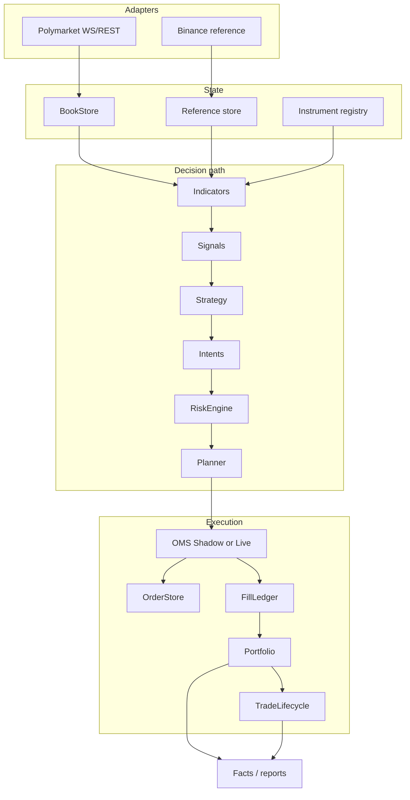
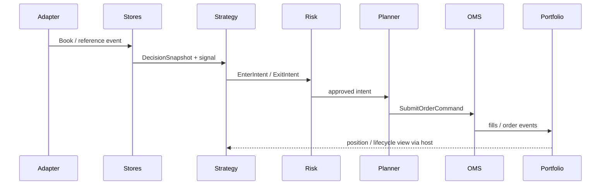

# Architecture

**Purpose:** current design of the accepted Tyrex_PM framework.  
**Baseline specs:** [`../../specifications/00_objective.md`](../../specifications/00_objective.md), [`../../specifications/02_architecture.md`](../../specifications/02_architecture.md).

## Objective and philosophy

- Trade Polymarket binary markets with small capital under **fail-closed** safety.
- Share one reusable stack across strategies.
- Strategies own hypothesis and intents; the framework owns feeds, state, risk, execution, portfolio, persistence, and facts.
- External venues such as Binance supply **reference data only**.

## Design pillars

| Pillar | Meaning |
|--------|---------|
| Event-driven | Adapters emit normalized events; an in-process dispatcher fans them out |
| Ports / adapters | Venue I/O stays at the edge; core types stay venue-agnostic |
| Dependency direction | Adapters → state → indicators → signals → strategy → intents → risk → plan → OMS → portfolio → facts |
| Deterministic host | Single-process `TradingHost` / observe path; mode changes OMS dispatch, not the signal pipeline |
| Fail-closed | Missing ack, dirty live worktree, stale books, unknown submission → block entries / stop |
| Authoritative ownership | Exactly one module owns each truth (orders, fills, positions, lifecycle phase) |

## High-level packages

```text
src/tyrex_pm/
  adapters/          Polymarket + Binance ingestion
  domain/            Polymarket market/instrument mapping
  market_data/       books, freshness, decision snapshots
  indicators/ signals/ strategies/
  risk/ planning/
  execution/         OMS protocol, ShadowOMS, polymarket live adapter
  portfolio/ lifecycle/ persistence/ reporting/
  runtime/           hosts, R7 gates, one-shot live
  application/       CLI
  engine/            in-process dispatcher
```

## Component architecture



## Dependency flow


## Data and execution flow



## Single-process model

`TradingHost` = observe evaluation pipeline with mode-selected OMS:

- **OBSERVE** — no OMS dispatch
- **SHADOW** — `ShadowOMS`
- **LIVE_TINY** — live Polymarket path via operator one-shot (`r7b-live-once`), not a generic continuous live product

## Known limitations

- No distributed bus / multi-process engine
- Generic long-running live loop not productized
- Z-Gap not implemented
- FAK fills are floor-protected, not fill-guaranteed under book move
- Fee bounds used for BUY caps are not the same as realized venue fee amounts

NautilusTrader components are **not** Tyrex_PM components; NT is reference reading material only (see [`../../specifications/06_architecture_references.md`](../../specifications/06_architecture_references.md)).
