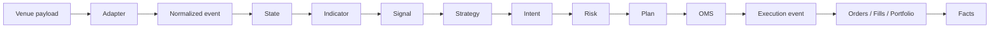
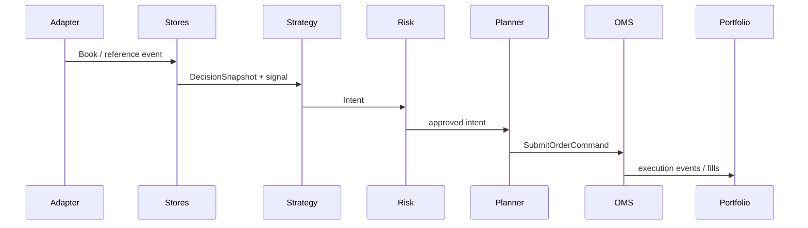

# Architecture

**Purpose:** current design of the accepted Tyrex_PM framework.  
**Baseline specs:** [`../../specifications/00_objective.md`](../../specifications/00_objective.md), [`../../specifications/02_architecture.md`](../../specifications/02_architecture.md).  
**Framework baseline:** commit `fb9d0d8` (R8).

## Objective and philosophy

- Trade Polymarket binary markets with small capital under **fail-closed** safety.
- Share one reusable stack across strategies.
- Strategies own hypothesis and intents; the framework owns feeds, state, risk, execution, portfolio, persistence, and facts.
- External venues such as Binance supply **reference data only**.

## Design pillars

| Pillar | Meaning |
|--------|---------|
| Event-driven | Adapters emit normalized events; an in-process dispatcher fans them out |
| Ports / adapters | Venue I/O stays at the infrastructure edge |
| Runtime flow ≠ import graph | Sequence of processing is not the same as source-code dependency direction |
| Deterministic host | Single-process `TradingHost` / observe path; mode changes OMS dispatch |
| Fail-closed | Missing ack, dirty live worktree, stale books, unknown submission → block |
| Layered authority | Internal accounting vs venue evidence (see below) |

## High-level packages

```text
src/tyrex_pm/
  adapters/          Polymarket + Binance ingestion
  domain/            Polymarket market/instrument mapping
  market_data/       books, freshness, decision snapshots
  indicators/ signals/ strategies/
  risk/ planning/
  execution/         OMS protocol, ShadowOMS, polymarket live adapter
  portfolio/ lifecycle/ persistence/ reporting/
  runtime/           hosts, R7 gates, one-shot live
  application/       CLI (composition root)
  engine/            in-process dispatcher
```

## Runtime flow (data / control)

This is how a payload moves through a running process — **not** the import dependency graph.

```text
Venue payload
→ Adapter
→ Normalized event
→ State
→ Indicator
→ Signal
→ Strategy
→ Intent
→ Risk
→ Plan
→ OMS
→ Execution event
→ Orders / Fills / Portfolio
→ Facts
```





## Static dependency rule (imports)

Documented from active import checks (not an aspirational clean-architecture claim).

| Rule | Current truth |
|------|----------------|
| `core` must not import adapters | Holds |
| Strategies must not import `execution.polymarket` or adapters | Holds for `strategies/` |
| Risk / planning must not import concrete strategies | Holds |
| Adapters depend inward on normalized domain/core types | Holds |
| Live transports stay under `execution/polymarket` | Holds |
| Composition roots (`application`, `runtime` hosts) may import concretes to wire | Holds |

### Remaining dependency debt

- `strategies.protocol` imports `ObserveDecision` from `framework_validation.reference_momentum` (validation type leaked into the protocol module).
- Protocol `on_signal` is typed to return `list[EnterIntent]`, while `ReferenceMomentumStrategy.on_signal` returns `list[IntentLike]` (`EnterIntent` \| `ExitIntent` \| `FlattenIntent`).
- R7 one-shot orchestration lives under `runtime/r7*` and is not yet a generic public strategy API.

## Authoritative-state layers

| Layer | Authority |
|-------|-----------|
| Internal runtime accounting | `Portfolio`, derived from confirmed execution events |
| Order state | `OrderStore` |
| Fill state | `FillLedger` |
| External venue evidence | Authenticated orders/trades + funder conditional balance |
| Reconciliation | Compares internal and external state |
| Disagreement | `UNKNOWN`, readiness block, or manual intervention |

- Portfolio is authoritative **inside the framework** for its derived positions.
- Portfolio **cannot** overrule contradictory venue evidence.
- Venue-confirmed trades establish fills; conditional balance establishes sellability.
- Data API positions are informational and may lag.
- Missing or conflicting evidence never means flat.

## Validated implementation versus generic target

These are **active and validated**, but **phase-specific** (R7/R8 tiny-live):

- `r7b-live-once`
- `r7_lifecycle_policy`
- `config/r7/`
- `var/state/r7/`
- R7 acknowledgment / residual CLI commands
- Guarded `ReferenceMomentumStrategy` composition for LIVE_TINY

They are **not** the desired public interface for every future strategy.  
Z-Gap must not import from R7-specific runtime packages. Promotion into generic framework contracts is future work.

## Single-process model

`TradingHost` = observe evaluation pipeline with mode-selected OMS:

- **OBSERVE** — no OMS dispatch
- **SHADOW** — `ShadowOMS`
- **LIVE_TINY** — live Polymarket path via operator one-shot (`r7b-live-once`), not a continuous live product

## Known limitations

- No distributed bus / multi-process engine
- Generic long-running live loop not productized
- Z-Gap not implemented
- FAK fills are floor-protected, not fill-guaranteed under book move
- Fee bounds ≠ confirmed actual fees
- Lifecycle outcome and inventory state are still partly combined in runtime enums (see [state_lifecycle_recovery](state_lifecycle_recovery.md))

NautilusTrader is **not** a dependency (reference reading only: [`../../specifications/06_architecture_references.md`](../../specifications/06_architecture_references.md)).
