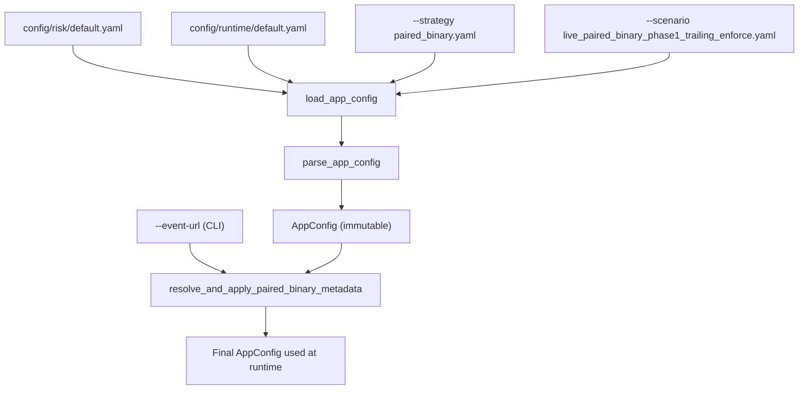
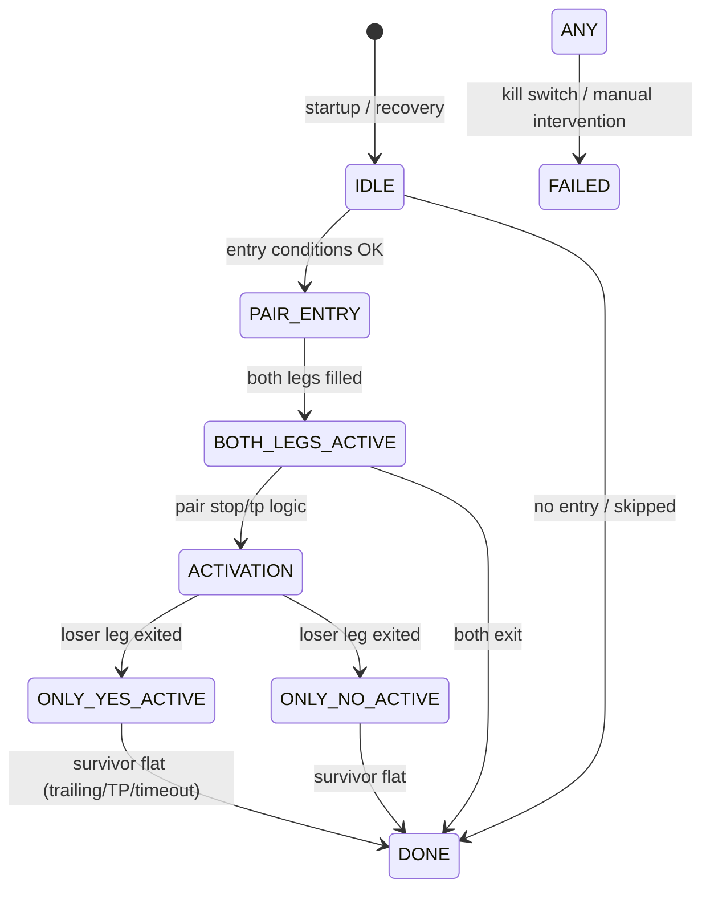
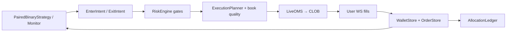
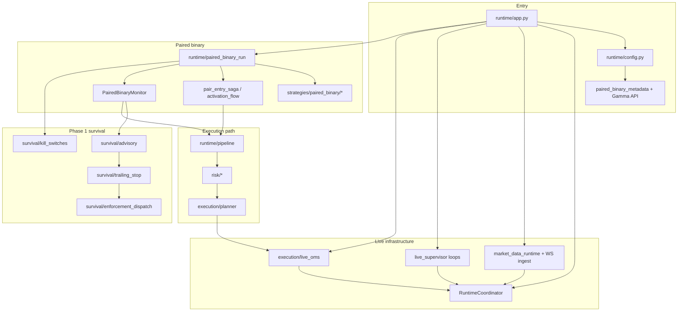

Here is what that command does end-to-end, how the configs combine, and what will actually happen with `--event-url "toto"`.

---

## Your command (with two caveats)

```bash
python -m tyrex_pm.runtime.app run \
  --strategy config/strategies/paired_binary.yaml \
  --scenario live_paired_binary_phase1_trailing_enforce \
  --run-name "phase1_trailing_enforce_dis0.125_$(date +%s)" \
  --event-url "toto"
```

**Caveat 1 — `--event-url "toto"`:** This is not a valid Polymarket event. The run will **stop early** (exit code `2`) during metadata resolution, before any live trading starts. A real value looks like:

`https://polymarket.com/event/btc-updown-5m-<unix_start_ts>`

**Caveat 2 — `$(date +%s)`:** That is bash syntax. In PowerShell it does not expand; your run folder name would literally contain `$(date +%s)`. On Windows use something like:

```powershell
--run-name "phase1_trailing_enforce_dis0.125_$([int][double]::GetUtcNow([datetime]::UtcNow).Subtract([datetime]'1970-01-01').TotalSeconds)"
```

(or set the timestamp manually).

---

## Config model: strategy vs scenario vs defaults

Tyrex loads **three base YAML files**, then **deep-merges** the scenario on top:



| Layer | File | Role |
|-------|------|------|
| **Risk defaults** | `config/risk/default.yaml` | Global gates: notional caps, deployment caps, venue min size, readiness |
| **Runtime defaults** | `config/runtime/default.yaml` | Mode defaults (`shadow`), reporting dir, supervisor intervals |
| **Strategy** | `config/strategies/paired_binary.yaml` | **What** to trade: `kind: paired_binary`, position size, spreads, entry/exit styles, pair SL/TP |
| **Scenario** | `config/scenarios/live_paired_binary_phase1_trailing_enforce.yaml` | **How** to run this experiment: `execution_mode: live`, WS market data, survival enforcement, lifecycle |
| **CLI** | `--event-url`, `--run-name` | Runtime overrides: resolve market identity; label the artifact folder |

### Strategy (`paired_binary.yaml`) — trading logic parameters

- `kind: paired_binary` → selects the paired-binary runtime loop
- `position_size`, `max_pair_entry_cost`, spread limits
- `pair_stop_loss_pct` / `pair_take_profit_pct` (classic pair exit rules)
- `entry_order_style: FAK`, timeouts, activation retries
- Default token IDs (shadow smoke values) and `market_id: shadow_test_market`

This file answers: *“Buy both legs of a BTC 5m pair with these economics and exit rules.”*

### Scenario (`live_paired_binary_phase1_trailing_enforce.yaml`) — experiment overlay

Deep-merged on top of defaults + strategy. For your scenario it sets:

| Section | What it overrides |
|---------|-------------------|
| `execution_mode: live` | Real CLOB orders (needs `TYREX_PRIVATE_KEY`) |
| `strategy.paired_binary.*` | Placeholders for `market_id`, `condition_id`, token IDs (filled by `--event-url`) |
| `runtime.market_data` | WS-primary books, quality enforcement, no REST poll |
| `runtime.survival` | Phase-1 survival stack; **trailing_stop.enforcement_mode: enforce** |
| `runtime.strategy_lifecycle` | Market-aware clock, flatten before close, block entry near close |
| `risk` | Higher caps for tiny live experiment (`max_usd: 15`, kill switches, etc.) |

This file answers: *“Run live on one resolved BTC 5m market, with trailing-stop **enforcement** (not just advisory), WS books, and these safety rails.”*

Merge logic is in `load_app_config`:

```2311:2368:src/tyrex_pm/runtime/config.py
def load_app_config(
    *,
    repo_root: Path,
    strategy_file: str = "config/strategies/guru_follow.yaml",
    scenario_file: str | None = None,
) -> AppConfig:
    scenario_file = _resolve_scenario_path(repo_root, scenario_file)
    risk_p = repo_root / "config" / "risk" / "default.yaml"
    rt_p = repo_root / "config" / "runtime" / "default.yaml"
    st_p = repo_root / strategy_file if not Path(strategy_file).is_absolute() else Path(strategy_file)

    risk = _load_yaml(risk_p)
    runtime = _load_yaml(rt_p)
    strategy = _load_yaml(st_p)

    if scenario_file:
        sc_p = repo_root / scenario_file if not Path(scenario_file).is_absolute() else Path(scenario_file)
        sc = _load_yaml(sc_p)
        if "risk" in sc:
            risk = _deep_merge(risk, sc["risk"])
        if "runtime" in sc:
            runtime = _deep_merge(runtime, sc["runtime"])
        ...
    return parse_app_config(risk=risk, strategy=strategy, runtime=runtime)
```

**Rule of thumb:** keep reusable trading knobs in **strategy**; put mode (`live`/`shadow`), infrastructure (WS, planner, survival modes), and experiment-specific risk in **scenario**.

---

## Execution flow (step by step)

```mermaid
sequenceDiagram
    participant CLI as runtime/app.py
    participant CFG as config.py
    participant META as event_metadata (Gamma API)
    participant COORD as RuntimeCoordinator
    participant BG as Background tasks
    participant LOOP as paired_binary_run
    participant MON as PairedBinaryMonitor
    participant PIPE as pipeline
    participant OMS as LiveOMS → Polymarket CLOB

    CLI->>CFG: load_app_config(strategy + scenario + defaults)
    CLI->>META: resolve_and_apply_paired_binary_metadata("toto")
    Note over META: FAIL here with invalid slug → exit 2

    CLI->>CLI: Create run_id, runs_dir/manifest.json, facts.jsonl
    CLI->>COORD: WalletStore, OrderStore, HealthRuntime
    CLI->>OMS: LiveOMS + PyClobBridge (if live + key present)

    par Live bootstrap
        BG->>BG: heartbeat_loop
        BG->>BG: venue_refresh_loop (wallet + positions)
        BG->>BG: user_ws_ingest (fills, order updates)
        BG->>BG: market_ws_ingest (order books, WS-primary)
    end

    CLI->>LOOP: recover_on_startup → run_paired_binary_loop
    loop Each tick (~1s poll or WS wake)
        LOOP->>LOOP: lifecycle guard (near close, max runtime)
        LOOP->>LOOP: phase machine (entry → activation → survivor)
        LOOP->>MON: monitor.tick() when in active/survivor phases
        MON->>MON: survival advisory + trailing enforce
        MON-->>LOOP: IntentWorkUnit(s)
        LOOP->>PIPE: process_intent_work_unit
        PIPE->>PIPE: RiskEngine → ExecutionPlanner → OMS
        OMS-->>COORD: venue acks / fills via user WS
    end

    LOOP->>CLI: terminal state → stop background tasks (one-shot)
```

### Phase 1 — CLI & config (`cmd_run`)

```879:932:src/tyrex_pm/runtime/app.py
async def cmd_run(args: argparse.Namespace) -> int:
    root = args.repo_root or _repo_root()
    app = load_app_config(
        repo_root=root,
        strategy_file=str(args.strategy),
        scenario_file=args.scenario,
    )
    ...
    if event_url or app.paired_binary is not None:
        ...
        app, resolved_event_meta = resolve_and_apply_paired_binary_metadata(
            app,
            event_url=event_url,
        )
    ...
    run_id = RunId(str(uuid4()))
    name_seg = _safe_run_dir_label(args.run_name) if args.run_name else ""
    run_dir_name = name_seg if name_seg else str(run_id)
    runs_dir = root / app.runtime.reporting.runs_dir / run_dir_name
```

With `"toto"`, `parse_event_ref` treats it as event slug `"toto"`, Gamma lookup fails → logged error → **return 2**. Nothing is traded.

With a **valid** event URL, placeholders in the scenario (`btc_5m_<YYYYMMDD_HHMM>`, `<required>`, etc.) get replaced with real `market_id`, `condition_id`, `yes_token_id`, `no_token_id`, `event_start_ts`, `event_end_ts`.

### Phase 2 — Live infrastructure wiring

Because `execution_mode: live`:

1. **`LiveOMS`** via `PyClobBridge` (needs env `TYREX_PRIVATE_KEY`)
2. **`RuntimeCoordinator`** — central hub: wallet, open orders, health, allocation ledger, market state
3. **Background asyncio tasks** (started before the strategy loop):
   - CLOB heartbeat
   - Periodic wallet + positions REST refresh
   - **User WebSocket** — order/fill truth
   - **Market WebSocket (primary)** — live order books for YES/NO tokens
   - REST bootstrap once at startup; REST recovery on WS gaps

Artifacts go to:

`var/reporting/runs/<run-name>/`
- `manifest.json` — run metadata
- `facts.jsonl` — every decision, risk gate, OMS submit, survival verdict (audit trail)

### Phase 3 — Paired binary main loop

`run_paired_binary_loop` drives a **state machine**:



**Per tick**, depending on `state.phase`:

| Phase | Module | Behavior |
|-------|--------|----------|
| `IDLE` | `entry_eval` | Read WS books, check spreads/cost, emit pair entry intents |
| `PAIR_ENTRY_PENDING` | `pair_entry_saga` | Submit FAK buys for YES+NO, handle partial fills |
| `ACTIVATION_*` | `activation_flow` | Determine winner/loser, exit losing leg |
| `ONLY_*_ACTIVE` | `PairedBinaryMonitor` + `survival/*` | Survivor damage control |
| Any open exposure | `strategy_lifecycle` | Block new entry near close; force flatten ~20s before event end |

### Phase 4 — Survival stack for *this* scenario

Your scenario enables survival with this enforcement profile:

| Module | Mode in this scenario | Effect |
|--------|----------------------|--------|
| `survivor_floor` | **advisory** | Computes floor; logs evidence; does not force exit |
| `recovery_level` | enabled | Tracks “loss recovered” state for trailing arming |
| `trailing_stop` | **enforce** | When trail triggers → **real SELL** via OMS |
| `reachability` | advisory | Scoring only |
| `economics` | advisory | Scoring only |

Mechanical sequence (as documented in the scenario header):

**survivor floor → recovery → trailing (post-recovery)**

On each monitor tick in survivor phases:

1. `evaluate_survival_advisory()` — reads fresh book, spread, depth
2. `_maybe_dispatch_survival_enforcement()` — if `trailing_stop` says exit and `enforcement_mode == enforce`:
   - Build exit intent (FAK retry policy from `survival.enforcement.order_policy`)
   - `process_intent_work_unit()` → **RiskEngine** → **ExecutionPlanner** → **LiveOMS**
3. Facts emitted: `survival_*`, `decision_snapshot`, `oms_submit`, etc.

Trailing params from your scenario (absolute price units, 0–1 scale):

- `trail_distance: "0.2"` (20 cents on a $0–$1 token)
- `activation_mode: loss_recovered`
- `arm_delay_s: 5.0`
- Quality gates: `max_spread: 0.04`, `require_fresh_book: true`

### Phase 5 — Order pipeline (every intent)



`process_intent_work_unit` in `runtime/pipeline.py` is the single front door for submits: risk pre-checks (notional, deployment, readiness, venue min size), optional planner repricing, OMS submit, fact emission.

### Phase 6 — Shutdown

When the strategy reaches a terminal phase (`DONE`, `FAILED`, etc.) and `stop_background_tasks_after_strategy_done: true` (set in your scenario):

- Emits `strategy_terminal_safe_to_stop`
- Cancels WS/heartbeat tasks
- Process exits

---

## Module interaction map



---

## What you need for a successful run

1. **Valid `--event-url`** for the target BTC 5m window (not `"toto"`)
2. **`.env`** with `TYREX_PRIVATE_KEY` (and live deps installed)
3. Optional preflight:

```powershell
python scripts/preflight_phase1_live_scenario.py `
  --scenario live_paired_binary_phase1_trailing_enforce `
  --event-url "https://polymarket.com/event/btc-updown-5m-<START_TS>"
```

4. Correct run-name timestamp syntax for your shell

---

## Summary

| Input | Effect |
|-------|--------|
| `--strategy paired_binary.yaml` | Base paired-binary trading parameters |
| `--scenario live_paired_binary_phase1_trailing_enforce` | Overlay: **live mode**, WS books, survival with **trailing enforce**, lifecycle/kill switches |
| `--run-name ...` | Folder under `var/reporting/runs/` (facts still use UUID `run_id`) |
| `--event-url "toto"` | **Fails immediately** — cannot resolve market metadata from Gamma |

The run is a **live paired-binary bot** on one Polymarket BTC 5m market: enter both legs, activate (exit loser), then manage the survivor with trailing-stop **enforcement** (real sells), all audited to `facts.jsonl`.

If you want, I can trace one specific phase (e.g. pair entry saga or trailing enforce dispatch) at function level next.